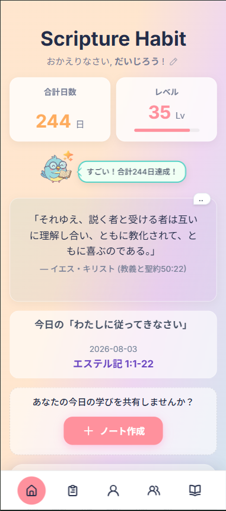
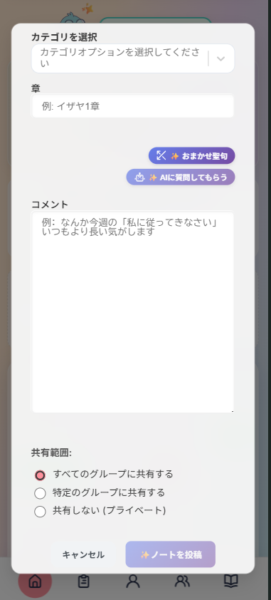
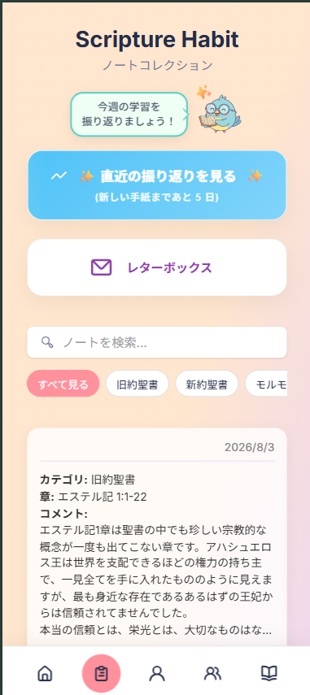
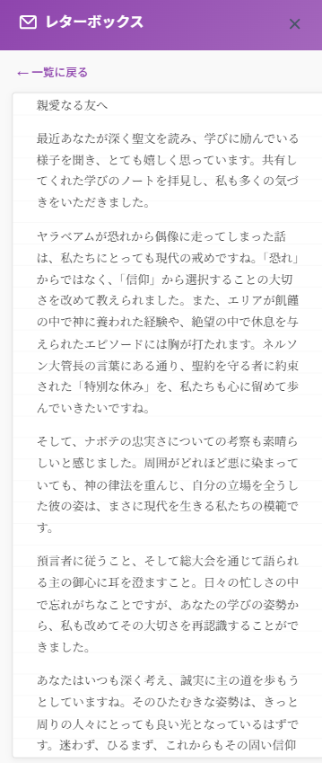
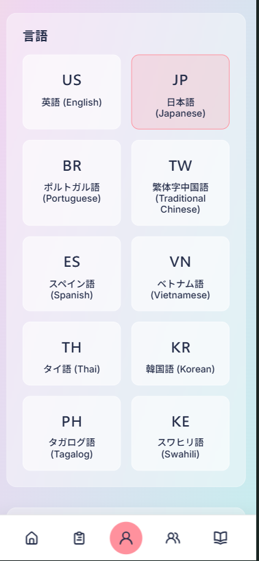
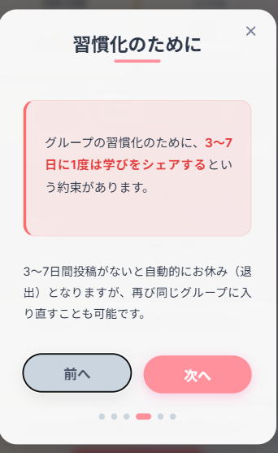
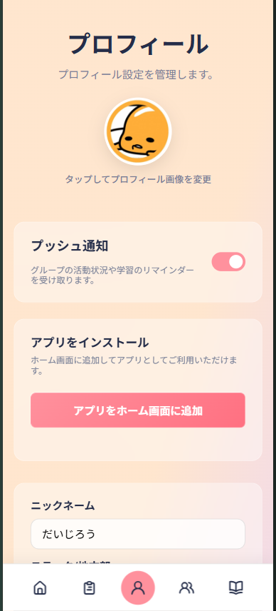
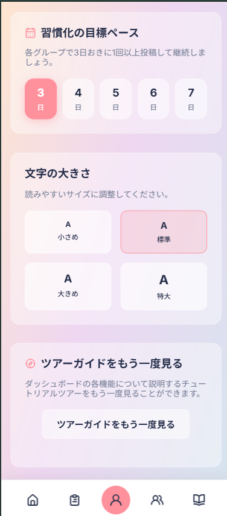

# Scripture Habit (スクハビ)

[English](README.md) | **日本語**

> **日々の聖典学習をもっと楽しく、有意義に**  
> *Making daily scripture study more fun and meaningful.*

毎日の聖典学習を仲間と一緒に楽しく習慣化する、AIリアルタイム翻訳＆グループチャット機能付きのオープンソースWebアプリです。

 **Web Application**: [https://scripturehabit.app](https://scripturehabit.app)  
 **Live Demo (登録不要で今すぐ体験)**: [https://scripturehabit.app/ja/demo](https://scripturehabit.app/ja/demo)

  
  
  
  
  
  
  

---

## このプロジェクトでみんなとやりたいこと

> **「聖典学習って、もっと楽しくて心に残るものにできるんじゃないか？」**

正直に言うと、僕自身ずっとひとりで毎日聖典を読むのが苦手で、三日坊主を繰り返していました。  
チェックリストを埋めるような「義務」にするんじゃなくて、遠くの友達や家族と「今日ここ読んでこう思ったよ」って気軽に言い合える場所があったら、きっと楽しく続けられるはず。そう思って、勢いとノリでコードを書き始めたのが Scripture Habit の始まりです。

聖典学習の習慣化を助けるソフトウェアに、決まった「正解」なんてまだどこにもありません。  
だからこそオープンソースにして、世界中の仲間と一緒に実験しながら、最高の形を作っていけたら最高に面白いなと思っています。

相根大治郎

---

## 運用データ

実際に公開・運用を行っており、日々の学習アクティブユーザー数を記録しています。現在、1日平均10人以上のユーザーがこのアプリで継続的にノートを投稿しています。

- **[日別ノート投稿ユーザー数 (Google スプレッドシート)](https://docs.google.com/spreadsheets/d/YOUR_SPREADSHEET_ID/edit?usp=sharing)**

---

## 主な機能

### 1. ダッシュボード

  

- **レベル & ストリーク表示**: 毎日のノート作成で連続学習日数やレベルが上がり、成長を実感できます。
- **今日の学習箇所ガイド**: その日読むべき範囲が自動表示され、ワンタップで対象ページを開けます。

---

### 2. ノート作成

  

- **ノートエディタ**: 日々の気づきや感想を記録して保存します。
- **アトミック更新処理**: ノート保存時に Firestore トランザクションを実行し、ストリーク計算・チャット同期・データ更新をまとめて行います。

---

### 3. マイノート・振り返り

  
  

- **検索 & フィルタリング**: タグやキーワードで過去の学習ノートをすぐに検索できます。
- **AI ウィークリーレター**: 1週間のノート内容をAIが読み取り、振り返りのフィードバックを届けてくれます。

---

### 4. グループチャット & 多言語対応

  
  

- **聖句リンク自動変換**: メッセージ内の聖句参照を自動的に読みやすいリンクに変換します。
- **AI リアルタイム自動翻訳**: 海外メンバーのメッセージや名前を即座に自動翻訳します。

---

### 5. 習慣化ルール & 設定

  
  
  

- **マイ習慣ルール**: マンネリを防ぐため、自分なりの学習ルールを設定できます。
- **プロフィール設定**: アバター、言語、通知などを柔軟にカスタマイズ可能です。

---

## セキュリティ & テスト

- **セキュリティ**: Firebase AppCheck と Zod による入力値バリデーション（詳細は [セキュリティポリシー](SECURITY.md) を参照）
- **エラー監視**: Sentry を導入し、本番環境でのエラーログを追跡
- **テスト**: Vitest（単体テスト）と Playwright（E2Eテスト）によるリグレッション防止

---

## 技術スタック

| カテゴリ | 使用技術 |
| :--- | :--- |
| **フロントエンド** | React 19, TypeScript 7.0 (Native), Vite 8.1, Vanilla CSS |
| **状態管理** | React Context (Split Context), `useReducer`, Zustand |
| **バックエンド API** | Node.js 26.0, Express 5.0, Vercel Serverless Functions |
| **データベース / 認証** | Google Cloud Firestore, Firebase Authentication, Firebase AppCheck |
| **AI** | Google Gemini API (自動翻訳・ウィークリーレター生成) |
| **API ドキュメント** | OpenAPI 3.0, Swagger UI (`/api/docs`) |
| **テスト** | Vitest (単体テスト), Playwright (E2E テスト) |

### データベース設計 (ER図)

  

### ディレクトリ構造

  

---

## API 仕様書 (Swagger UI)

OpenAPI 3.0 に準拠した Swagger UI を公開しています。

- **[Swagger UI 画面](https://scripturehabit.app/api/docs)**: `https://scripturehabit.app/api/docs`
- **[OpenAPI JSON](https://scripturehabit.app/api/openapi.json)**: `https://scripturehabit.app/api/openapi.json`

---

## ドキュメント

### 日本語版
- **[ドキュメント目次](./docs/ja/README.md)**: 各技術ドキュメントのインデックス。
- **[開発および環境セットアップガイド](./docs/ja/development-guide.md)**: ローカル環境構築とコントリビューション手順。
- **[アーキテクチャ設計書](./docs/ja/architecture.md)**: ディレクトリ構造と全体レイヤーの解説。
- **[チャット & ダッシュボード同期設計](./docs/ja/feature-chat-dashboard.md)**: リアルタイム同期と Firestore リスナーの仕様。
- **[ノート投稿 & ストリーク計算ロジック](./docs/ja/logic-note-posting.md)**: 連続学習記録、レベルアップ、トランザクションの詳細。

### English Version
- **[Technical Documentation Index](./docs/README.md)**
- **[Development & Setup Guide](./docs/development-guide.md)**
- **[Architecture & Structure](./docs/architecture.md)**
- **[Chat & Dashboard Sync](./docs/feature-chat-dashboard.md)**
- **[Note Posting Mechanism](./docs/logic-note-posting.md)**

---

## 貢献について

Scripture Habit はオープンソースプロジェクトです。開発者だけでなく、翻訳やデザイン、日常の利用からのフィードバックなど、どなたでも歓迎しています。

開発の始め方やガイドラインについては [コントリビューションガイド](CONTRIBUTING.md) を、コミュニティ基準については [行動規範 (Code of Conduct)](CODE_OF_CONDUCT.md) をご確認ください。

特に以下の分野での協力を求めています：

- **翻訳の追加・修正**: 各言語の自然な言い回しの確認や、新しい言語の追加
- **Dashboard / UI の改善**: ダッシュボードやモバイル画面の使いやすさの向上
- **ユーザー体験の改善・テスト**: バグ報告や、日々の学習フローをより良くするための提案
- **新機能のアイデア**: 聖典学習を継続しやすくするためのアイデアや意見

Issue や Pull Request はいつでもお気軽にお送りください。

---

## コントリビューター（貢献者）

本プロジェクトを支えてくださっている素晴らしい皆様に心より感謝申し上げます：

<!-- ALL-CONTRIBUTORS-LIST:START - Do not remove or modify this section -->
<!-- prettier-ignore-start -->
<!-- markdownlint-disable -->
<table>
  <tbody>
    <tr>
      <td align="center" valign="top" width="20%"><a href="https://github.com/daijir"> <b>daijir</b></a></td>
      <td align="center" valign="top" width="20%"><a href="https://github.com/Sembatya2020"> <b>Sembatya2020</b></a></td>
      <td align="center" valign="top" width="20%"><a href="https://github.com/GreiceMoreira"> <b>GreiceMoreira</b></a></td>
      <td align="center" valign="top" width="20%"><a href="https://github.com/Bimbolin"> <b>Bimbolin</b></a></td>
      <td align="center" valign="top" width="20%"><a href="https://github.com/KadenTheHero"> <b>KadenTheHero</b></a></td>
    </tr>
  </tbody>
</table>

<!-- markdownlint-restore -->
<!-- prettier-ignore-end -->

<!-- ALL-CONTRIBUTORS-LIST:END -->

---

## サポート・インフラ協賛 (Supported By)

本オープンソースプロジェクトをご支援いただいているプラットフォームに深く感謝申し上げます：

  
  &nbsp;&nbsp;&nbsp;&nbsp;
  

- **[Vercel](https://vercel.com)**: サーバーレスホスティング、エッジルーティング、ウェブアナリティクスをご提供いただいています。
- **[Sentry](https://sentry.io)**: 本番環境のエラー監視、パフォーマンス追跡、診断トレーシングをご提供いただいています。
- **[GitHub](https://github.com)**: リポジトリホスティングおよび GitHub Actions による自動テスト・CI/CD パイプラインをご提供いただいています。

---

## ライセンス

本プロジェクトは **GNU Affero General Public License v3.0 (AGPL-3.0)** のもとで公開されています。詳細は [LICENSE](LICENSE) ファイルをご確認ください。

