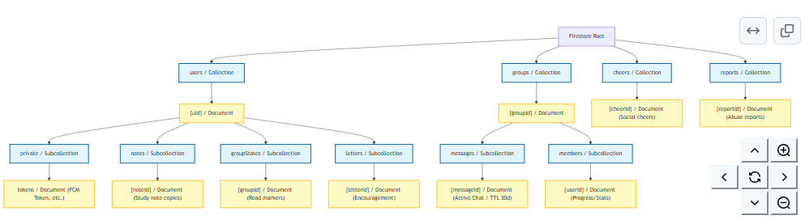

# Scripture Habit

English | [日本語](README.ja.md)

> **Making daily scripture study more fun and meaningful.**  

An open-source web application designed to help people build a lasting and joyful daily scripture study habit together with friends and family.

> 💡 **Interested in contributing or improving features?**  
> You don't need to understand the entire codebase! Feel free to pick a feature from [`/docs`](docs/README.md) that catches your interest and start small.

  <video src="https://github.com/user-attachments/assets/9cb294e7-7a90-49c3-93f5-3995a899ee43" width="360" autoplay loop muted playsinline>
  </video>

 **Web Application**: [https://scripturehabit.app](https://scripturehabit.app)  
 **Live Demo (No registration required)**: [https://scripturehabit.app/en/demo](https://scripturehabit.app/en/demo)

  
  
  
  
  
  
  

---

## About This Initiative

> **"Can we make daily scripture study more joyful and meaningful?"**

To be completely honest, I was never very good at reading the scriptures consistently on my own, and I found myself repeatedly giving up after just a few days.  

Rather than turning study into an obligation or a mechanical checklist, I wished for a place where friends and family—even when living far apart—could simply share what they read and felt each day. With that hope in heart, I sat down and began writing code, which became the beginning of Scripture Habit.

There is no single "correct answer" when it comes to building tools for scripture study.  
That is why this project is open-source: so that we can open it to the world, learn through trial and error together, and shape something that brings joy to Heavenly Father and blesses the lives of others.

Daijiro Sagane

---

## Operational Records

Scripture Habit is actively deployed and running in production. Currently, an average of 10+ users consistently write and share study notes every day.

- **[Daily Note-Posting Active Users (Google Sheet)](https://docs.google.com/spreadsheets/d/1mocqYfFnQdeCrkDQSfLO1vpDha69oXHS5fmdq-hdODw/edit?usp=sharing)**

---

## Key Features

### 1. Dashboard

  

- **Growth & Streak Tracking**: Experience steady progress as daily note-taking accumulates into continuous study days and levels.
- **Today's Reading Guide**: Gently displays the suggested passage for the day, allowing you to open the scripture page with a single tap.

---

### 2. Note Creation

  

- **Note Editor**: Freely record and preserve your personal thoughts, promptings, and insights.
- **Reliable Synchronization**: Executes Firestore transactions upon saving to seamlessly update study days, sync group chats, and refresh data without conflict.

---

### 3. My Notes & Reflection

  
  

- **Search & Filtering**: Browse past study notes and easily revisit previous reflections using tags and keywords.
- **AI Reflection Letters (LetterBox)**: Delivers thoughtful letters that embrace your notes and connect your insights with scripture stories.
- **Letters to Future Self (Time Capsule)**: Seal words of encouragement and SOS reminders for future milestones (Day 10, 25...), unlocked alongside a snapshot of your past journey.

---

### 4. Group Chat & Multi-Language Support

  
  

- **Scripture Link Conversion**: Automatically identifies scripture references in messages and formats them into clean, interactive links.
- **Real-Time AI Translation**: Instantly translates messages and names from friends around the world into natural, everyday language.

---

### 5. Habit Rules & Preferences

  
  
  

- **Personal Habit Rules**: Establish custom study guidelines to keep your daily learning fresh and sustainable.
- **Profile & Preferences**: Flexibly customize your avatar, language, and notification preferences at your own pace.

---

## Security & Quality Assurance

- **Security Measures**: Thorough validation with Firebase AppCheck and Zod ensures secure and trustworthy communication (see [Security Policy](SECURITY.md)).
- **Error Monitoring**: Sentry integration actively monitors and catches unexpected production issues in real time.
- **Quality Verification**: Continuous testing with Vitest (Unit) and Playwright (E2E) guarantees stable and reliable operation.

---

## Tech Stack

| Category | Technologies |
| :--- | :--- |
| **Frontend** | React 19, TypeScript 7.0 (Native), Vite 8.1, Vanilla CSS |
| **State Management** | React Context (Split Context), `useReducer`, Zustand |
| **Backend API** | Node.js 26.0, Express 5.0, Vercel Serverless Functions |
| **Database / Auth** | Google Cloud Firestore, Firebase Authentication, Firebase AppCheck |
| **AI Integration** | Google Gemini API (Real-Time Translation & Reflection Letters) |
| **API Documentation** | OpenAPI 3.0, Swagger UI (`/api/docs`) |
| **Testing** | Vitest (Unit Tests), Playwright (E2E Tests) |

### Database Schema (ER Diagram)

  

### Directory Architecture

  

---

## API Documentation (Swagger UI)

Interactive Swagger UI documentation is publicly available:

- **[Swagger UI Screen](https://scripturehabit.app/api/docs)**: `https://scripturehabit.app/api/docs`

---

## Documentation

### English Version
- **[Technical Documentation Index](./docs/README.md)**: Index of architectural and technical guides.
- **[Development & Setup Guide](./docs/development-guide.md)**: Local development setup and contribution guide.

### 日本語版 (Japanese Version)
- **[ドキュメント目次](./docs/ja/README.md)**
- **[開発および環境構築ガイド](./docs/ja/development-guide.md)**

---

## Contributing

Scripture Habit is an open-source project. Whether you write code, refine translations, improve UI design, or share thoughts on daily usability, every form of participation is warmly welcomed.

> [!TIP]
> **You don't need to understand the whole codebase!** Pick a feature from [`/docs`](docs/README.md) that interests you and start small.

For setup steps and guidelines, please see our [Contributing Guide](CONTRIBUTING.md) and [Code of Conduct](CODE_OF_CONDUCT.md).

We would especially love your help in these areas:

- **Translations & Phrasing**: Polishing expressions for natural phrasing and adding new languages.
- **Dashboard & UI**: Improving usability, layouts, and mobile experience.
- **User Experience & Testing**: Reporting bugs and suggesting ideas to make daily study smoother.
- **Feature Ideas**: Sharing thoughts on how to nurture lasting scripture habits.

Feel free to open an issue or submit a pull request anytime.

---

## Contributors

Special thanks to the wonderful people who support this journey:

<!-- ALL-CONTRIBUTORS-LIST:START - Do not remove or modify this section -->
<!-- prettier-ignore-start -->
<!-- markdownlint-disable -->
<table>
  <tbody>
    <tr>
      <td align="center" valign="top" width="20%"><a href="https://github.com/daijir"> <b>daijir</b></a></td>
      <td align="center" valign="top" width="20%"><a href="https://github.com/Sembatya2020"> <b>Sembatya2020</b></a></td>
      <td align="center" valign="top" width="20%"><a href="https://github.com/GreiceMoreira"> <b>GreiceMoreira</b></a></td>
      <td align="center" valign="top" width="20%"><a href="https://github.com/Bimbolin"> <b>Bimbolin</b></a></td>
      <td align="center" valign="top" width="20%"><a href="https://github.com/KadenTheHero"> <b>KadenTheHero</b></a></td>
    </tr>
  </tbody>
</table>

<!-- markdownlint-restore -->
<!-- prettier-ignore-end -->

<!-- ALL-CONTRIBUTORS-LIST:END -->

---

## Supported By

Special thanks to the following platforms for generously supporting this open-source project:

  
  &nbsp;
  
  &nbsp;
  

- **[Vercel](https://vercel.com)**: Providing serverless hosting, edge routing, and web analytics.
- **[Sentry](https://sentry.io)**: Supporting real-time production error monitoring, performance tracking, and diagnostic tracing.
- **[GitHub](https://github.com)**: Providing repository hosting and continuous integration / automated testing pipelines (GitHub Actions).

---

## License

This project is licensed under the **GNU Affero General Public License v3.0 (AGPL-3.0)** - see the [LICENSE](LICENSE) file for details.
