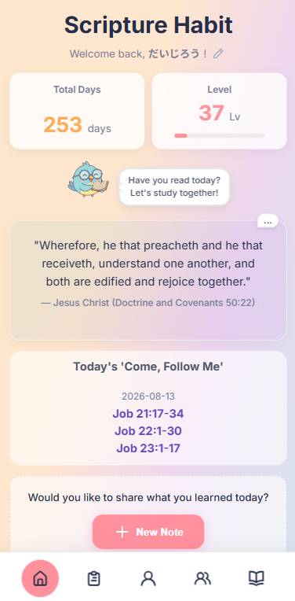
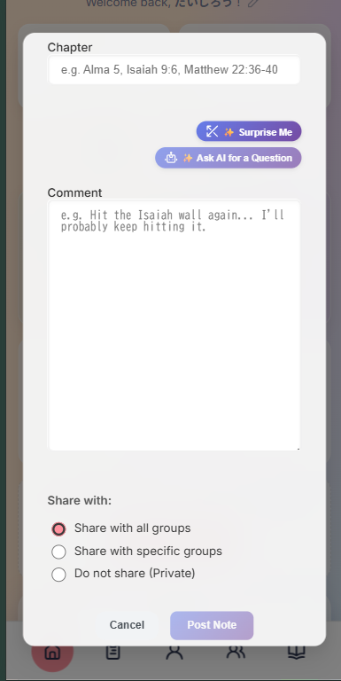
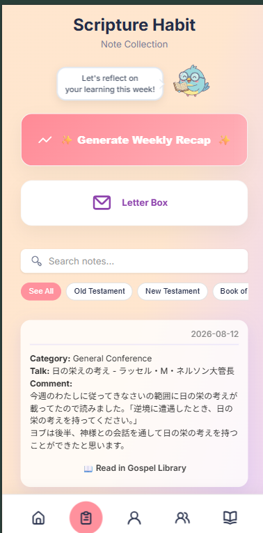
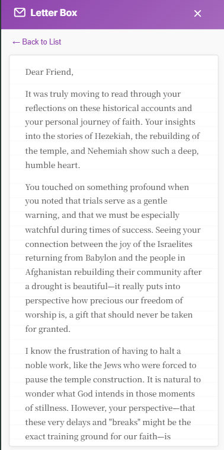
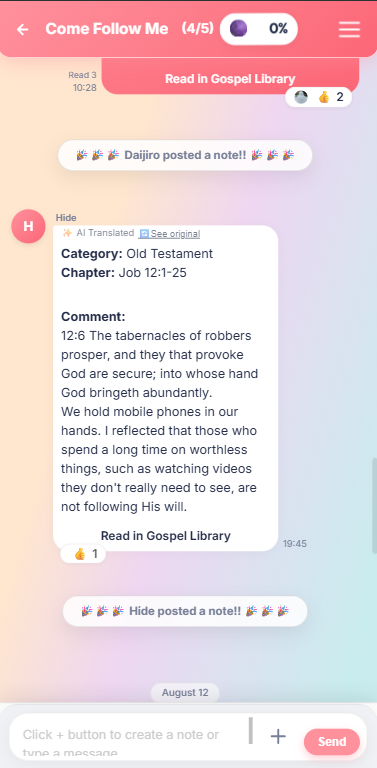
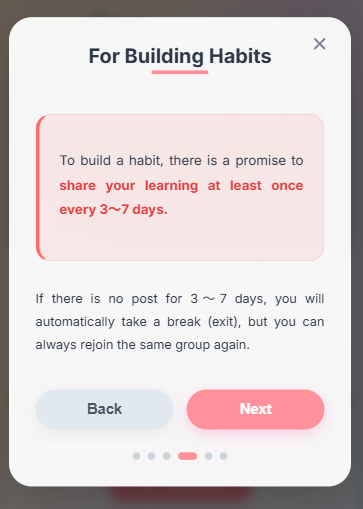
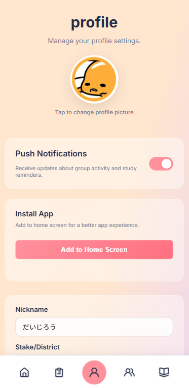
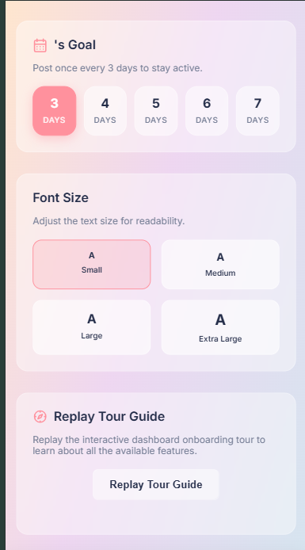
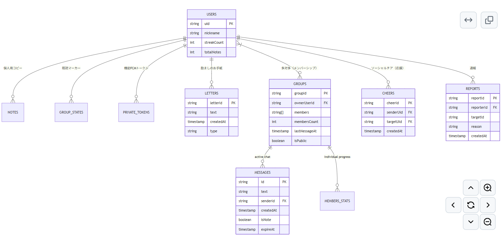
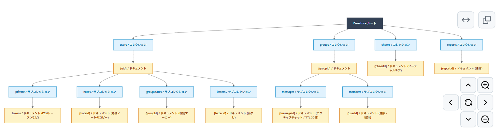

# Scripture Habit

English | [日本語](README.ja.md)

> **Making daily scripture study more fun and meaningful.**

An open-source community web application featuring AI real-time translation & group features to make daily scripture study a joyful habit together with friends.

 🌐 **Web Application**: [https://scripturehabit.app](https://scripturehabit.app)  
 🚀 **Live Demo (No Signup Required)**: [https://scripturehabit.app/en/demo](https://scripturehabit.app/en/demo)

  
  
  
  
  

---

## 💡 A Note from the Creator (Why I Built This)

> **"Can we make daily scripture study more fun, meaningful, and connected?"**

To be completely honest, I was never great at reading scriptures consistently on my own. I kept dropping the habit after just a few days.  

I realized I didn't need another strict checklist. What I really wanted was **joy and connection**, a simple place to share small daily thoughts with friends and family, even if we speak different languages. On a bit of a whim and pure excitement, I started writing code, and Scripture Habit was born.

There is no single "right answer" when it comes to software for building a scripture habit. That’s why I made this project open-source: so we can experiment, build, and shape the best experience together as a community.

Daijiro Sagane

---

## Operational Data

The application is actively deployed and in operation, tracking daily active users studying scriptures. Currently, an average of 10+ users post study notes daily on a continuous basis.

- 📈 **[Daily Note-Posting Active Users (Google Sheet)](https://docs.google.com/spreadsheets/d/YOUR_SPREADSHEET_ID/edit?usp=sharing)**

---

## Key Features

### 1. Dashboard

  

- **Level & Streak Display**: Experience visible growth as continuous study days (streaks) and levels increase with daily note creation.
- **Today's Reading Guide**: Automatically displays the recommended reading passage for the day, allowing users to open the target page with a single tap.

---

### 2. Note Creation

  

- **Note Editor**: Record and save daily insights and reflection notes.
- **Atomic Update Processing**: Executes a Firestore transaction upon saving a note to atomically handle streak calculation, chat synchronization, and user data updates.

---

### 3. My Notes & Reflection

  
  

- **Search & Filtering**: Instantly search past study notes by tags or keywords.
- **AI Weekly Letter**: Gemini AI analyzes a week's worth of note entries to deliver personalized reflection feedback.

---

### 4. Group Chat & Multi-language Support

  
  

- **Automatic Scripture Link Conversion**: Automatically converts scripture references in chat messages into easy-to-read interactive links.
- **AI Real-Time Translation**: Instantly and automatically translates messages and user names from international group members.

---

### 5. Habit Rules & Settings

  
  
  

- **Personal Habit Rules**: Set custom study rules to maintain motivation and prevent routines from becoming monotonous.
- **Profile Settings**: Flexibly customize avatar, language, notification preferences, and more.

---

## Security & Testing

- **Security**: Firebase AppCheck and Zod input validation (see [Security Policy](SECURITY.md))
- **Error Monitoring**: Sentry integration for real-time production error logging
- **Testing**: Vitest (Unit testing) and Playwright (E2E testing) to prevent regressions

---

## Tech Stack

| Category | Technologies |
| :--- | :--- |
| **Frontend** | React 19, TypeScript 7.0 (Native), Vite 8.1, Vanilla CSS |
| **State Management** | React Context (Split Context), `useReducer`, Zustand |
| **Backend API** | Node.js 26.0, Express 5.0, Vercel Serverless Functions |
| **Database / Auth** | Google Cloud Firestore, Firebase Authentication, Firebase AppCheck |
| **AI** | Google Gemini API (Automatic Translation & Weekly Letter Generation) |
| **API Documentation** | OpenAPI 3.0, Swagger UI (`/api/docs`) |
| **Testing** | Vitest (Unit), Playwright (E2E) |

### Database Schema (ER Diagram)

  

### Directory Architecture

  

---

## API Documentation (Swagger UI)

Public Swagger UI conforming to OpenAPI 3.0 specification is available:

- **[Swagger UI Screen](https://scripturehabit.app/api/docs)**: `https://scripturehabit.app/api/docs`
- **[OpenAPI JSON](https://scripturehabit.app/api/openapi.json)**: `https://scripturehabit.app/api/openapi.json`

---

## Documentation

### English Version
- **[Technical Documentation Index](./docs/README.md)**
- **[Development & Setup Guide](./docs/development-guide.md)**
- **[Architecture & Structure](./docs/architecture.md)**
- **[Chat & Dashboard Sync](./docs/feature-chat-dashboard.md)**
- **[Note Posting Mechanism](./docs/logic-note-posting.md)**

### 日本語版 (Japanese Version)
- **[ドキュメント目次](./docs/ja/README.md)**
- **[開発および環境セットアップガイド](./docs/ja/development-guide.md)**
- **[アーキテクチャ設計書](./docs/ja/architecture.md)**
- **[チャット & ダッシュボード同期設計](./docs/ja/feature-chat-dashboard.md)**
- **[ノート投稿 & ストリーク計算ロジック](./docs/ja/logic-note-posting.md)**

---

## Contributing

Scripture Habit is an open-source project, and contributions are welcome. Whether you write code, design, translate, or just use the app, any help is appreciated.

Please see our [Contributing Guide](CONTRIBUTING.md) and [Code of Conduct](CODE_OF_CONDUCT.md) for details on development setup, guidelines, and community standards.

Areas where we could use help:

- **Translations**: Reviewing existing translations for natural phrasing, or adding support for new languages.
- **Dashboard & UI**: Improving dashboard usability, layouts, and mobile interface design.
- **User Experience & Testing**: Reporting bugs, testing features, and suggesting workflow improvements.
- **Feature Ideas**: Suggesting ideas that could make daily study habits more effective.

Feel free to open an issue or submit a pull request on GitHub.

---

## License

This project is licensed under the MIT License - see the [LICENSE](LICENSE) file for details.

