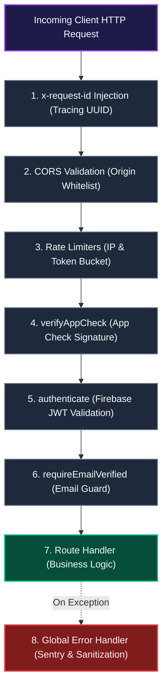
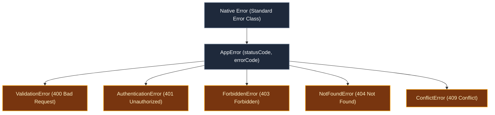

# API Design & Error Handling

This document details the backend Express middleware pipeline (`api_internal/`), rate-limiting strategies, standardized `AppError` class hierarchy, and Sentry error monitoring in Scripture Habit.

---

## 1. Middleware Pipeline Architecture

Incoming backend requests traverse a structured, security-first middleware pipeline:

### Pipeline Breakdown

1. **Distributed Tracing & Early Guards**  
   Every request is tagged with an unique `x-request-id` UUID, followed by strict CORS origin validation and tier-specific rate limiting.

2. **Defense-in-Depth Authentication**  
   Verifies App Check cryptographic tokens, authenticates Firebase JWT bearer credentials, and enforces verified email states prior to handler execution.

3. **Centralized Exception Interception**  
   Synchronous and asynchronous exceptions bubble up to the global error handler, which captures contextual traces to Sentry and formats clean client responses.

---

## 2. Security & Authentication Middleware

1. **Distributed Tracing (`x-request-id`)**: Injects an unique UUID into request and response headers to correlate client telemetry with server logs and Sentry events.
2. **Rate Limiting (`express-rate-limit`)**:
   - **Global Limit**: 300 requests per 15 minutes.
   - **Invites & Group Joins**: 15 attempts per hour (prevents brute-force invite enumeration).
   - **AI Generation**: 100 requests per hour.
3. **App Check Verification (`verifyAppCheck`)**: Validates client authenticity against Firebase App Check.
4. **JWT Verification (`authenticate`)**: Decodes Bearer tokens and attaches the verified user context to `req.user`.
5. **Email Verification Guard (`requireEmailVerified`)**: Ensures password-authenticated users verify their email address before accessing group data.

---

## 3. Standardized Error Hierarchy (`AppError`)

Rather than relying on arbitrary status codes, the backend organizes exceptions into a typed `AppError` hierarchy:

### Error Hierarchy Breakdown

- **`ValidationError` (400)**: Emitted on Zod schema validation failures, detailing invalid field paths and constraints.
- **`AuthenticationError` (401)**: Emitted when JWT credentials are missing, malformed, or expired.
- **`ForbiddenError` (403)**: Emitted on unauthorized resource access attempts or unverified email states.
- **`NotFoundError` (404)**: Emitted when requested entities (groups, notes) do not exist.
- **`ConflictError` (409)**: Emitted on transaction lock contention or group capacity limits.

---

## 4. Error Sanitization & Sentry Observability

- **Production Sanitization**:  
  Unexpected 500 errors strip internal stack traces and database connection details, returning a safe error descriptor alongside the `requestId`.
- **Sentry Integration**:  
  Unhandled exceptions automatically transmit contextual traces, user identifiers (`req.user.uid`), and route parameters to Sentry for rapid triage.

---

## 5. Related Documentation

- [Architecture Overview](./architecture.md)
- [App Check & API Protection](./security-architecture.md)
- [Monitoring & Observability](./monitoring-observability.md)
