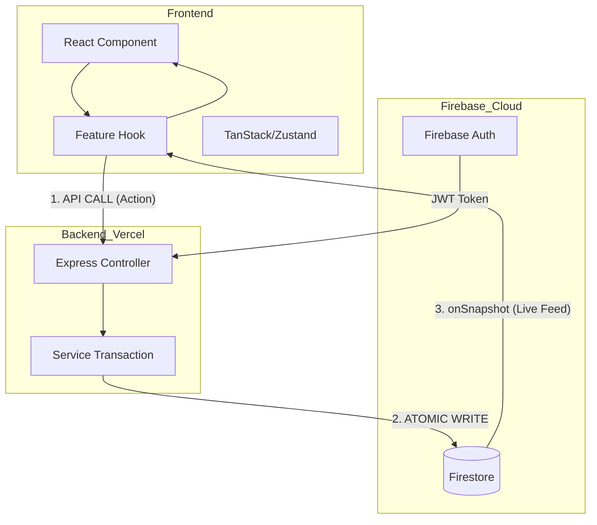

# Technical Architecture Reference

This document provides details about the technical structure of the **scripture-habit** project, covering the tech stack, component design, data flow, and mobile architecture.

---

## 🛠️ Technical Stack

We use a modern, type-safe stack designed for fast development and good performance on both web and mobile.

### Frontend
- **Framework**: **React 19** (Concurrent Rendering, React Server Components ready).
- **Build Tool**: **Vite 8** (Fast Hot Module Replacement and optimized build bundles).
- **Navigation**: **React Router 7** (Single-page app layouts and deep-linking).
- **Data Fetching**: **TanStack Query 5** (Query state management, automated refetch, and offline sync caching).
- **State Management**: **Zustand 5** (Lightweight global UI and layout state).
- **Real-time**: **Firebase 12 Client SDK** (Firestore real-time sync using WebSocket listeners).

### Backend
- **Platform**: **Node 22** with **Express 5** (Hosted serverless on Vercel Functions).
- **Database**: **Cloud Firestore** (Document-based real-time NoSQL database).
- **Authentication**: **Firebase Admin SDK 13** (Server-side JWT verification and user management).
- **AI Engine**: **Gemini 3.1 Flash-Lite Preview** (Prompt handling, cached translation engine).

---

## 📂 Directory Structure & Physical Layers

The project is structured into the following key directories, each representing a physical layer:

```
scripture-habit/
├── api/                  # 1. API Layer (Vercel Serverless Function entry points)
├── api_internal/         # 2. Internal Layer (Business logic, routes, and services)
├── backend/              # 3. Backend Layer (Local dev server Express wrapper)
├── src/                  # 4. Frontend Layer (Vite + React 19 application)
└── types/                # 5. Schema Layer (Shared TypeScript definitions)
```

### Physical Layer Responsibilities

#### 1. API Layer (`api/`)
Serves as the serverless execution entry points (e.g., `api.ts`) deployed on Vercel. It intercepts external client requests and forwards them to the Internal Layer's Express router.

#### 2. Internal Layer (`api_internal/`)
The core hub of backend operations. It contains Express route handlers, controllers, middlewares, domain services for database transactions, and dispatchers for emails or push notifications.

#### 3. Backend Layer (`backend/`)
A lightweight Express wrapper and dev server wrapper utilized solely to spin up and run the backend locally on port 5000.

#### 4. Frontend Layer (`src/`)
A client application built using React 19 and Vite 8. It contains UI components (styled with Vanilla CSS) and state management/data-fetching pipelines utilizing Zustand, TanStack Query, and the Firebase Client SDK.

---

## 🏗️ Architectural Layers

### 1. The Schema Layer (`/types`)
**Centralized Data Models**: All Firestore document models are defined as TypeScript interfaces in the root `types/` folder. This ensures that the Backend (Admin SDK) and Frontend (Client SDK) always use identical data structures.

### 2. The Logic Layer (Custom Hooks)
We follow a **"Logic-Component Split"** philosophy:
- **Components**: Responsible for layout, styling (Vanilla CSS), and rendering.
- **Hooks**: Responsible for API calls, data synchronization, and business logic (e.g., `use-chat-sync-controller.ts`, `use-chat-data-engine.ts`, `useNoteSubmission`).
- **Benefit**: Components remain simple and testable, while logic is reusable across different views.

### 3. The Backend Service Layer (`api_internal/services`)
Routes are simple controllers. All main processes (transactions, streak calculations, notifications) are handled in **Services**:
- **`NoteService`**: Handles the note-posting transaction.
- **`StreakEngine`**: Internal logic for calculating 36-hour grace periods.
- **`ArchiveService`**: Manages bucket-based message archiving.

---

## 💾 State Management Taxonomy

We categorize state by its source and persistence to avoid redundant renders.

| State Category | Tool | Purpose |
| :--- | :--- | :--- |
| **Server State** | TanStack Query | Caching API responses, handling loading/error states for metadata. |
| **Real-time State** | Firestore SDK | Synchronized chat messages, unread counts, and group activity. |
| **Global UI State** | Zustand | Managing modals, sidebar visibility, and theme settings. |
| **Auth State** | AuthContext | Standardizing the `currentUser` object across all components. |

> [!IMPORTANT]
> **State Conflict Prevention & Single Source of Truth**:
> To prevent race conditions and conflicts between TanStack Query and Firestore live subscriptions, TanStack Query is strictly restricted to static server states (such as `systemStatus`). All other collaborative data (chats, group details, streaks, profile data) are fetched and synchronized exclusively through Firestore's `onSnapshot` listener. This ensures that no overlapping cache updates flicker the UI.

---

## 🔄 Data Flow: The Synchronized Loop

Our architecture separates **Mutations** (API) from **Queries** (Direct DB Listeners).



---

## 💾 Database Schema Blueprint

Scripture Habit stores relational and gamified data structures in Firestore. Below is the simplified collection hierarchy:

```
Firestore Root
├── users/ (Collection)
│   └── {uid}/ (Document)
│       ├── nickname: string
│       ├── timeZone: string
│       ├── lastPostDate: string (YYYY-MM-DD)
│       ├── level: number
│       ├── streakDays: number
│       ├── hasFcmToken: boolean
│       └── private/ (Subcollection)
│           └── tokens/ (Document)
│               └── fcmTokens: string[]
│       └── groupStates/ (Subcollection)
│           └── {groupId}/ (Document)
│               └── readMessageCount: number
├── groups/ (Collection)
│   └── {groupId}/ (Document)
│       ├── name: string
│       ├── inviteCode: string
│       ├── ownerId: string
│       ├── messageCount: number
│       ├── unityScore: number
│       ├── members/ (Subcollection)
│       │   └── {uid}/ (Document)
│       │       └── joinedAt: Timestamp
│       ├── messages/ (Subcollection)
│       │   └── {messageId}/ (Document)
│       │       └── content: string
│       └── messages_latest/ (Subcollection)
│           └── latest/ (Document)
│               └── messages: Message[] (High-performance cache strictly capped at the latest 25 messages. This ensures the document stays under the Firestore 1MB size limit and avoids write errors)
```

---

## 🎮 Local Emulator Seeding System

Connecting a fresh developer workspace to blank emulators makes UI testing tedious. The local environment features an automated seeding pipeline:

- **Command**: `npm run db:seed`
- **Execution Script**: [`seed.ts`](../scripture-habit/scripts/seed.ts)
- **Lifecycle Flow**:
  1. **Purge**: Cleans out any matching test users and existing active groups to guarantee idempotency.
  2. **Auth Generation**: Automatically generates dummy accounts on the Local Firebase Auth emulator.
  3. **User Document Mocking**: Populates user profiles, mock daily streaks, level configurations, and FCM flags.
  4. **Group Assembly**: Builds a shared study group, maps invite relationships, generates chat message history, and updates the aggregated cache previews.

---

## 🗺️ CodeTours (Developer Navigation)

To guide new developers, the workspace contains **22 interactive CodeTours** (under `.tours/`). Developers can launch them in VS Code via the Command Palette:
1. `CodeTour: Start Tour`
2. Select desired tour (e.g., **Tour 1: Frontend Core Mechanics** to study live React hooks, or **Tour 13: Local Development & Setup** to review emulator and seeding configs).

---

## 🛡️ Reliability & Security
- **Type Guards**: `firestoreConverters.ts` uses Zod to ensure that malformed data in Firestore is caught and cleaned before it causes errors in the UI.
- **Automated Profile Sync**: While member identity fields (e.g. nickname) are duplicated across group preview arrays, messages, and reactions to save read costs, the backend runs `ProfileService.syncProfileToChats` using atomic batches (`db.batch()`) to push updates immediately to all corresponding records, preventing unsynced states.
- **Error Boundaries**: Component-level boundaries prevent errors in a chat message from breaking the entire Dashboard.
- **Sentry Integration**: All layers report performance issues and unhandled exceptions to a centralized Sentry dashboard.
- **Monorepo Boundaries (Future Roadmap)**: Although `/types` and `/api_internal` currently rely on relative path imports, the long-term plan is to migrate to a formal workspaces layout (using NPM or PNPM Workspaces) to decouple compile-time boundaries cleanly.
