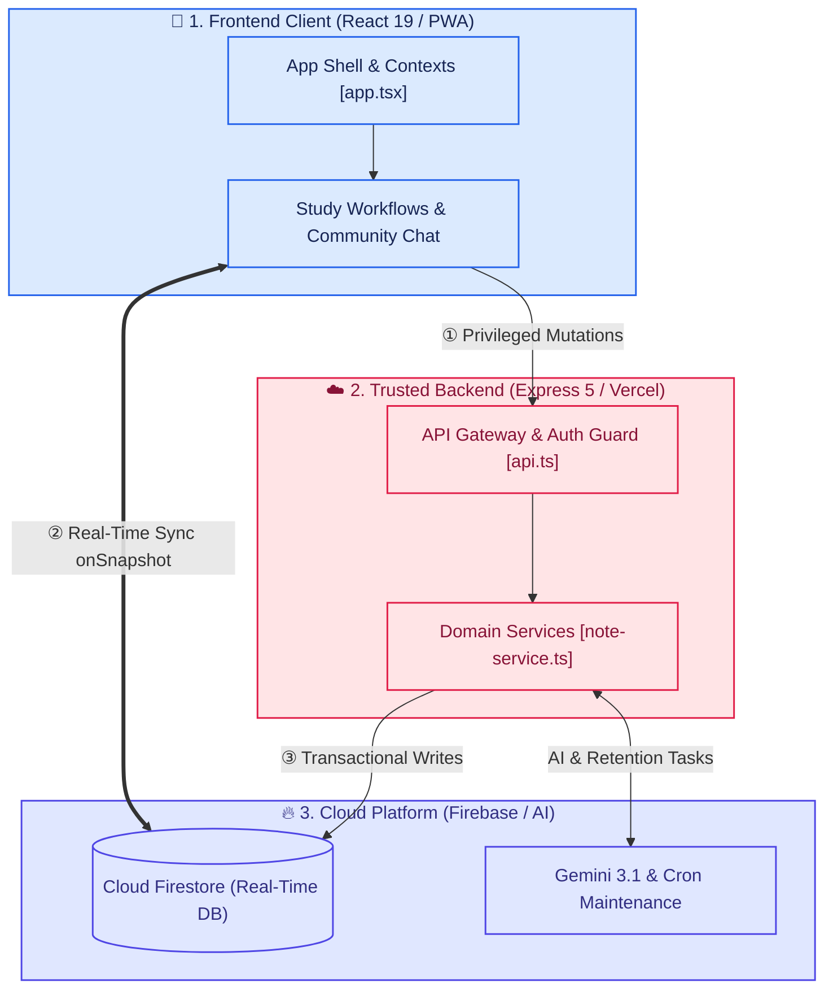
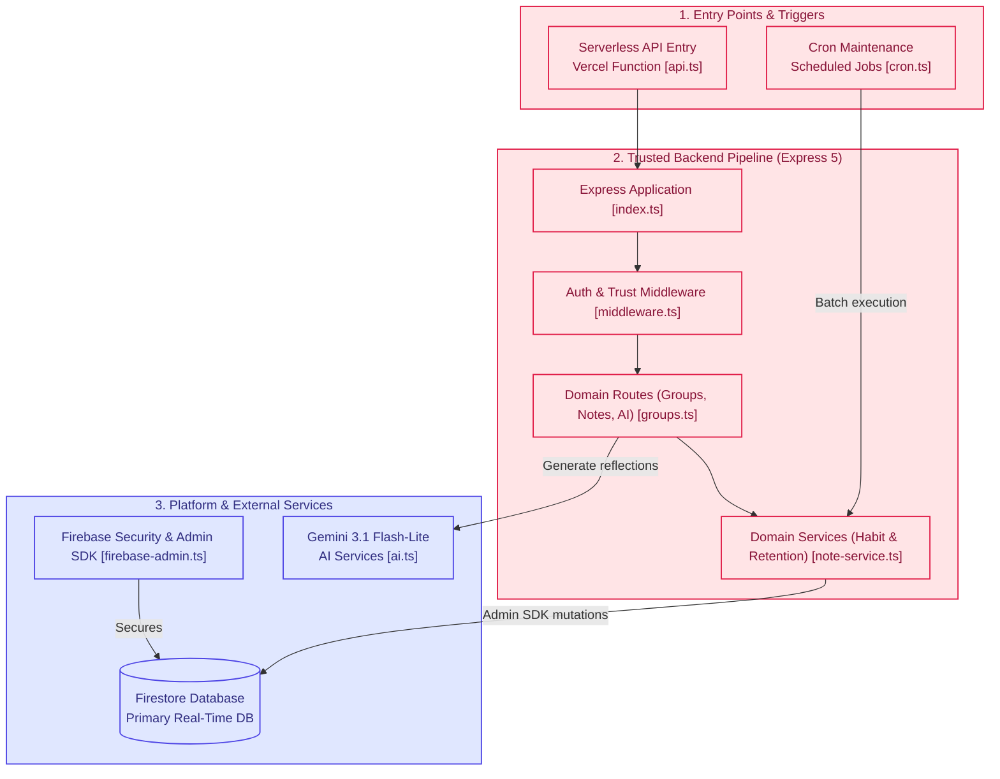
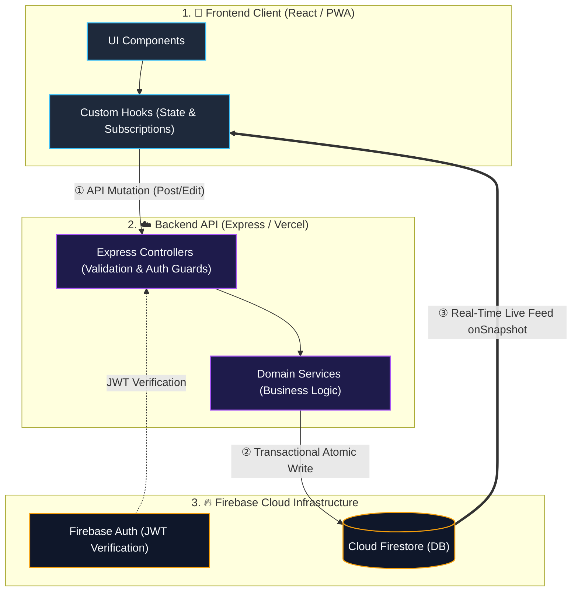

# Architecture & Technical Reference

This document provides a technical overview of the Scripture Habit architecture, detailing the technology stack, directory structure, data flow, and state management strategy.

> [!TIP]
> **Interactive Architecture Tour**: [Open Live Tour (App Bootstrapping & Routing)](https://htmlpreview.github.io/?https://github.com/ScriptureHabit/scripture-habit/blob/main/docs/public/architecture-tour.html?tour=tour-root&lang=en)

---

## 1. Tech Stack

Built on modern web standards to deliver high responsiveness and a cohesive developer experience.

| Layer | Technology | Rationale & Responsibility |
| :--- | :--- | :--- |
| **Frontend** | **React 19** + **Vite 8** | Fast builds and modern component architecture |
| **Routing** | **React Router 7** | SPA navigation and deep-link routing |
| **State & Data Fetching** | **Zustand 5** / **TanStack Query 5** | Lightweight UI state and efficient API cache management |
| **Real-Time Data** | **Firebase Client SDK 12** | Firestore WebSocket listeners for instant message synchronization |
| **Backend API** | **Node.js >= 22 (LTS 24)** + **Express 5** | Robust serverless API gateway hosted on Vercel Functions |
| **Database** | **Cloud Firestore** | Real-time, document-oriented NoSQL database |
| **Authentication** | **Firebase Authentication** | Secure sign-in (Google / Email) and server-side JWT verification |
| **AI Subsystem** | **Gemini 3.1 Flash-Lite** | Multilingual translation, question prompts, and reflection letters |

---

## 2. Directory Structure & Responsibilities

Maintains clear separation of concerns with predictable module boundaries.

```
scripture-habit/
├── api/                  # Vercel Serverless Function entry points
├── api_internal/         # Core backend logic (routes, services, notifications, cron)
├── backend/              # Local development Express server wrapper (Port: 5000)
├── src/                  # Frontend client (React 19 + Vite application)
└── types/                # Shared TypeScript schemas and data contracts
```

---

## 3. System Component Architecture

To maintain clarity and legibility in Markdown previewers, the architecture is presented in three focused views with balanced aspect ratios:
1. **High-Level Overview**: Core interactions across Frontend, Backend, and Cloud Platform.
2. **Frontend & Workflows**: Component orchestration, custom hooks, and state boundaries.
3. **Backend & Platform Services**: Serverless API routes, domain services, and external integrations.

### 3.1 High-Level Architecture Overview

A balanced top-to-bottom overview showing user flows from the React PWA client through trusted API gateways and real-time Firestore synchronization.



---

### 3.2 Frontend Client & Feature Workflows

Detailed component composition, state management, study workflows, and offline-capable chat queues.

```mermaid
flowchart TD
    subgraph Core["📱 1. React Client Core"]
        Bootstrap["Client Bootstrap [main.tsx]"] --> AppShell["App Shell & Router [app.tsx]"]
        AppShell --> Contexts["Auth & Identity [auth-provider.tsx]"]
        AppShell --> Stores["Global UI State (Zustand) & PWA [sw.ts]"]
        Contexts --> SDK["Firebase Client SDK [firebase.ts]"]
    end

    subgraph Features["⚡ 2. Study & Community Workflows"]
        direction LR
        subgraph Study["Study & Reflection"]
            NoteWork["Note Submission [use-note-submission.ts]"]
            DashSync["Dashboard Sync [use-dashboard-sync.ts]"]
            MyNotes["Notes & Search [my-notes.tsx]"]
            LetterBox["Letter Box [use-letter-box.ts]"]
            MyNotes --> LetterBox
        end
        subgraph Chat["Groups & Chat"]
            ChatProvider["Chat Provider [group-chat-provider.tsx]"]
            ChatSync["Stream Sync [use-chat-sync-controller.ts]"]
            OfflineQueue["Offline Queue [offline-chat-queue.ts]"]
            ChatProvider --> ChatSync
            ChatProvider -.-> OfflineQueue
        end
    end

    subgraph External["🔥 3. Cloud & Server Targets"]
        Firestore[("Cloud Firestore (Real-Time DB)")]
        API["Trusted Backend API [api.ts]"]
    end

    AppShell ==> Features
    NoteWork & ChatProvider -->|"API Mutations"| API
    OfflineQueue -.->|"Retry Pending"| API
    NoteWork & DashSync & ChatSync <==>|"Real-Time Sync"| Firestore

    click Bootstrap "https://github.com/scripturehabit/scripture-habit/blob/main/src/main.tsx"
    click AppShell "https://github.com/scripturehabit/scripture-habit/blob/main/src/app.tsx"
    click Contexts "https://github.com/scripturehabit/scripture-habit/blob/main/src/context/auth-provider.tsx"
    click Stores "https://github.com/scripturehabit/scripture-habit/blob/main/src/sw.ts"
    click SDK "https://github.com/scripturehabit/scripture-habit/blob/main/src/firebase.ts"
    click NoteWork "https://github.com/scripturehabit/scripture-habit/blob/main/src/components/newnote/hooks/use-note-submission.ts"
    click DashSync "https://github.com/scripturehabit/scripture-habit/blob/main/src/components/dashboard/hooks/use-dashboard-sync.ts"
    click MyNotes "https://github.com/scripturehabit/scripture-habit/blob/main/src/components/mynotes/my-notes.tsx"
    click LetterBox "https://github.com/scripturehabit/scripture-habit/blob/main/src/components/letterbox/hooks/use-letter-box.ts"
    click ChatProvider "https://github.com/scripturehabit/scripture-habit/blob/main/src/components/groupchat/group-chat-provider.tsx"
    click ChatSync "https://github.com/scripturehabit/scripture-habit/blob/main/src/components/groupchat/hooks/core/use-chat-sync-controller.ts"
    click OfflineQueue "https://github.com/scripturehabit/scripture-habit/blob/main/src/utils/offline-chat-queue.ts"
    click API "https://github.com/scripturehabit/scripture-habit/blob/main/api/api.ts"

    classDef toneBlue fill:#dbeafe,stroke:#2563eb,stroke-width:1.5px,color:#172554
    classDef toneAmber fill:#fef3c7,stroke:#d97706,stroke-width:1.5px,color:#78350f
    classDef toneMint fill:#dcfce7,stroke:#16a34a,stroke-width:1.5px,color:#14532d
    classDef toneNeutral fill:#f1f5f9,stroke:#64748b,stroke-width:1.5px,color:#0f172a
    class Core,Bootstrap,AppShell,Contexts,Stores,SDK toneBlue
    class Study,NoteWork,DashSync,MyNotes,LetterBox toneAmber
    class Chat,ChatProvider,ChatSync,OfflineQueue toneMint
    class External,Firestore,API toneNeutral
```



---

### 3.3 Backend API & Cloud Infrastructure

The trusted server-side execution path, flowing downwards from triggers to Express pipeline, domain services, Firestore transactions, and Gemini AI.



---

## 4. Layer Architecture & State Taxonomy

### ① Logic-Component Split
- **UI Components (`src/components/`)**: Dedicated to layout, styling (Vanilla CSS), and visual presentation.
- **Custom Hooks (`src/hooks/`)**: Handle server communication, data synchronization, and business logic.

### ② State Management Division
- **Real-Time Data (Chat, Unread Counts, Streaks)**: Subscribed via Firestore `onSnapshot` for instant updates.
- **Server API State (System Settings, Static Metadata)**: Managed and revalidated through TanStack Query.
- **Global UI State (Modals, Theme)**: Maintained in lightweight Zustand stores.
- **Auth State**: Centrally managed through `AuthContext`.

---

## 5. Data Flow: Decoupled Writes and Real-Time Subscriptions

Scripture Habit adopts a data flow architecture that cleanly separates transactional write operations from real-time subscriptions.



### Data Flow Mechanism

1. **Write Operations (Mutations)**  
   When a user creates a study note or sends a chat message, the frontend custom hook dispatches a request to the backend API.  
   The server verifies authentication via JWT and validates the payload using Zod schemas. It then executes a **Firestore atomic transaction** to calculate study metrics, synchronize chat feeds, and update progression levels simultaneously.

2. **Real-Time Synchronization (Subscriptions)**  
   Upon database updates, Firestore `onSnapshot` listeners deliver changes directly to the client without requiring page reloads.  
   This instantly updates both the user's own actions and activities from group members, such as new study notes and shared Unity progress.

3. **Separation of Writes and Reads**  
   Executing writes through backend API transactions while streaming updates through real-time subscriptions prevents client-side state divergence and guarantees strict data consistency across devices.

---

## 6. Related Documentation

- [Network & Performance Optimization](./network-performance-optimization.md)
- [Database & Data Security](./database-security.md)
- [API Design & Error Handling](./api-middleware-error-handling.md)
- [Development & Setup Guide](./development-guide.md)
