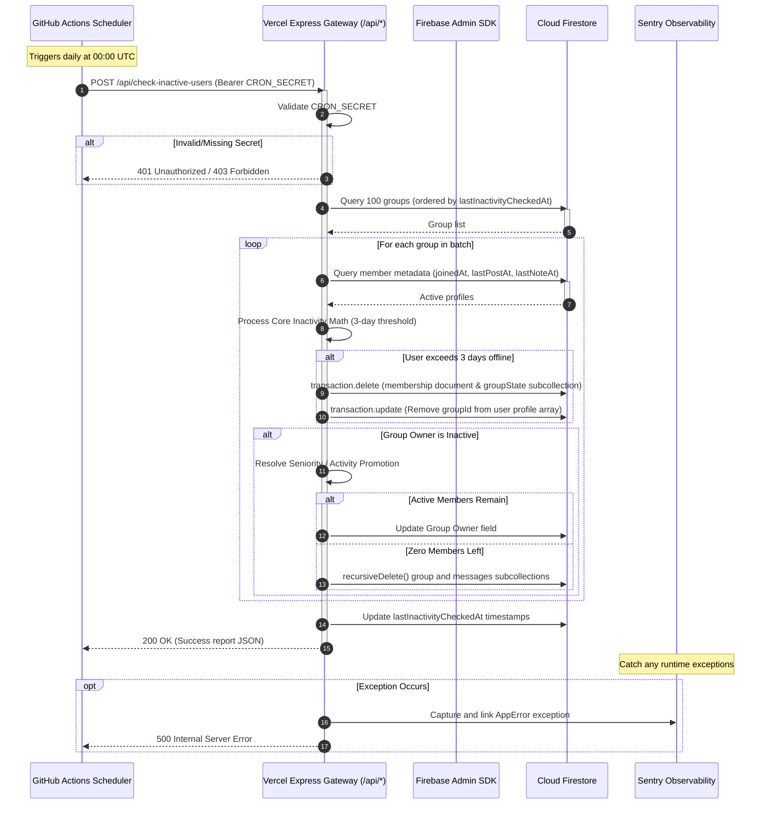

# CI/CD & Maintenance Automation: Pipeline Operations

This guide provides deep technical documentation for the continuous integration, continuous delivery (CI/CD), and scheduled serverless background jobs that orchestrate the **scripture-habit** platform.

---

## 🚀 1. Continuous Integration & Deployment (CI/CD)

The continuous integration pipeline is driven by **GitHub Actions** (`.github/workflows/ci.yml`). It runs on every push and pull request targeting the core branches (`main`, `master`, `develop`).

### 1.1 Environment Architecture
The runner environment uses a highly optimized setup to handle our advanced front-and-back stack requirements:
*   **Operating System**: `ubuntu-latest`
*   **Container**: `mcr.microsoft.com/playwright:v1.59.1-noble` (Includes pre-compiled native browser binaries matching our E2E environment requirements).
*   **Node.js**: `22.x` (Matching Capacitor 8 and ESM standards).
*   **Java Runtime (JDK)**: `21` (Required to run the Firestore and Firebase Auth Emulators locally).

### 1.2 Pipeline Steps & Fail-safes
The pipeline is designed with a strict "shift-left" validation structure:
1.  **Strict Install (`npm ci`)**: Ensures absolute package lock lockstep, downloading cached packages for speed.
2.  **Linting Guard (`npm run lint`)**: Validates React hook dependency matrices and TypeScript compliance. *(Configured to print errors but allow the pipeline to proceed locally for transition buffers).*
3.  **Vitest Suite (`npm test`)**: Executes unit and logic tests (e.g., Gospel Library Mapper translations and state-resets).
4.  **Backend Integration Tests (`npm run test:internal`)**: Spins up the Firestore Rules Suite and REST API integration suites inside the local Java Emulators.
5.  **Browser E2E Tests (`npm run test:e2e`)**: Executes Playwright E2E tests, including multi-lingual locale simulation and database isolation validation.
6.  **Playwright Artifact Capture**: On test failures, the HTML trace viewer contents are uploaded to the GitHub Artifact store, retaining traces for 30 days.

### 1.3 CD (Continuous Delivery) to Vercel
Upon a **successful** build on the primary production branch (`refs/heads/main` or `refs/heads/master`), the runner triggers automatic CD using the Vercel CLI:
```bash
npm install --global vercel@latest
vercel pull --yes --environment=production --token=$VERCEL_TOKEN
vercel deploy --prod --token=$VERCEL_TOKEN
```
This deploys the React client to static edge points and updates Vercel Serverless Functions (`api/api.ts` entry point).

---

## 🏃 2. Daily Cron Jobs & Scheduled Maintenance

To maintain high data quality, dynamic user purging, and statistics recovery without manual intervention, the platform schedules daily automated Cron runs.

### 2.1 Daily Inactivity Check (`check-inactive-users.yml`)
Runs every day at **00:00 UTC (9:00 AM JST)** via GitHub Actions scheduler. It targets the serverless gateway to scan, rotate, and kick inactive participants while executing ownership succession plans.

*   **Security Protocol**: Uses a shared Bearer secret (`CRON_SECRET`) configured securely in GitHub Secrets.
*   **Target URI**: `https://scripturehabit.app/api/check-inactive-users/`
*   **Execution Command**:
    ```bash
    curl -L -X POST "https://scripturehabit.app/api/check-inactive-users/" \
      -H "Authorization: Bearer ${{ secrets.CRON_SECRET }}" \
      -H "Content-Type: application/json"
    ```

### 2.2 Operational Flow Diagram

The following sequence diagram details how the GitHub Scheduler, Vercel Serverless Edge, Firestore, and Sentry logging interact during the daily maintenance run:



---

## 🔑 3. Essential Infrastructure Secrets & Configuration

To enable correct operation, ensure the following keys are registered in the GitHub Repository Secrets (`Settings > Secrets and variables > Actions`):

| Secret Key | Scope | Purpose |
| :--- | :--- | :--- |
| `VERCEL_TOKEN` | Continuous Delivery | API access token generated from your Vercel Account Settings to trigger CLI deploys. |
| `VERCEL_ORG_ID` | Continuous Delivery | Vercel Organization ID matching your corporate/personal scope. |
| `VERCEL_PROJECT_ID` | Continuous Delivery | Target Vercel Project ID associated with the scripture-habit deployment. |
| `CRON_SECRET` | Operations & Cron | Long random string (shared secret) to secure serverless endpoints against external invocation. |

> [!WARNING]
> Never commit production secret values to version control. Set them as GitHub Actions Secrets for remote execution, and local `.env.local` variables for local test dry-runs.
