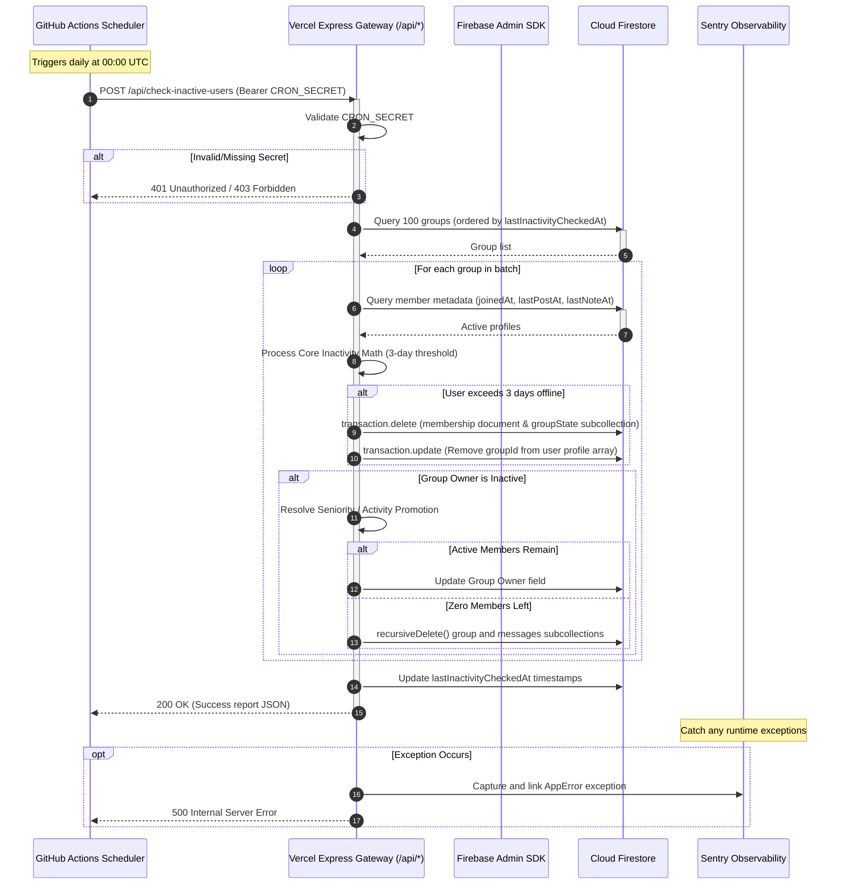

# CI/CD & Maintenance Automation

This guide explains the continuous integration, continuous delivery (CI/CD) pipelines, and scheduled background jobs for the **scripture-habit** platform.

---

## 1. Continuous Integration & Deployment (CI/CD)

Our CI pipeline runs on **GitHub Actions** (`.github/workflows/ci.yml`). It is triggered by any push or pull request to the `main`, `master`, or `develop` branches.

### 1.1 Runner Environment Setup
The runner environment uses the following setup:
*   **Operating System**: `ubuntu-latest`
*   **Container**: `mcr.microsoft.com/playwright:v1.59.1-noble` (Includes browser binaries for E2E tests).
*   **Node.js**: `22.x`
*   **Java Runtime (JDK)**: `21` (Required for Firestore and Firebase Auth Emulators).

### 1.2 Pipeline Steps
1. **Install Dependencies (`npm ci`)**: Installs exact package versions using cache for faster runs.
2. **Linting Check (`npm run lint`)**: Checks React hook dependencies and TypeScript rules.
3. **Unit Tests (`npm test`)**: Runs unit and logic tests via Vitest.
4. **Integration Tests (`npm run test:internal`)**: Runs Firestore rules and REST API tests inside local Firebase Emulators.
5. **E2E Tests (`npm run test:e2e`)**: Runs Playwright end-to-end tests.
6. **Artifact Capture**: On failure, uploads Playwright HTML trace reports (retained for 30 days).

### 1.3 CD (Continuous Delivery) to Vercel
When a build succeeds on the `main` or `master` branch, it automatically deploys to Vercel:
```bash
npm install --global vercel@latest
vercel pull --yes --environment=production --token=$VERCEL_TOKEN
vercel deploy --prod --token=$VERCEL_TOKEN
```
This deploys the frontend and updates Vercel Serverless Functions (`api/api.ts`).

---

## 2. Daily Cron Jobs & Scheduled Maintenance

The platform runs scheduled daily background jobs to keep database records clean and handle inactive users.

### 2.1 Daily Inactivity Check (`check-inactive-users.yml`)
This workflow runs daily at **00:00 UTC (9:00 AM JST)** via GitHub Actions. It triggers a serverless endpoint to scan for inactive group members and handle group ownership updates.

*   **Security Protocol**: Uses a shared Bearer secret (`CRON_SECRET`) configured securely in GitHub Secrets.
*   **Target URI**: `https://scripturehabit.app/api/check-inactive-users/`
*   **Execution Command**:
    ```bash
    curl -L -X POST "https://scripturehabit.app/api/check-inactive-users/" \
      -H "Authorization: Bearer ${{ secrets.CRON_SECRET }}" \
      -H "Content-Type: application/json"
    ```

### 2.2 Inactivity Check Sequence Diagram
The sequence diagram below shows how the inactivity check job runs:



---

## 3. Repository Secrets & Configuration

Ensure the following secrets are registered in GitHub (`Settings > Secrets and variables > Actions`):

| Secret Key | Scope | Purpose |
| :--- | :--- | :--- |
| `VERCEL_TOKEN` | Continuous Delivery | API access token generated from your Vercel Account Settings to trigger CLI deploys. |
| `VERCEL_ORG_ID` | Continuous Delivery | Vercel Organization ID matching your corporate/personal scope. |
| `VERCEL_PROJECT_ID` | Continuous Delivery | Target Vercel Project ID associated with the scripture-habit deployment. |
| `CRON_SECRET` | Operations & Cron | Long random string (shared secret) to secure serverless endpoints against external invocation. |

> [!WARNING]
> Never commit production secrets to Git. Use GitHub Secrets for CI/CD, and `.env.local` for local development.
