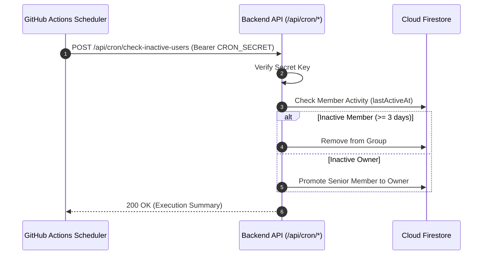

# CI/CD & Maintenance Automation

This document details GitHub Actions automated testing, continuous delivery pipelines, and scheduled maintenance workflows.

---

## 1. Continuous Integration & Delivery (CI/CD)

The GitHub Actions workflow (`.github/workflows/ci.yml`) runs quality checks and deploys updates on pushes to `main`.

### 1.1 Runner Environment
- **OS**: `ubuntu-latest`
- **Container**: `mcr.microsoft.com/playwright:v1.59.1-noble` (bundled browser binaries)
- **Node.js**: `24.x` (minimum requirement: `>= 22.0.0`)
- **Java**: `JDK 21` (runs Firebase Emulators)

### 1.2 Pipeline Steps
1. **Linter**: ESLint static code analysis (`npm run lint`)
2. **Quality & Consistency**: i18n coverage and backend integrity (`npm run check:all`)
3. **Unit Tests**: Vitest frontend and hook suites (`npm test`)
4. **Integration Tests**: Emulated API routes and security rules (`npm run test:internal`, `npm run test:rules`)
5. **E2E Tests**: Playwright browser automation (`npm run test:e2e:ci`)
6. **Vercel Continuous Delivery**: Automatic production deployments on successful merge to `main`

---

## 2. Scheduled Maintenance Workflows

### Daily Inactivity Scan (`check-inactive-users.yml`)
Dispatched daily at 00:00 UTC from GitHub Actions to prune dormant accounts and reassign group ownerships.

---

## 3. Secret Management

The following variables are configured under GitHub `Settings > Secrets and variables > Actions`:

| Secret Key | Purpose |
| :--- | :--- |
| `VERCEL_TOKEN` | API access token for automated Vercel deployments |
| `VERCEL_ORG_ID` | Vercel Organization ID |
| `VERCEL_PROJECT_ID` | Target Vercel Project ID |
| `CRON_SECRET` | Shared secret to authorize scheduled maintenance invocations |

---

## 4. Related Documentation

- [Testing Guide](./testing-guide.md)
- [Maintenance & Scheduled Jobs](./maintenance-cron.md)
- [Inactivity & Auto-Kick Rules](./inactivity-and-autokick.md)
