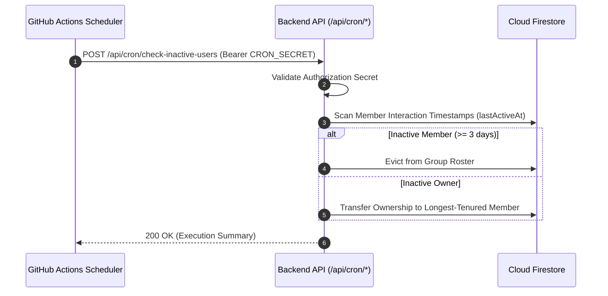

# CI/CD & Maintenance Automation

This document details the GitHub Actions automated quality pipeline, continuous delivery architecture, and scheduled background maintenance workflows in Scripture Habit.

---

## 1. Continuous Integration & Delivery (CI/CD)

The GitHub Actions workflow (`.github/workflows/ci.yml`) enforces automated quality gates on pull requests and deploys updates on pushes to `main`.

### 1.1 Runner Environment
- **OS**: `ubuntu-latest`
- **Container**: `mcr.microsoft.com/playwright:v1.59.1-noble` (bundled browser binaries)
- **Node.js**: `24.x` (minimum requirement: `>= 22.0.0`)
- **Java**: `JDK 21` (executes Firebase Emulators)

### 1.2 Pipeline Steps
1. **Static Analysis**: ESLint syntax and code hygiene verification (`npm run lint`)
2. **Consistency Audit**: i18n translation coverage and backend contract checks (`npm run check:all`)
3. **Unit Tests**: Vitest frontend and hook suites (`npm test`)
4. **Integration Tests**: Emulated API routes and security rules (`npm run test:internal`, `npm run test:rules`)
5. **E2E Tests**: Playwright browser automation (`npm run test:e2e:ci`)
6. **Continuous Delivery**: Automatic production deployments to Vercel on successful merge to `main`

---

## 2. Scheduled Maintenance Workflows

### Daily Inactivity Scan (`check-inactive-users.yml`)
Triggered daily at 00:00 UTC from GitHub Actions to prune dormant accounts and manage group ownership succession.

### Maintenance Scan Sequence Breakdown

1. **Secure Scheduled Invocation**  
   GitHub Actions issues an authorized HTTP POST with the `CRON_SECRET` bearer token.

2. **Roster Timestamp Audit**  
   The API scans member activity records against resolved inactivity thresholds.

3. **Atomic State Updates & Audit Log**  
   Executes roster evictions and ownership transfers in Firestore, returning an execution summary payload.

---

## 3. Secret Management

The following variables are managed in GitHub repository settings (`Settings > Secrets and variables > Actions`):

| Secret Key | Purpose |
| :--- | :--- |
| `VERCEL_TOKEN` | API access token for automated Vercel deployments |
| `VERCEL_ORG_ID` | Vercel Organization ID |
| `VERCEL_PROJECT_ID` | Target Vercel Project ID |
| `CRON_SECRET` | Shared secret to authorize scheduled maintenance endpoints |

---

## 4. Related Documentation

- [Testing Guide](./testing-guide.md)
- [Maintenance & Scheduled Jobs](./maintenance-cron.md)
- [Inactivity & Auto-Kick Engine](./inactivity-and-autokick.md)
