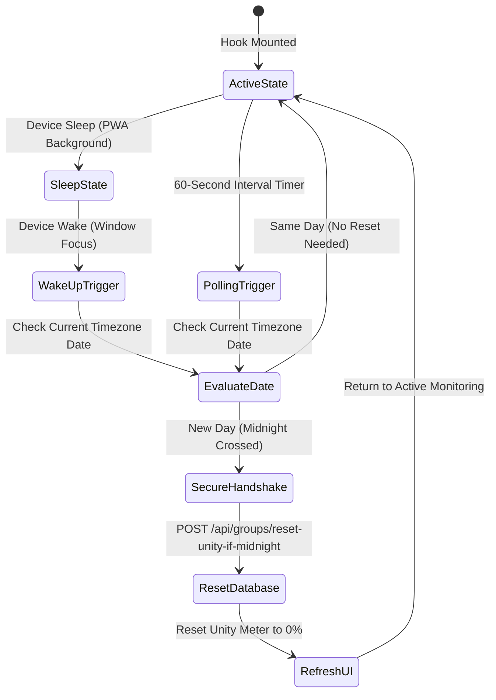

# Daily Unity Midnight Reset Hook

This document details the `useUnityMidnightReset` hook (`src/hooks/use-unity-midnight-reset.ts`), which detects local midnight transitions across group timezones and triggers backend daily activity resets.

---

## 1. Lifecycle & Sequence

The hook coordinates periodic interval timers and window focus listeners to detect midnight rollovers and reset group participation metrics:

---

## 2. Core Implementation Highlights

### ① Window Focus Listening
Because timers pause when devices sleep, the hook listens to `window.addEventListener('focus', ...)` to re-evaluate the date whenever the user reopens the app.

### ② Timezone-Aware Evaluation
Calculates the current date string (`YYYY-MM-DD`) within the group's assigned timezone and compares it against `dailyActivity.date` in Firestore.

### ③ Concurrency Locking
Uses React `useRef` locks (`isResettingRef`) to prevent redundant API dispatches when switching tabs rapidly.

---

## 3. Secure Reset API (`/api/groups/reset-unity-if-midnight`)

- **Auth & App Check Protected**: Verifies Firebase ID tokens and App Check headers before modifying group activity states.
- **Immediate UI Refresh**: Upon confirmation (`{ reset: true }`), executes the `onReset()` callback to reset the daily progress meter to 0%.

---

## 4. Related Documentation

- [Unity & Daily Participation](./unity-participation.md)
- [Chat & Dashboard Synchronization](./feature-chat-dashboard.md)
