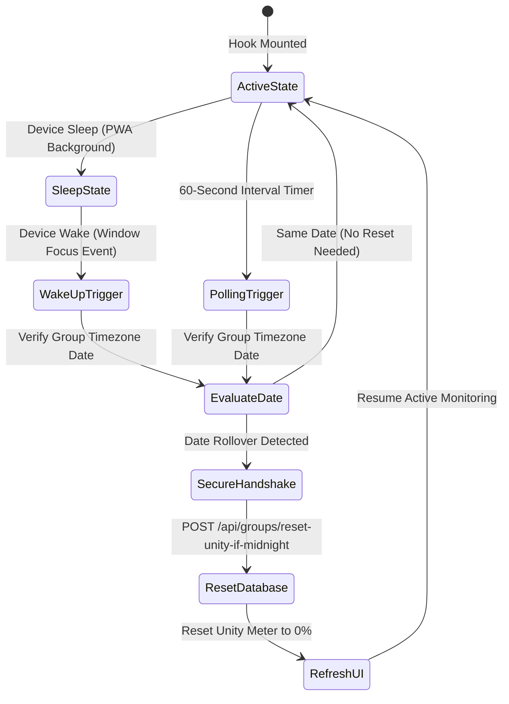

# Daily Unity Midnight Reset Hook

::: tip Interactive Architecture Tour
Explore the live data-flow blueprint and guided walkthrough for this feature:
- **Online (GitHub Browser Preview)**: [Open Interactive Tour (Habit Dashboard & Reset)](https://htmlpreview.github.io/?https://github.com/ScriptureHabit/scripture-habit/blob/main/docs/public/architecture-tour.html?tour=tour-dashboard&lang=en)
- **VitePress / Local**: [Open Habit Dashboard & Reset Tour](/architecture-tour.html?tour=tour-dashboard&lang=en)
:::

This document details the `useUnityMidnightReset` hook (`src/hooks/use-unity-midnight-reset.ts`), which detects local midnight transitions across group timezones and triggers backend daily activity resets in Scripture Habit.

---

## 1. Lifecycle & State Machine

The hook coordinates 60-second polling timers with browser window focus events to detect midnight date rollovers:

### State Machine Breakdown

1. **Dual Detection System**  
   Combines an active 60-second polling timer with `window.focus` listeners to capture midnight transitions occurring while the device is sleeping or tab is backgrounded.

2. **Timezone Date Comparison**  
   Resolves the current date string (`YYYY-MM-DD`) within the group's assigned timezone, comparing it with the cached `dailyActivity.date`.

3. **Concurrency Locking & Reset Dispatch**  
   Enforces a `useRef` lock (`isResettingRef`) to prevent duplicate API dispatches, calling `/api/groups/reset-unity-if-midnight` and resetting the UI meter to 0%.

---

## 2. Core Implementation Highlights

### ① Window Focus Listening
Because background timers throttle during device sleep, the hook attaches a `focus` event listener to re-evaluate the calendar date immediately upon app resumption.

### ② Timezone-Aware Evaluation
Calculates the current date string within the group's specific timezone (`group.timeZone`) rather than local device time.

### ③ Mutual Exclusion Locking
Employs React `useRef` locks to guard against race conditions caused by rapid tab switches.

---

## 3. Secure Reset API (`/api/groups/reset-unity-if-midnight`)

- **Authentication & App Check**: Verifies cryptographic signatures and bearer tokens prior to database modification.
- **Immediate Local Callback**: Upon receiving `{ reset: true }`, invokes the `onReset()` callback to reset the Unity progress bar immediately.

---

## 4. Related Documentation

- [Unity Participation Architecture](./unity-participation.md)
- [Chat & Dashboard Synchronization](./feature-chat-dashboard.md)
