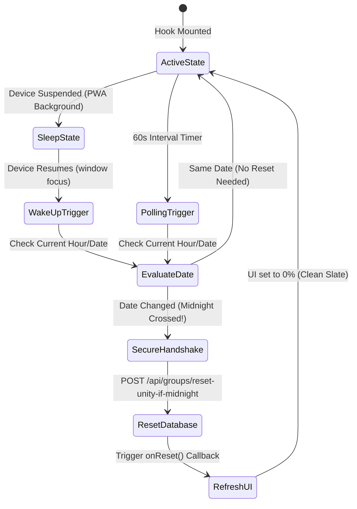

# Group Activity Midnight Reset Hook

The **scripture-habit** app uses the **`useUnityMidnightReset`** React hook (`src/hooks/use-unity-midnight-reset.ts`) to handle midnight resets across different timezones. When midnight passes in a group's configured timezone, the hook updates the client UI and securely triggers the backend database to reset the group's activity statistics for the new day.

---

## 1. Architectural Overview

The hook uses a combination of periodic checking (polling), app focus monitoring (on device wake-up), and secure API calls to reset the group's statistics at midnight.



---

## 2. Core Mechanisms

### 2.1 Active Focus & Device Wake-Up
On mobile devices and Progressive Web Apps (PWAs), users often lock their phones or leave the app in the background. In these suspended states, traditional timers like `setInterval` stop running. To handle this, the hook listens for when the app gains focus:
```typescript
window.addEventListener('focus', handleFocus);
```
When the user opens the app or returns to the tab, the `focus` event triggers a check. If a new day has started while the app was asleep, the reset runs immediately.

### 2.2 Timezone Date Calculations
To support global users, the hook converts the client's current time to the group's specific timezone:
1. Retrieve the group's configured time zone (e.g., `Asia/Tokyo`, `America/Denver`).
2. Format the client's current time into that time zone:
   ```typescript
   const todayStr = formatDateInTimeZone(new Date(), groupTimeZone);
   ```
3. Normalize the formatted date string to `YYYY-MM-DD` format.
4. Compare this date string with the group's last active date (`dailyActivity.date`) stored in Firestore:
   ```typescript
   if (normalizedActivityDate && normalizedActivityDate !== normalizedToday) {
       // MIDNIGHT CROSSED
   }
   ```

### 2.3 Double-Check Latching (Concurrency Control)
To prevent redundant network requests when the app is opened multiple times around midnight, the hook uses React `useRef` buffers:
- **`lastCheckedDateRef`**: Stores the last checked date. If the date has not changed, the hook skips the reset request.
- **`isResettingRef`**: A boolean flag that prevents duplicate reset requests while an API call is already running.

---

## 3. Secure API Reset Handshake

Since resetting data requires database write operations, the backend endpoint (`/api/groups/reset-unity-if-midnight`) requires validation. The client hook provides two verification headers when sending the reset request:

```
┌────────────────────────────────────────────────────────┐
│                   Secure HTTP Headers                  │
├─────────────────┬──────────────────────────────────────┤
│ Authorization   │ Bearer <Firebase ID Token (Auth)>    │
├─────────────────┼──────────────────────────────────────┤
│ X-AppCheck      │ <Firebase App Check JWT (Integrity)> │
└─────────────────┴──────────────────────────────────────┘
```

1. **User Authentication**: The hook gets a fresh ID token from Firebase Auth to verify the user is a member of the group:
   ```typescript
   const idToken = await currentUser.getIdToken();
   ```
2. **App Integrity**: The hook requests an App Check token to verify the app is genuine:
   ```typescript
   const tokenResponse = await getToken(appCheck, false);
   const appCheckToken = tokenResponse.token;
   ```
3. **Backend Validation**: The backend checks both the user authentication and App Check tokens before resetting the fields in Firestore.
4. **UI Update**: When the backend returns `{ reset: true }`, the hook calls `onReset()`, resetting the group's progress bar to `0%` in the UI.
