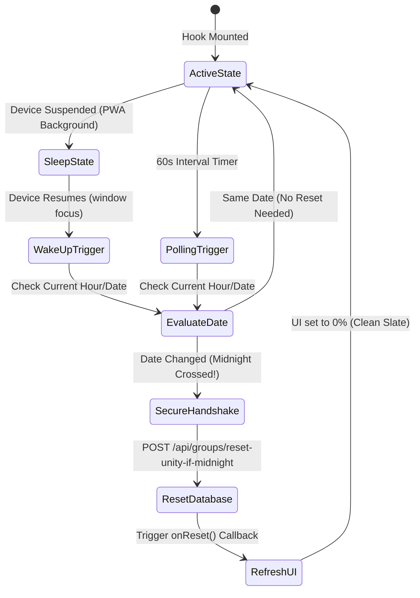

# Client-Side Unity Midnight Reset & Timezone-Warp Hook

To maintain real-time group solidarity indicators across global timezones, **scripture-habit** integrates a custom React hook **`useUnityMidnightReset`** (`src/hooks/use-unity-midnight-reset.ts`). 

This hook is responsible for managing client-side clock drift, mobile sleep states, and timezone-aligned calendar day-flips. It synchronizes client-side UI states and securely prompts the backend database to clear previous-day solidarity percentages as soon as midnight is crossed within the group's specific timezone.

---

## 🏗️ Architectural Overview

The hook combines sub-minute polling, OS lifecycle wake-up focus hooks, and a two-token secure gateway handshake to keep local clients and Firestore in complete alignment.



---

## ⚙️ Core Technical Mechanisms

### 1. Active Focus & PWA Wake-Up Sync
On mobile devices and PWAs, users often lock their screens or leave the app running in the background for hours. During suspension, CPU cycles are paused, which means traditional `setInterval` timers freeze.
To handle this, the hook registers a native browser focus listener:
```typescript
window.addEventListener('focus', handleFocus);
```
When the user unlocks their phone or returns to the browser tab, the `focus` event fires. The hook immediately bypasses the polling timer and executes an instantaneous check. If a calendar day-flip has occurred during sleep, the reset triggers instantly.

### 2. Timezone-Standardized Date Calculations
The hook standardizes the client's system clock into the group's custom timezone:
1. It retrieves the group's configured time zone (e.g. `'Asia/Tokyo'`, `'America/Denver'`).
2. It formats the client's current system time using the group's time zone:
   ```typescript
   const todayStr = formatDateInTimeZone(new Date(), groupTimeZone);
   ```
3. It normalizes all string structures to standard ISO `YYYY-MM-DD` strings via `normalizeDateString()`.
4. It compares this localized date string against the group's stored `dailyActivity.date` value in the Firestore document:
   ```typescript
   if (normalizedActivityDate && normalizedActivityDate !== normalizedToday) {
       // MIDNIGHT CROSSED
   }
   ```

### 3. Concurrency Protection & State Buffering
To prevent network spamming (which could be triggered if a user repeatedly opens and closes the app near midnight), the hook maintains two safety buffers using React `useRef`:
- **`lastCheckedDateRef`**: Caches the last normalized date checked today. If the current date matches the cached date, the function returns immediately without executing API calls.
- **`isResettingRef`**: Acts as a boolean latch (`true` during network activity). It blocks concurrent identical execution threads if a reset is already in-flight.

---

## 🚦 Secure Gateway Handshake

Since database resets cost write operations, the backend endpoint (`/api/groups/reset-unity-if-midnight`) must be heavily fortified against spoofing or unauthorized triggers. The client-side hook coordinates a two-token authentication handshake before dispatching the reset request:

```
┌────────────────────────────────────────────────────────┐
│                   Secure HTTP Headers                  │
├─────────────────┬──────────────────────────────────────┤
│ Authorization   │ Bearer <Firebase ID Token (Auth)>    │
├─────────────────┼──────────────────────────────────────┤
│ X-AppCheck      │ <Firebase App Check JWT (Integrity)> │
└─────────────────┴──────────────────────────────────────┘
```

1. **Authentication Token**: The hook fetches a fresh ID Token from Firebase Auth to verify the sender is a logged-in group member:
   ```typescript
   const idToken = await currentUser.getIdToken();
   ```
2. **App Check Verification Token**: If App Check is configured on the client, the hook invokes the App Check SDK to retrieve an attestation token:
   ```typescript
   const tokenResponse = await getToken(appCheck, false);
   const appCheckToken = tokenResponse.token;
   ```
3. **Gateway Dispatch**: The request is fired to the backend with both headers. The backend verifies the user's membership and confirms the App Check token is genuine before performing the atomic Firestore fields reset.
4. **Local Callback UI Refresh**: Once the backend responds with a success status (`{ reset: true }`), the hook fires the optional parent `onReset()` callback. This notifies the parent component to refresh Firestore listeners, instantly setting the group's unity progress bar to `0%` in the interface.
