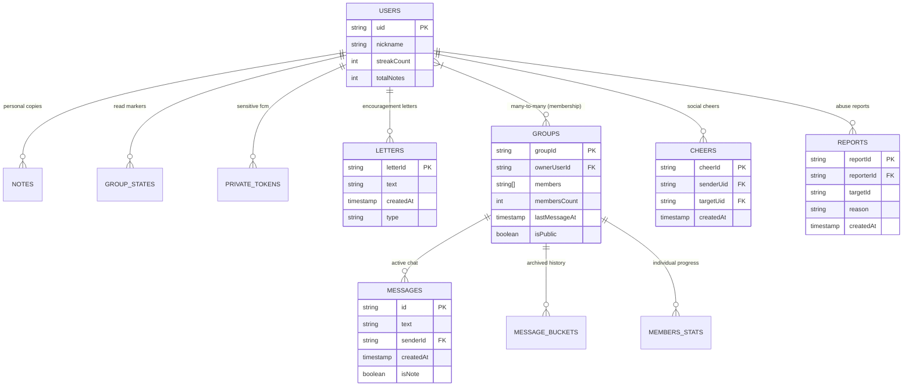

# Database & Schema Architecture

This document defines the data architecture, entity-relationship models, schema roadmaps, and high-concurrency database patterns used to maintain a highly scalable backend for **scripture-habit**.

---

## 📂 Entity-Relationship (ER) Blueprint

Our data model is hierarchical, balancing the need for real-time synchronization with long-term data persistence.



---

## 🗺️ Schema Roadmap & Denormalization

### 1. `groups` (The Center of Gravity)
* **Denormalization Strategy**: We store `memberPreviews` (nickname/photo) and `lastMessageAt` directly on the root group document. This allows the client dashboard to render active groups instantly without spawning sub-queries or secondary document fetches.
* **Activity Tracking**: `dailyActivity` stores a timestamped list of active UIDs to calculate group "Unity" without querying the entire message collection.

### 2. `users` (The Profile & Personal Sync)
* **Shared ID**: The document ID matches the Firebase Auth UID to prevent synchronization loops.
* **Redundancy**: `groupIds` (array) is maintained on the user document to allow fast index lookup queries when presenting the user's active groups.

### 3. Subcollections (Granular Data Isolation)
* **`/messages`**: Optimized for lightweight, real-time message stream listeners.
* **`/members`**: Stores per-group member statistics (study points, individual milestones) that are too large to fit in the main group document limits.

---

> [!IMPORTANT]
> ### 🛡️ Security Rules & Write Permissions Lockdown
> Detail specifications regarding gateway verification rules (`isAuthenticated()`, `isAppCheckVerified()`), dynamic membership lookups, and the backend-only write validation policies are documented inside **[Firebase Security Rules & Write Isolation](firebase-security-rules.md)**.
> All client mutation controls and atomic transaction routines are described inside **[Firestore Transactions & Counter Service Design](firestore-transactions-counters.md)**.

---

## 📦 Scalability: The Bucket Pattern (Chat Archiving)

To avoid Firestore's document-size limits (1MB per document) and keep real-time client syncs extremely lightweight, the application implements the **Bucket Pattern** for chat history.

```
       [ Client Chat Listener ] ─── Subscribed to ───► [ groups/{id}/messages ] (Active Space)
                                                                 │
                                                    (Automated Cron Sweeps)
                                                                 ▼
                                                [ groups/{id}/message_buckets/{bucketId} ]
                                                        (Archived Cold Storage)
```

### Mechanisms:
* **Active Collection**: High-frequency messages are stored in `/messages` and kept small.
* **Archiving Cron**: An automated cron job (`ArchiveService` triggered daily) sweeps messages older than 30 days and moves them into a bucketed subcollection `/message_buckets/{bucketId}`.
* **Bandwidth Savings**: The "active" chat listener remains lightweight, ensuring that `onSnapshot` listeners do not consume excessive cellular bandwidth or device memory on mobile apps.

---

## 🔐 Private Data Isolation

Sensitive user credentials and platform configuration tokens are completely isolated from general query pools:
`users/{uid}/private/tokens`

* **Isolation Policy**: Access to this subcollection is restricted at the database gateway. Neither group members nor group owners can peek into these documents. Only the Admin SDK and the owning user have credentials to read or write tokens.
