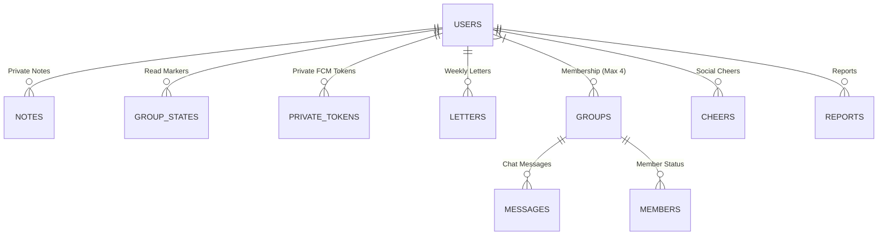
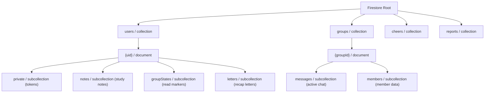

# Database & Security Architecture

This document defines the data architecture, Entity-Relationship (ER) model, collection hierarchy, and privacy boundaries for Cloud Firestore in Scripture Habit.

---

## 1. Entity-Relationship (ER) Model

---

## 2. Firestore Hierarchical Path Layout

---

## 3. Schema Design & Denormalization

1. **Groups Collection (`groups/{groupId}`)**:
   - Stores `memberPreviews` (nicknames and avatars) directly in the parent document to render dashboard cards without extra reads.
   - Stores `dailyActivity` (list of today's active poster UIDs) to calculate group completion instantly without querying chat logs.
2. **Users Collection (`users/{uid}`)**:
   - Mirrors active `groupIds` array on the user document for single-query membership lookups.

---

## 4. Automated Chat Retention (Firestore Native TTL)

To prevent unbounded document growth and keep real-time listeners lightweight, messages are written with an `expireAt` timestamp (30 days from creation).
Cloud Firestore's **Time-to-Live (TTL)** engine automatically deletes expired message documents in the background.

---

## 5. Private Token Isolation

Sensitive tokens (e.g. FCM push tokens) are strictly isolated in the `users/{uid}/private/tokens` subcollection.
Firestore Security Rules ensure only the authenticated user (`request.auth.uid == uid`) and backend Admin SDK can access these credentials.

---

## 6. Related Documentation

- [Firebase Security Rules](./firebase-security-rules.md)
- [Firestore Transactions & Counters](./firestore-transactions-counters.md)
- [Architecture Overview](./architecture.md)
