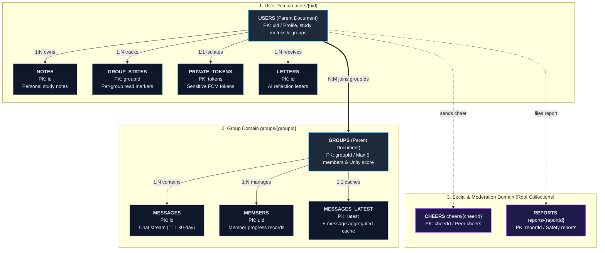
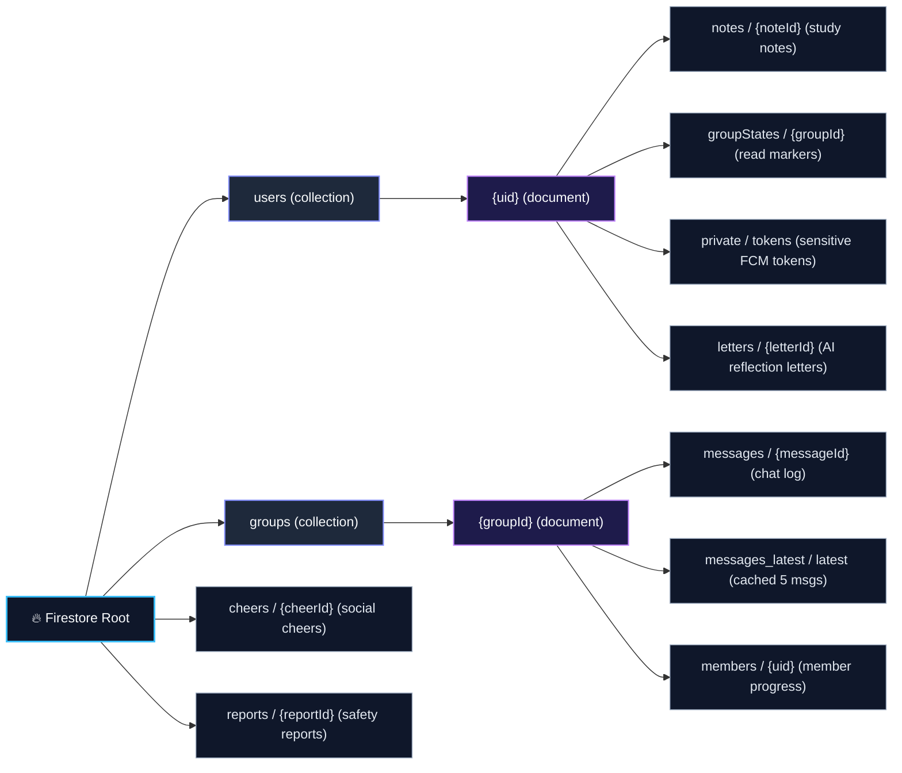

# Database & Security Architecture

This document defines the Cloud Firestore data architecture, Entity-Relationship (ER) model, collection hierarchy, denormalization strategies, and privacy isolation boundaries in Scripture Habit.

---

## 1. Entity-Relationship (ER) Model

The structural relationship between primary Firestore collections and subcollections:

### ER Model Breakdown

1. **User Domain (`users/{uid}`)**  
   Encapsulates personal profile attributes and study metrics. Subcollections partition personal study notes (`notes`), per-group read markers (`groupStates`), AI-generated reflections (`letters`), and device notification tokens (`private/tokens`) into clear ownership scopes.

2. **Group Domain (`groups/{groupId}`)**  
   Maintains micro-circles capped at 5 members. The parent document coordinates metadata and Unity scores, while subcollections house the message stream (`messages`), membership states (`members`), and preview cache aggregates (`messages_latest`).

3. **Social & Moderation Domain (`cheers`, `reports`)**  
   Cross-cutting events such as peer encouragements and moderation reports reside in independent root collections to decouple operational lifecycles from user documents.

---

## 2. Collection Schema Specifications

### 2.1 User Domain (`/users/{uid}`)

| Collection / Path | Primary Fields | Type | Description & Constraints |
| :--- | :--- | :--- | :--- |
| **`users/{uid}`** (Parent Document) | `uid` (PK) `nickname` `email` `photoURL` `bio` `stake` / `ward` `language` `timeZone` `streakCount` `highestStreak` `daysStudiedCount` `totalNotes` `studiedDates` `groupIds` `groupId` `kickThreshold` `hasFcmToken` `hasCompletedOnboarding` `lastPostAt` `createdAt` | string string string string string string string string number number number number string[] string[] string number boolean boolean timestamp timestamp | Firebase Auth UID Display nickname (max 50 chars) Account email address Profile avatar image URL Biography (max 500 chars) Church stake and ward names UI language code (`en`, `ja`, `es`, etc.) User operational timezone (IANA format) Current active study streak in days All-time highest streak record Cumulative days studied count Total study notes created count List of studied dates (YYYY-MM-DD) Joined group ID array (max 4 groups) Currently selected active group ID Inactivity auto-kick threshold (1-30 days) Denormalized flag for rapid FCM eligibility checks Onboarding completion flag Timestamp of last note creation Account creation timestamp |
| **`users/{uid}/notes/{noteId}`** (Subcollection) | `id` (PK) `userId` (FK) `scripture` `chapter` `title` / `speaker` `comment` `text` `shareOption` `sharedWithGroups` `sharedMessageIds` `searchTokens` `createdAt` `editedAt` | string string string string string string string enum string[] map string[] timestamp timestamp | Note UUID Author User UID Scripture category (`Book of Mormon`, `New Testament`, etc.) Chapter reference (e.g., `1 Nephi 1:1`) General Conference / Talk title & Speaker Personal study reflections Composite text for full-text token search Sharing scope (`all`, `current`, `specific`, `none`) Target group IDs where note is published Map of `groupId -> messageId` Prefix search token array Creation timestamp Last edited timestamp |
| **`users/{uid}/groupStates/{groupId}`** (Subcollection) | `groupId` (PK) `readMessageCount` `lastReadAt` `lastActiveAt` `updatedAt` | string number timestamp timestamp timestamp | Target Group ID Read message count (for unread badge calculation) Timestamp of last read message Timestamp of last active interaction in group State update timestamp |
| **`users/{uid}/private/tokens`** (Private Subcollection) | `docId` (PK: `'tokens'`) `fcmTokens` `updatedAt` | string string[] timestamp | Fixed document ID Array of active FCM push notification tokens Last token synchronization timestamp |
| **`users/{uid}/letters/{letterId}`** (Subcollection) | `id` (PK) `title` `content` `type` `read` `createdAt` | string string string string boolean timestamp | Letter Document ID Letter subject/title AI reflection letter or developer welcome body `developer_welcome` or `weekly_reflection` Read status flag Generation timestamp |

---

### 2.2 Group Domain (`/groups/{groupId}`)

| Collection / Path | Primary Fields | Type | Description & Constraints |
| :--- | :--- | :--- | :--- |
| **`groups/{groupId}`** (Parent Document) | `groupId` (PK) `name` `description` `ownerUserId` (FK) `members` `membersCount` `maxMembers` `isPrivate` `isAiGroup` `isDemoGroup` `inviteCode` `inviteCodeExpiresAt` `previousInviteCodes` `dailyActivity` `memberPreviews` `memberLastActive` `memberLastReadAt` `memberKickThresholds` `timeZone` `lastMessageAt` `lastMessageText` `createdAt` | string string string string string[] number number boolean boolean boolean string timestamp string[] map array map map map string timestamp string timestamp | Group Document ID (auto-generated) Group name (max 100 chars) Group description (max 1000 chars) Creator User UID Array of member UIDs (max 5) Current member count Capacity limit (fixed at 5) Private group visibility flag AI companion presence flag Demo sandbox flag 6-character invite code Invite code expiration date (null = permanent) History of previous valid invite codes Today's active poster records `{ date: 'YYYY-MM-DD', activeMembers: [] }` Denormalized previews (`memberPreviews: MemberPreview[]`) Last active timestamp per member (`UID -> timestamp`) Last read timestamp per member (`UID -> timestamp`) Inactivity threshold per member (`UID -> number`) Group operational timezone Timestamp of latest message Preview text snippet of latest message Group creation timestamp |
| **`groups/{groupId}/messages/{messageId}`** (Subcollection) | `id` (PK) `groupId` (FK) `senderId` (FK) `senderNickname` `senderPhotoURL` `text` `messageType` `isNote` `scripture` `chapter` `originalNoteId` (FK) `replyTo` `reactions` `reactionPreviews` `translations` `createdAt` `expireAt` | string string string string string string enum boolean string string string map map map map timestamp timestamp | Message Document ID Parent Group ID Sender User UID Sender display name Sender avatar URL Message text body (max 2000 chars) `text`, `studyNote`, `userJoined`, `unityAnnouncement` etc. Synchronized note flag Scripture category (when note) Chapter reference (when note) Original User Note ID (when note) Quoted reply metadata Emoji reaction map (`emoji -> string[]`) Reaction avatar previews map Multilingual translation cache (`lang -> text`) Post timestamp **Firestore TTL auto-expiration timestamp (30 days from creation)** |
| **`groups/{groupId}/members/{uid}`** (Subcollection) | `userId` (PK) `nickname` `photoURL` `status` `readMessageCount` `lastActive` `lastReadAt` `joinedAt` `kickThreshold` | string string string enum number timestamp timestamp timestamp number | Member User UID Denormalized display name Denormalized avatar URL `active`, `idle`, `kicked` Read message count Last action timestamp Last read timestamp Join timestamp Personal kick threshold in days |
| **`groups/{groupId}/messages_latest/latest`** (Subcollection) | `docId` (PK: `'latest'`) `messages` | string Message[] | Fixed document ID Array of 5 most recent message snapshots (Strategy B instant preview cache) |

---

### 2.3 Social & Moderation Domain (Root Collections)

| Collection / Path | Primary Fields | Type | Description & Constraints |
| :--- | :--- | :--- | :--- |
| **`cheers/{cheerId}`** | `cheerId` (PK) `senderUid` (FK) `targetUid` (FK) `groupId` (FK) `createdAt` | string string string string timestamp | Cheer event ID Sender User UID Target receiver User UID Associated Group ID Sent timestamp |
| **`reports/{reportId}`** | `reportId` (PK) `messageId` (FK) `reporterId` (FK) `reportedUserId` (FK) `reason` `createdAt` | string string string string string timestamp | Report ID Reported message ID Reporter User UID Reported User UID Report reason (max 1000 chars) Report submission timestamp |

---

## 3. Firestore Hierarchical Path Layout

Hierarchical mapping of root collections, parent documents, and subcollections:

### Hierarchical Path Breakdown

1. **User Subcollection Nesting**  
   Consolidating personal data under `users/{uid}` simplifies Security Rules to `request.auth.uid == uid`, preventing cross-tenant access at the structural level.

2. **Group Scoping & Cache Separation**  
   Nesting `messages` under `groups/{groupId}` ensures live listeners are constrained to group members, while isolating `messages_latest/latest` minimizes document read volume during initial dashboard rendering.

---

## 4. Schema Design & Denormalization

1. **Groups Collection (`groups/{groupId}`)**:
   - `memberPreviews`: Embeds nicknames and avatars directly in the parent document to render dashboard cards without auxiliary queries.
   - `dailyActivity`: Embeds today's active poster UIDs to compute Unity scores in $O(1)$ time without scanning chat history.
2. **Users Collection (`users/{uid}`)**:
   - Maintains an array of joined `groupIds` on the parent document for single-query membership lookups.

---

## 5. Automated Chat Retention (Firestore Native TTL)

To prevent unbounded storage growth and keep real-time listeners lightweight, messages are written with an `expireAt` timestamp (30 days from creation).
Cloud Firestore's **Time-to-Live (TTL)** engine automatically removes expired documents in the background.

---

## 6. Private Token Isolation

Sensitive tokens (e.g., FCM push tokens) reside strictly within the `users/{uid}/private/tokens` subcollection.
Firestore Security Rules enforce that only the authenticated owner (`request.auth.uid == uid`) and backend Admin SDK can access these credentials.

---

## 7. Related Documentation

- [Firebase Security Rules](./firebase-security-rules.md)
- [Firestore Transactions & Counters](./firestore-transactions-counters.md)
- [Architecture Overview](./architecture.md)
