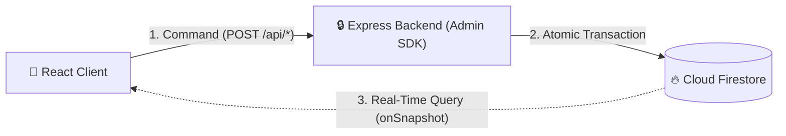

# ADR-001: CQRS Architecture with Real-Time Subscriptions & Backend-Enforced Mutations

## Status
Accepted

## Date
2026-04-10

## Context
Scripture Habit is a collaborative scripture study platform featuring real-time group chat, daily study note sharing, habit milestone celebrations, and group membership governance (e.g. strict 5-member limit per group, auto-kick after 3 days of inactivity).

Firebase Firestore provides both a Client SDK (which allows direct reads/writes from the browser) and an Admin SDK (for privileged server execution). A naive Firebase application uses direct client writes with Firestore Security Rules.

However, Scripture Habit has complex domain constraints:
1. **Study Streak & Unity Integrity**: A single note submission updates user study stats, daily reading calendars, group unity scores, and triggers group announcements atomically.
2. **Strict Capacity Limits**: Circles are capped at 5 active members to prevent the bystander effect. Concurrent joins must never exceed this capacity.
3. **Automated Housekeeping**: Inactivity timeouts and leader succession require trusted transaction isolation.
4. **Data Tampering Protection**: Clients must not be able to artificially inflate their milestone counts or modify others' messages.

## Decision
Adopt a **Command Query Responsibility Segregation (CQRS)** architecture:
- **Read Path (Query)**: The frontend client directly subscribes to Firestore collections and documents using the Firebase Client SDK (`onSnapshot`) with multi-tab persistent IndexedDB caching. Reads are guarded by Firestore Security Rules (`isAuthenticated()`, member access checks).
- **Write Path (Command)**: All mutations (note creation, message posting, joining/leaving groups, updating profile) MUST go through an authenticated serverless backend API (Express on Vercel Functions). The backend uses the Firebase Admin SDK inside atomic transactions to enforce all business rules and invariants before committing.

## Alternatives Considered

### 1. Direct Client Writes with Complex Firestore Security Rules
- **Pros**: Zero backend server overhead; lower operational complexity initially.
- **Cons**: Firestore Security Rules do not support complex procedural business logic, multi-document distributed updates across unrelated collections, or external integrations (e.g. FCM push notifications, AI generation).
- **Why Rejected**: Security rules quickly become unmaintainable and cannot safely handle race conditions during concurrent group joins or atomic streak calculations.

### 2. Traditional Full REST API (Read & Write through Express)
- **Pros**: Centralized control over all database operations; completely agnostic to Firestore client SDK.
- **Cons**: Loses Firestore's native zero-latency real-time listener capability (`onSnapshot`), requiring complex WebSocket server infrastructure or aggressive polling that drains mobile battery.
- **Why Rejected**: Increased latency and hosting costs; forfeits Firestore's strongest feature (real-time offline-first sync).

### 3. GraphQL Subscription Architecture
- **Pros**: Precise client data querying and typed mutations.
- **Cons**: High operational overhead to deploy and maintain Apollo Server / subscriptions on serverless infrastructure.
- **Why Rejected**: Excessive complexity for a lightweight study habit application.

## Consequences

### Positive
- **High Data Integrity**: All business logic (capacities, streaks, milestones, unread counters) runs in trusted Node.js environments using ACID transactions.
- **Instant Real-Time UI**: Client listens to Firestore updates via native WebSockets; local cache provides instantaneous reads.
- **Simplified Security Rules**: Security rules focus strictly on read authorization and lock down client-side writes, reducing the attack surface.

### Negative / Trade-offs
- **Backend Deployment Requirement**: Requires maintaining and deploying serverless API functions alongside static frontend hosting.
- **Two Authentication Layers**: The backend must verify Firebase ID tokens on every request using `auth.verifyIdToken()` middleware.
