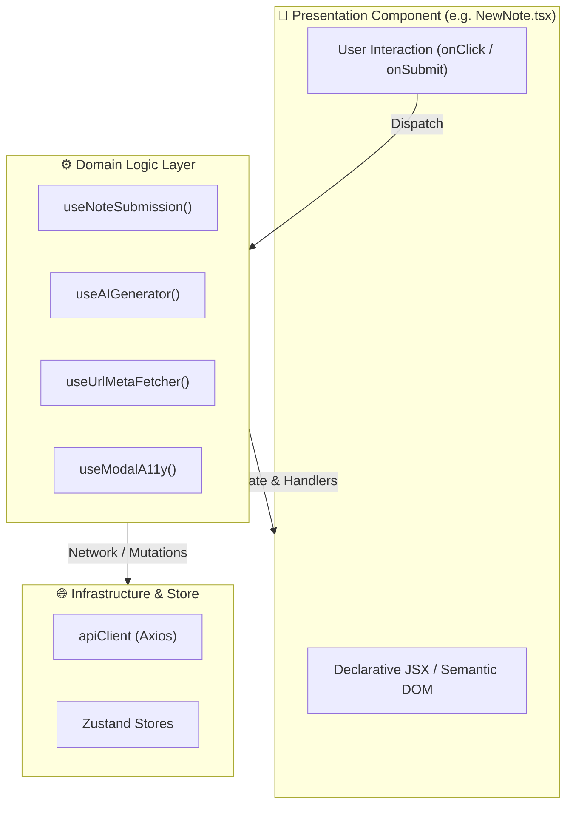

# ADR-002: Frontend Logic-Component Split via Dedicated Custom Hooks

## Status
Accepted

## Date
2026-05-15

## Context
In modern React development (React 19), single-file components frequently degrade into monoliths exceeding 800–1200 lines when form state, asynchronous API interactions, optimistic UI handling, accessibility bindings, and modal lifecycles are co-located in the rendering file.

In early iterations of Scripture Habit, components like `GroupChat`, `NewNote`, and `Dashboard` grew bloated and difficult to test because business logic, keyboard listeners, and JSX were intertwined.

## Decision
Enforce a strict architectural boundary between **Logic (Hooks)** and **Presentation (Components)**:

1. **Presentation Layer (`src/components/`)**:
   - Components are responsible **only** for layout, rendering, semantic HTML, and mapping user interactions (clicks, keyboard events) to hook callbacks.
   - Files should ideally stay under 200–300 lines of code.
   - Components must not make raw `apiClient.post` or Firestore calls directly.
2. **Logic Layer (`src/hooks/` and `src/components/*/hooks/`)**:
   - All state management (`useState`, `useReducer`), asynchronous side-effects (`useEffect`), and API orchestrations reside exclusively within custom hooks (e.g. `useNoteSubmission`, `useAIGenerator`, `useGroupActions`, `useModalA11y`).
   - Hooks expose clean, declarative interfaces: data, loading/error states, and action dispatchers.
3. **Subcomponent Decomposition**:
   - Complex dialogs or composite views are broken down into subcomponents within a dedicated `subcomponents/` or `components/` folder co-located with the feature.

## Alternatives Considered

### 1. Global State for Everything (Redux / Heavy Zustand)
- **Pros**: All state resides in centralized stores.
- **Cons**: High boilerplate; moves local ephemeral UI state (e.g. dropdown open, input focus) into global scope, complicating cleanup and leading to unnecessary re-renders.
- **Why Rejected**: Domain hooks provide localized encapsulation with zero boilerplate, while Zustand is preserved for true cross-component globals (e.g. active modal, current user).

### 2. Co-located Monolithic Components
- **Pros**: Everything is visible in one file without jumping between directories.
- **Cons**: High cognitive load, fragile refactoring, difficult to unit test without rendering massive component trees, violating Single Responsibility Principle.
- **Why Rejected**: Leads to regression-prone code and slows down development.

## Consequences

### Positive
- **Independent Testability**: Domain hooks can be thoroughly unit-tested using `@testing-library/react`'s `renderHook()` without mounting complex DOM trees or mocking rendering CSS.
- **Cognitive Clarity**: A developer reading `new-note.tsx` immediately grasps the structure without scrolling through hundreds of lines of async fetch handling.
- **Reusability**: Core logic like `useModalA11y` or `useApiWarmupOnMount` can be shared across disparate modals without duplicating event listeners.

### Negative / Trade-offs
- **File Proliferation**: A single feature may comprise 4–6 smaller files (main component, hooks, subcomponents) instead of one large file.
- **Indirection**: Tracing an action requires opening the corresponding hook file.
