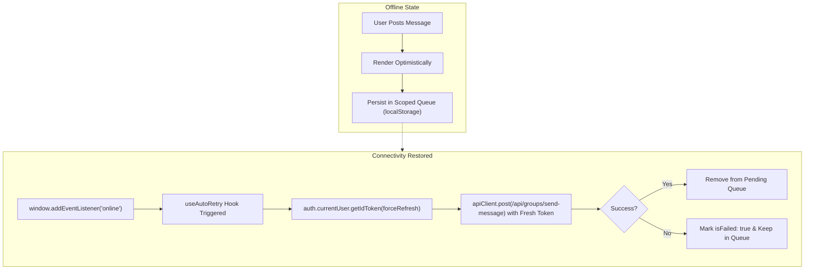

# ADR-003: Application-Level Scoped Message Queuing over Workbox BackgroundSync

## Status
Accepted

## Date
2026-09-22

## Context
Scripture Habit is designed for real-world study habits, including commuters reading scriptures on subways or flights with intermittent cellular connectivity. When a user submits a study reflection or chat message while offline, they expect:
1. Instant visual feedback (optimistic UI rendering).
2. Reliable delivery once internet connectivity is restored.
3. Transparent failure and retry controls if delivery fails repeatedly.

Workbox provides a `BackgroundSyncPlugin` that catches failed network requests and replays them when the browser triggers the `sync` event.

However, all API mutation requests in Scripture Habit (`/api/*`) are secured by Firebase Authentication using short-lived JWTs (Firebase ID tokens) with a **1-hour expiration time**.

If Workbox serializes a failed raw `Request` to IndexedDB and replays it 4 hours later, the HTTP request will contain an **expired `Authorization: Bearer <token>`**, causing the backend to reject it with `401 Unauthorized`. Workbox does not natively support asynchronous token refresh before replaying cached requests.

## Decision
1. **De-register Workbox `BackgroundSyncPlugin` on authenticated `/api/` mutations**:
   - The Service Worker (`src/sw.ts`) is dedicated strictly to shell precaching, static asset caching, and notification click routing. It does not intercept or replay authenticated mutation requests.
2. **Implement Application-Level Offline Queuing**:
   - Maintain pending and failed messages in `localStorage` scoped strictly by `userId` and `groupId` (`src/utils/offline-chat-queue.ts`).
   - Use custom React hooks (`useAutoRetry.ts`, `useMessageActions.ts`) that reactively monitor connectivity (`online` event) and call `auth.currentUser.getIdToken()` to acquire a **fresh, valid ID token** before retrying.
   - Automatically purge legacy unscoped storage keys upon access to prevent cross-account message leakage on shared devices.

## Alternatives Considered

### 1. Workbox BackgroundSync with Custom Replay Callback
- **Pros**: Automatic background execution even after the PWA tab is closed.
- **Cons**: Service workers in many browsers (e.g. Safari on iOS) do not support the Background Sync API (`SyncManager`), or severely throttle background tasks. Intercepting and modifying headers inside the Workbox sync loop is complex and fragile.
- **Why Rejected**: Fails silently on iOS Safari and produces 401 token expiry crashes on extended offline periods.

### 2. Pure Online-Only with Immediate Error
- **Pros**: Simplest implementation.
- **Cons**: Very frustrating user experience for users writing reflective study thoughts on mobile in transit; leads to lost notes.
- **Why Rejected**: Contradicts the project's goal of fostering a daily study habit in everyday conditions.

## Consequences

### Positive
- **Zero Token Expiry Failures**: Requests are re-authenticated with fresh Firebase ID tokens at the moment of retry.
- **Cross-Platform Parity**: Works identically across desktop browsers, iOS Safari, Android Chrome, and Capacitor native builds without depending on vendor-specific Service Worker background sync APIs.
- **Privacy & Hygiene**: User-scoped keys (`scripture_habit_pending_msgs_${userId}_${groupId}`) prevent message leakage between different accounts using the same browser.

### Negative / Trade-offs
- **Tab Lifecycle Dependency**: Retries occur while the web app is open or when it is reopened, rather than executing invisibly while the app is closed.
