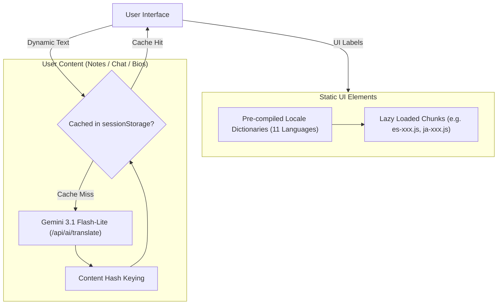

# ADR-004: Hybrid Multilingual Strategy: Static i18n Dictionaries & On-Demand AI Translation

## Status
Accepted

## Date
2026-06-20

## Context
Scripture Habit is used by an international community spanning 11 languages (`en`, `ja`, `es`, `pt`, `ko`, `it`, `vi`, `th`, `tl`, `sw`, `zho`). In diverse study groups, members frequently share reflections in different languages (e.g. Japanese, Portuguese, English) within the same chat group.

Building a multi-language experience presents two distinct challenges:
1. **Static UI Internationalization**: Buttons, labels, notifications, and navigation require instantaneous, zero-latency rendering without recurring API costs or network dependency.
2. **Dynamic User-Generated Content**: User reflections, profile bios, and nicknames require natural, context-aware translations that understand religious and scripture terminology.

## Decision
Adopt a **Hybrid Multilingual Architecture**:

1. **Static UI Layer**:
   - Compile comprehensive TypeScript translation dictionaries in `src/locales/`.
   - Use dynamic ES module imports with code-splitting (`/assets/<lang>-*.js`) so a user loading Japanese only downloads the Japanese dictionary chunk, minimizing bundle size and initial load time.
   - Enforce 100% key parity via automated pre-commit and CI verification scripts (`npm run check:i18n`).
2. **Dynamic User Content Layer**:
   - Translate user notes, messages, and profile fields on demand via Gemini 3.1 Flash-Lite (`/api/ai/translate`).
   - Use content-hash caching in `sessionStorage` (e.g. `trans_user_bio_${userId}_${lang}_${contentHash}`) to avoid redundant API round-trips and cost.
   - Fall back to the original text if the translation service is unavailable or offline.

## Alternatives Considered

### 1. Cloud Translation API (Google Cloud Translation Basic / Advanced)
- **Pros**: Dedicated translation API, low latency.
- **Cons**: Charged per character without contextual understanding. Translating scripture passages literally often loses theological nuance (e.g. LDS-specific terms like "Stake", "Ward", "Doctrine and Covenants").
- **Why Rejected**: LLMs (Gemini 3.1 Flash-Lite) produce significantly more natural and reverent translations with prompt tuning for LDS terminology at lower overall cost.

### 2. Full Machine Translation of All Database Records on Write
- **Pros**: Translating once on submission makes subsequent reads instant.
- **Cons**: Exponential database storage bloat (11 translations per note) and massive API costs for languages that no group member will ever view.
- **Why Rejected**: On-demand user translation with client-side caching only incurs costs when an actual reader requests the translation.

## Consequences

### Positive
- **Optimal Web Performance**: Static UI strings load instantly with zero API overhead and no Lighthouse impact.
- **Natural Scripture Context**: Gemini translations respect scripture chapter formatting and respectful vernacular.
- **Cost Efficiency**: Content hashing ensures identical notes or repeatedly viewed profiles never incur duplicate translation costs within a session.

### Negative / Trade-offs
- **Initial Translation Latency**: First-time translation of a long note takes ~500–1200ms while the LLM generates the output.
