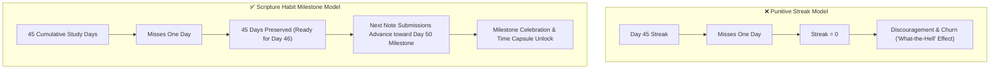

# ADR-005: Cumulative Milestone Habit Model over Punitive Streak Resets

## Status
Accepted

## Date
2026-07-01

## Context
Traditional habit tracking apps (e.g. Duolingo, Habitica, GitHub commit streaks) center their gamification around **consecutive-day streaks**. If a user studies for 45 consecutive days and misses day 46 due to illness, travel, or family emergencies, their streak drops immediately to **0**.

Behavioral psychology research demonstrates that this zero-reset pattern triggers the **"What-the-Hell Effect"** (the abstinence violation effect):
- Once the fragile streak is broken, the perceived cost of missing day 47 drops to zero.
- The user experiences feelings of guilt, failure, and discouragement rather than joy.
- In practice, a broken streak is the single largest driver of permanent churn in daily study applications.

For scripture study—an activity rooted in spiritual uplift, personal reflection, and grace—a punitive gamification system directly contradicts the core mission of the project.

## Decision
Design the entire progression architecture around **Cumulative Consistency & Milestone Celebrations**:

1. **Cumulative Study Days (Never Resets to 0)**:
   - A user's total study days (`studyDays`) increases monotonically every day they record a reflection.
   - Missing a day does **not** erase past effort. The count remains preserved.
2. **Consecutive Days as a Secondary Metric**:
   - Consecutive streaks are tracked alongside cumulative days for personal encouragement, but are decoupled from level progression or access to features.
3. **Discrete Milestone Celebrations & Time Capsules**:
   - Meaningful milestones (Day 10, Day 25, Day 50, Day 100...) unlock celebratory badges, confetti animations, and reflection features (e.g. Letters to Future Self / Time Capsules).
4. **Group Unity Participation**:
   - Rather than judging individual members, small circles (max 5) focus on collective daily participation (Unity score), encouraging members to cheer each other on without shame.

## Alternatives Considered

### 1. Paid / Earned Streak Freezes (Duolingo Model)
- **Pros**: Users can protect their streak if they anticipate missing a day.
- **Cons**: Commercializes habit tracking; creates anxiety around maintaining a currency of "freezes"; still causes churn if multiple consecutive days are missed.
- **Why Rejected**: Creates perverse incentives and anxiety around scripture study.

### 2. No Tracking at All (Pure Freeform Journal)
- **Pros**: Completely pressure-free.
- **Cons**: Without tangible sense of progress or milestones, users lack visible evidence of growth, leading to gradual disengagement.
- **Why Rejected**: Gentle gamification and milestones significantly increase long-term habit formation when framed supportively.

## Consequences

### Positive
- **Long-Term User Retention**: Users who take breaks (vacations, busy work weeks) return to the app without dread because their historical progress is intact.
- **Spiritual Alignment**: Emphasizes continuous striving, grace, and steady accumulation over mechanical perfectionism.
- **Community Encouragement**: Groups cheer for cumulative milestones rather than policing missed days.

### Negative / Trade-offs
- **Algorithm Complexity**: Calculating milestone thresholds and pace requires tracking both continuous windows and cumulative records in Firestore counters.
