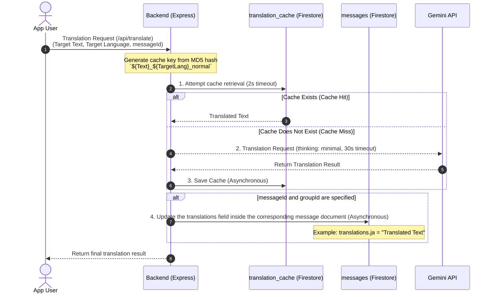
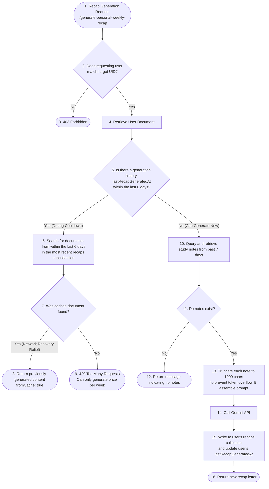

# 🔬 Detailed Explanation: AI (Gemini) Integration, Dynamic Translation, and Weekly Recap Pipeline

This document provides a detailed explanation of the backend implementation and architecture of Scripture Habit's multi-language features: **"AI (Gemini)-powered Note Translation"**, **"Weekly Recap Generation"** for personalizing study habits, and **"Automated Discussion Topic Generation"** to foster community engagement.

---

## ⚡ Common Gemini API Call Design

AI calls are consolidated into the `callGemini` function in [ai.ts](../../../scripture-habit/api_internal/routes/ai.ts).

```typescript
const callGemini = async (prompt: string): Promise<string> => {
    if (!process.env.GEMINI_API_KEY) throw new Error('Gemini API Key missing');
    
    const apiUrl = `https://generativelanguage.googleapis.com/v1beta/models/gemini-3.1-flash-lite-preview:generateContent?key=${process.env.GEMINI_API_KEY}`;
    const response = await axios.post(apiUrl, { 
        contents: [{ parts: [{ text: prompt }] }],
        generationConfig: {
            thinkingConfig: {
                thinkingLevel: "minimal"
            }
        }
    }, { timeout: 30000 }); // 30秒タイムアウト設定
    
    const candidate = response.data?.candidates?.[0];
    if (candidate?.finishReason === 'SAFETY') {
        throw new Error('AI content blocked by safety filters');
    }

    const generatedText = candidate?.content?.parts?.[0]?.text;
    if (!generatedText) throw new Error('AI failed to generate a response');
    return generatedText.trim();
};
```

### Technical Features and Design Decisions
1. **Model Selection (`gemini-3.1-flash-lite-preview`)**:
   To operate dynamically in mobile apps and chat screens, we use the Flash-Lite model, which achieves **extremely high response speed and exceptionally low cost**.
2. **`thinkingLevel: "minimal"` Configuration**:
   This setting explicitly minimizes the reasoning (thinking) process of the Gemini 3.1 generation. For tasks like translation or template summarization that do not require deep reasoning steps, this is a key optimization that **cuts API response times by more than half**.
3. **Safety Filter (`finishReason === 'SAFETY'`) Validation**:
   Given that the application handles scriptures and user interpretations, if content is blocked by Gemini's safety mechanisms, this is detected to perform appropriate error handling and log events to Sentry.

---

## 🔄 Dynamic Translation Pipeline

When users speaking other languages read shared notes on the chat screen, translation is performed on demand. The server implements a **two-tier cache layer** to prevent unnecessary API costs.

### 1. Translation Process Sequence Diagram



---

### 2. Bulk (Batch) Translation Optimization: Batch Translation

When translating multiple chat messages at once (e.g., when scrolling through chat), sending individual requests would lead to "Too Many Requests (429 errors)" and "extremely high latency." To address this, a Batch translation endpoint (`/api/translate-batch`) is implemented to perform **"bulk retrieval, bulk AI calling, and bulk cache commit."**

#### The 3 Steps of Batch Processing
1. **Parallel Cache Checking**:
   Generate the MD5 keys corresponding to all requested message IDs and read the cache from Firestore in parallel using `Promise.all`.
2. **Batch AI Inference in a Single Prompt**:
   Combine the messages that were not found in the cache and construct a single prompt instructing Gemini to return the results in a **JSON map format**.
   - Prompt instruction: `Format: {"msg_id": "translated_text", ...}`
3. **Atomic Batch Writing (`db.batch()`)**:
   Parse the JSON returned by Gemini and use Firestore's **`db.batch()` (batch commit)** to atomically write to both the translation cache (`translation_cache`) and the message documents (`messages`) in bulk.

---

## 📅 Weekly Recap and Smart Self-Healing Cache

This feature allows users to reflect on their study notes from the past 7 days and receive a heartwarming feedback letter from the AI. The implementation incorporates a smart check design that satisfies two conflicting requirements: **"API abuse prevention"** and **"graceful recovery from connection errors."**

### 1. Weekly Recap Flowchart



### 2. Design Philosophy of "6-Day Cooldown" and "Recovery Cache"
Because generating AI letters consumes a significant number of tokens, this feature should ideally be restricted to "once a week." However, **if a user's network connection drops or the app suddenly closes, simply returning a uniform 429 error on the next attempt would lead to a terrible user experience, where the user has "spent XP or generation rights but could not see the content."**

Therefore, Scripture Habit implements the following logic:
- **Cooldown Check**: Check if the `lastRecapGeneratedAt` timestamp is within the last 6 days at the time of generation.
- **Smart Recovery (Relief Measure)**: If the request is within the cooldown window, instead of immediately returning an error, the system scans the database subcollections (`recaps` and `letters`) to **verify if a document was actually generated within the last 6 days. If found, it reuses that data and returns it to the client (`fromCache: true`).**
- This ensures that even when reloading due to connection errors, the generated letter is reliably delivered to the user without incurring any additional API costs.

---

## 💻 Core Code Explanation

Below are the core sections of batch translation and weekly recap processing within [ai.ts](../../../scripture-habit/api_internal/routes/ai.ts).

### 1. Implementation of Batch Translation and JSON Cleaning

```typescript
router.post('/translate-batch', authenticate, aiLimiter, verifyAppCheck, async (req: AuthenticatedRequest, res: Response) => {
    const validation = translateBatchSchema.safeParse(req.body);
    if (!validation.success) return res.status(400).json({ error: 'Invalid input' });
    
    const { messages, targetLanguage, groupId, force } = validation.data;
    const finalResults: Record<string, string> = {};
    const toTranslate: Array<{ id: string; text: string }> = [];

    // 1. 各メッセージのキャッシュをFirestoreから並行チェック
    if (!force && db) {
        try {
            const cachePromises = messages.map(async (msg) => {
                const cacheKey = crypto.createHash('md5').update(`${msg.text}_${targetLanguage}_normal`).digest('hex');
                const cacheRef = db.collection('translation_cache').doc(cacheKey);
                try {
                    const cacheDoc = await withTimeout(cacheRef.get(), 2000);
                    if (cacheDoc && cacheDoc.exists) {
                        return { msg, translatedText: cacheDoc.data()?.translatedText };
                    }
                } catch {}
                return { msg, translatedText: null };
            });
            
            const cacheResults = await Promise.all(cachePromises);
            for (const result of cacheResults) {
                if (result.translatedText) {
                    finalResults[result.msg.id] = result.translatedText;
                } else {
                    toTranslate.push(result.msg); // キャッシュがないものだけを翻訳リストに追加
                }
            }
        } catch {
            toTranslate.push(...messages);
        }
    } else {
        toTranslate.push(...messages);
    }

    if (toTranslate.length === 0) return res.json({ success: true, translations: finalResults });

    // 2. まとめてAIにリクエスト (JSON出力の強制)
    try {
        const targetLangName = languageNames[targetLanguage] || targetLanguage;
        const prompt = `Task: Translate these message items into ${targetLangName}.
            【STRICT RULES】:
            1. Preserve the exact markdown structure, especially bold labels like **Category:** or **Comment:**.
            2. Translate the labels themselves into ${targetLangName}.
            3. Output ONLY a valid JSON object mapping IDs to their translations. NO markdown backticks or extra text.
            
            Format: {"msg_id": "translated_text", ...}
            
            Messages:
            ${JSON.stringify(toTranslate.map(m => ({ id: m.id, text: m.text })))}`;
        
        const resultRaw = await callGemini(prompt);

        // 3. 堅牢な JSON クリーニング処理
        // AIがマークダウンブロック（```json ... ```）等で囲んで返答してきた場合の対策
        const jsonStart = resultRaw.indexOf('{');
        const jsonEnd = resultRaw.lastIndexOf('}');
        if (jsonStart === -1 || jsonEnd === -1) {
            throw new Error('AI returned invalid JSON format');
        }
        const cleanedJson = resultRaw.substring(jsonStart, jsonEnd + 1);
        const batchTranslations = JSON.parse(cleanedJson);

        // 4. Firestore バッチコミットによる高速・安全な一括保存
        if (db) {
            const batch = db.batch();
            for (const msg of toTranslate) {
                const translated = batchTranslations[msg.id];
                if (translated) {
                    finalResults[msg.id] = translated;
                    
                    // キャッシュドキュメントのバッチ登録
                    const cacheKey = crypto.createHash('md5').update(`${msg.text}_${targetLanguage}_normal`).digest('hex');
                    const cacheRef = db.collection('translation_cache').doc(cacheKey);
                    batch.set(cacheRef, { 
                        originalText: msg.text, 
                        translatedText: translated, 
                        targetLanguage, 
                        createdAt: admin.firestore.FieldValue.serverTimestamp() 
                    });
                    
                    // チャットメッセージ本体内の翻訳フィールドの更新
                    const messageRef = db.collection('groups').doc(groupId).collection('messages').doc(msg.id);
                    batch.set(messageRef, { 
                        translations: { [targetLanguage]: translated } 
                    }, { merge: true });
                }
            }
            await withTimeout(batch.commit(), 5000, 'Batch commit timeout');
        }

        res.json({ success: true, translations: finalResults });
    } catch (err) {
        handleAiError(res, err, 'batch translation');
    }
});
```

---

### 2. Implementation of Weekly Recap Communication Timeout Relief Cache

```typescript
router.post('/generate-personal-weekly-recap', authenticate, aiLimiter, verifyAppCheck, async (req: AuthenticatedRequest, res: Response) => {
    const validation = personalRecapSchema.safeParse(req.body);
    if (!validation.success) return res.status(400).json({ error: 'Invalid input' });

    const { uid, language } = validation.data;
    const baseLang = language?.split('-')[0] || 'en';
    const targetLangName = languageNames[baseLang] || 'English';

    try {
        if (req.user?.uid !== uid) return res.status(403).send('Forbidden');

        const userRef = db.collection('users').doc(uid);
        const uSnap = await userRef.get();
        if (!uSnap.exists) return res.status(404).send('User not found');
        const uData = uSnap.data() || {};

        // === クールダウンチェック（6日間制限） ===
        if (uData.lastRecapGeneratedAt) {
            const lastDate = (uData.lastRecapGeneratedAt as admin.firestore.Timestamp).toDate();
            const sixDaysAgo = new Date();
            sixDaysAgo.setDate(sixDaysAgo.getDate() - 6);

            if (lastDate > sixDaysAgo) {
                let cachedRecapText: string | null = null;
                try {
                    // 1. 直近生成されたサブコレクション 'recaps' を検索
                    const recentRecapSnap = await userRef.collection('recaps')
                        .orderBy('createdAt', 'desc')
                        .limit(1)
                        .get();
                    if (!recentRecapSnap.empty) {
                        const recentRecapData = recentRecapSnap.docs[0].data();
                        const recapDate = (recentRecapData.createdAt as admin.firestore.Timestamp).toDate();
                        if (recapDate > sixDaysAgo && recentRecapData.text) {
                            cachedRecapText = recentRecapData.text; // キャッシュヒット
                        }
                    }

                    // キャッシュが見つかった場合は、429制限を回避して過去のレターを安全に再送する
                    if (cachedRecapText) {
                        return res.json({
                            success: true,
                            recap: cachedRecapText,
                            message: 'Returned cached recent recap.',
                            fromCache: true
                        });
                    }
                } catch (cacheErr) {
                    console.warn('[AI Personal Recap] Failed to retrieve cached recap:', cacheErr);
                }

                // キャッシュが何らかの理由で取得できない場合のみ、429制限とする
                return res.status(429).json({ error: 'Personal recap already generated recently.' });
            }
        }

        // === 新規生成処理 ===
        const sevenDaysAgo = new Date();
        sevenDaysAgo.setDate(sevenDaysAgo.getDate() - 7);
        
        // 過去7日間の学習ノートをクエリ
        const snapshot = await withTimeout(
            userRef.collection('notes')
                .where('createdAt', '>=', admin.firestore.Timestamp.fromDate(sevenDaysAgo))
                .orderBy('createdAt', 'asc')
                .limit(100)
                .get(),
            8000
        );

        const notes: string[] = [];
        snapshot.forEach(d => { 
            const data = d.data();
            const content = data.comment || data.text;
            if (content) {
                // LLMのコンテキスト長あふれを防止するため、1ノートあたり1000文字で制限（安全設計）
                const truncated = content.length > 1000 ? content.substring(0, 1000) + '...' : content;
                notes.push(truncated); 
            }
        });

        if (notes.length === 0) {
            return res.json({ message: 'No personal notes found for this week.' });
        }

        const prompt = `Task: Write a warm personal letter summarizing these study notes and encouraging the user. 
            Start with "Dear Friend" (or the equivalent in the output language).
            Notes: ${notes.join('\n\n')}
            
            【STRICT RULES】:
            1. You MUST respond ONLY in ${targetLangName}.`;

        const generatedText = await callGemini(prompt);

        // データベース保存処理（タイムスタンプの更新とサブコレクション登録）
        const recapRef = userRef.collection('recaps').doc();
        await recapRef.set({
            text: generatedText,
            createdAt: admin.firestore.FieldValue.serverTimestamp(),
            type: 'weekly_encouragement'
        });
        await userRef.update({
            lastRecapGeneratedAt: admin.firestore.FieldValue.serverTimestamp()
        });

        res.json({ success: true, recap: generatedText });
    } catch (err) {
        handleAiError(res, err, 'personal recap');
    }
});
```
