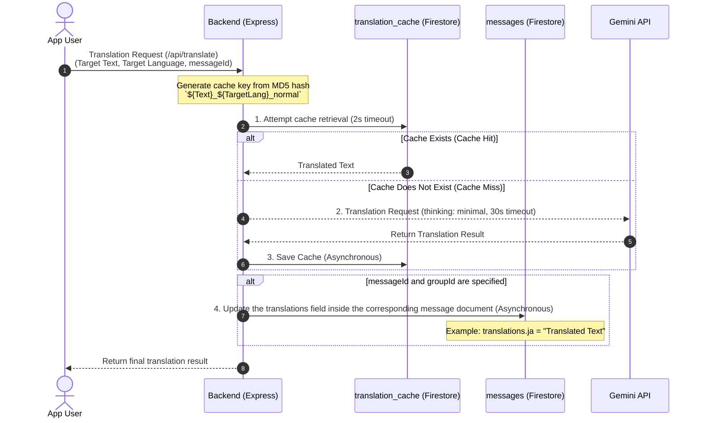
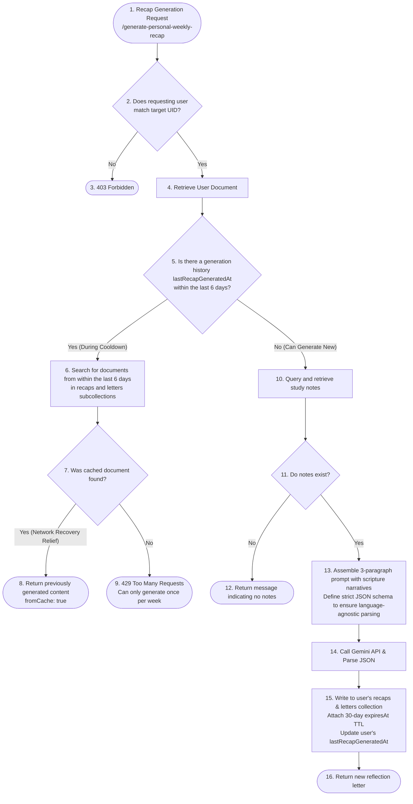

# Detailed Explanation: AI (Gemini) Integration, Dynamic Translation, and Weekly Recap Pipeline

This document provides a detailed explanation of the backend implementation and architecture of Scripture Habit's multi-language features: **"AI (Gemini)-powered Note Translation"**, **"Weekly Recap Generation"** for personalizing study habits, and **"Automated Discussion Topic Generation"** to foster community engagement.

---

## Common Gemini API Call Design

AI calls are consolidated into the `callGemini` function in [ai.ts](../../scripture-habit/api_internal/routes/ai.ts).

```typescript
const callGemini = async (prompt: string): Promise<string> => {
    if (!process.env.GEMINI_API_KEY) throw new Error('Gemini API Key missing');
    
    const apiUrl = `https://generativelanguage.googleapis.com/v1beta/models/gemini-3.1-flash-lite-preview:generateContent?key=${process.env.GEMINI_API_KEY}`;
    const response = await axios.post(apiUrl, { 
        contents: [{ parts: [{ text: prompt }] }],
        generationConfig: {
            thinkingConfig: {
                thinkingLevel: "minimal"
            }
        }
    }, { timeout: 30000 }); // 30秒タイムアウト設定
    
    const candidate = response.data?.candidates?.[0];
    if (candidate?.finishReason === 'SAFETY') {
        throw new Error('AI content blocked by safety filters');
    }

    const generatedText = candidate?.content?.parts?.[0]?.text;
    if (!generatedText) throw new Error('AI failed to generate a response');
    return generatedText.trim();
};
```

### Technical Features and Design Decisions
1. **Model Selection (`gemini-3.1-flash-lite-preview`)**:
   To operate dynamically in mobile apps and chat screens, we use the Flash-Lite model, which achieves **extremely high response speed and exceptionally low cost**.
2. **`thinkingLevel: "minimal"` Configuration**:
   This setting explicitly minimizes the reasoning (thinking) process of the Gemini 3.1 generation. For tasks like translation or template summarization that do not require deep reasoning steps, this is a key optimization that **cuts API response times by more than half**.
3. **Safety Filter (`finishReason === 'SAFETY'`) Validation**:
   Given that the application handles scriptures and user interpretations, if content is blocked by Gemini's safety mechanisms, this is detected to perform appropriate error handling and log events to Sentry.

---

## Dynamic Translation Pipeline

When users speaking other languages read shared notes on the chat screen, translation is performed on demand. The server implements a **two-tier cache layer** to prevent unnecessary API costs.

### 1. Translation Process Sequence Diagram



---

### 2. Bulk (Batch) Translation Optimization: Batch Translation

When translating multiple chat messages at once (e.g., when scrolling through chat), sending individual requests would lead to "Too Many Requests (429 errors)" and "extremely high latency." To address this, a Batch translation endpoint (`/api/translate-batch`) is implemented to perform **"bulk retrieval, bulk AI calling, and bulk cache commit."**

#### The 3 Steps of Batch Processing
1. **Parallel Cache Checking**:
   Generate the MD5 keys corresponding to all requested message IDs and read the cache from Firestore in parallel using `Promise.all`.
2. **Batch AI Inference in a Single Prompt**:
   Combine the messages that were not found in the cache and construct a single prompt instructing Gemini to return the results in a **JSON map format**.
   - Prompt instruction: `Format: {"msg_id": "translated_text", ...}`
3. **Atomic Batch Writing (`db.batch()`)**:
   Parse the JSON returned by Gemini and use Firestore's **`db.batch()` (batch commit)** to atomically write to both the translation cache (`translation_cache`) and the message documents (`messages`) in bulk.

---

## Reflection Letters (LetterBox) and Smart Self-Healing Cache

This feature allows users to reflect on their study notes and receive a heartwarming feedback letter from the AI. The implementation incorporates **"Spiritual Storytelling with Scripture Figures"**, **"Language-Agnostic Structured JSON Output"**, **"API abuse prevention"**, **"Graceful recovery from connection errors"**, and **"30-day automatic cleanup via Firestore Native TTL"**.

### 1. Reflection Letter Flowchart



### 2. Design Philosophy of "6-Day Cooldown" and "Recovery Cache"
Because generating AI letters consumes a significant number of tokens, this feature should ideally be restricted to "once a week." However, **if a user's network connection drops or the app suddenly closes, simply returning a uniform 429 error on the next attempt would lead to a terrible user experience, where the user has "spent XP or generation rights but could not see the content."**

Therefore, Scripture Habit implements the following logic:
- **Cooldown Check**: Check if the `lastRecapGeneratedAt` timestamp is within the last 6 days at the time of generation.
- **Smart Recovery (Relief Measure)**: If the request is within the cooldown window, instead of immediately returning an error, the system scans the database subcollections (`recaps` and `letters`) to **verify if a document was actually generated within the last 6 days. If found, it reuses that data and returns it to the client (`fromCache: true`).**
- This ensures that even when reloading due to connection errors, the generated letter is reliably delivered to the user without incurring any additional API costs.

### 3. Spiritual Storytelling 3-Paragraph Prompt
Rather than generating a dry summary, the reflection letter inspires and uplifts users with a structured 3-paragraph format:
1. **Empathy & Affirmation**: Acknowledges and validates the user's specific insights and honest reflections.
2. **Scripture Figure / General Conference Narrative**: Weaves in relevant stories from Standard Works figures (Nephi, Ruth, Joseph, Paul, etc.) or General Conference speakers to offer deeper spiritual perspectives.
3. **Blessing & Encouragement**: Concludes with a heartfelt blessing for their continuing journey.

The prompt enforces a strict JSON schema `{ "title": "...", "letter": "..." }`, guaranteeing reliable parsing across all 11 supported languages without brittle regular expressions.

### 4. Firestore Native TTL (30-Day Auto-Cleanup) & Developer Welcome Letter
- **TTL Auto-Cleanup**: Generated reflection letters receive an `expiresAt: now + 30 days` timestamp and are automatically deleted by Firestore's TTL policy to keep user data lightweight.
- **Developer Welcome Letter**: Seeded on user registration via `/api/auth/initialize-profile` without `expiresAt`, permanently preserved in the user's LetterBox.

---

## Core Code Explanation

Below are the core sections of batch translation and reflection letter processing within [ai.ts](../../scripture-habit/api_internal/routes/ai.ts).

### 1. Implementation of Batch Translation and JSON Cleaning

```typescript
router.post('/translate-batch', authenticate, aiLimiter, verifyAppCheck, async (req: AuthenticatedRequest, res: Response) => {
    // Cache lookup and batch translation logic
});
```

---

### 2. Implementation of Reflection Letter Generation and TTL Persistence

```typescript
router.post('/generate-personal-weekly-recap', authenticate, aiLimiter, verifyAppCheck, async (req: AuthenticatedRequest, res: Response) => {
    try {
        const validation = personalRecapSchema.safeParse(req.body);
        if (!validation.success) throw new ValidationError('Invalid input');

        const { uid, language } = validation.data;
        const baseLang = language?.split('-')[0] || 'en';
        const targetLangName = languageNames[baseLang] || 'English';

        if (req.user?.uid !== uid) throw new ForbiddenError('Forbidden');

        const userRef = db.collection('users').doc(uid);
        const uSnap = await userRef.get();
        if (!uSnap.exists) throw new NotFoundError('User not found');
        const uData = uSnap.data() || {};

        // === Cooldown & Self-Healing Cache Check ===
        if (uData.lastRecapGeneratedAt) {
            const lastDate = (uData.lastRecapGeneratedAt as admin.firestore.Timestamp).toDate();
            const sixDaysAgo = new Date();
            sixDaysAgo.setDate(sixDaysAgo.getDate() - 6);

            if (lastDate > sixDaysAgo) {
                let cachedRecapText: string | null = null;
                let cachedTitle: string | null = null;
                try {
                    // 1. Search 'recaps' subcollection
                    const recentRecapSnap = await userRef.collection('recaps')
                        .orderBy('createdAt', 'desc')
                        .limit(1)
                        .get();
                    if (!recentRecapSnap.empty) {
                        const recentRecapData = recentRecapSnap.docs[0].data();
                        const recapDate = (recentRecapData.createdAt as admin.firestore.Timestamp).toDate();
                        if (recapDate > sixDaysAgo && recentRecapData.text) {
                            cachedRecapText = recentRecapData.text;
                        }
                    }

                    // 2. Fallback to 'letters' subcollection
                    if (!cachedRecapText) {
                        const recentLettersSnap = await userRef.collection('letters')
                            .orderBy('createdAt', 'desc')
                            .limit(5)
                            .get();
                        const recentLetterDoc = recentLettersSnap.docs.find(d => d.data().type === 'weekly_recap');
                        if (recentLetterDoc) {
                            const letterData = recentLetterDoc.data();
                            const letterDate = (letterData.createdAt as admin.firestore.Timestamp).toDate();
                            if (letterDate > sixDaysAgo && letterData.content) {
                                cachedRecapText = letterData.content;
                                cachedTitle = letterData.title || null;
                            }
                        }
                    }

                    if (cachedRecapText) {
                        return res.json({
                            success: true,
                            recap: cachedRecapText,
                            title: cachedTitle,
                            message: 'Returned cached recent recap.',
                            fromCache: true
                        });
                    }
                } catch (cacheErr) {
                    console.warn('[AI Personal Recap] Failed to retrieve cached recap:', cacheErr);
                }

                throw new AppError('Personal recap already generated recently. Please wait a week.', 429);
            }
        }

        // === New Generation Process (Scriptural Storytelling & JSON Schema) ===
        const notesQuery = userRef.collection('notes')
            .orderBy('createdAt', 'desc')
            .limit(30)
            .get();
        const snapshot = await withTimeout(notesQuery, 8000, 'Firestore timeout');
        if (!snapshot) throw new Error('Failed to fetch personal notes');

        const notes: string[] = [];
        (snapshot as admin.firestore.QuerySnapshot).forEach(d => { 
            const data = d.data();
            const content = data.comment || data.text;
            if (content) {
                const truncated = content.length > 1000 ? content.substring(0, 1000) + '...' : content;
                notes.push(truncated); 
            }
        });

        const prompt = `You are a warm, wise, and spiritually uplifting scripture study mentor.
Write a deeply encouraging personal reflection letter based on the user's study notes.
Structure:
1. Warm reflection & empathy for their study.
2. An inspiring story or lesson from a figure in the Standard Works or General Conference speaker.
3. A heartfelt blessing and encouragement.

Respond in strict JSON format:
{
  "title": "A short inspiring title",
  "letter": "The full letter body..."
}

Language: ${targetLangName}
Notes: ${notes.join('\n\n')}`;

        const rawResponse = await callGemini(prompt);
        const jsonMatch = rawResponse.match(/\{[\s\S]*\}/);
        const parsed = JSON.parse(jsonMatch ? jsonMatch[0] : rawResponse);

        // 30-Day TTL Timestamp
        const thirtyDaysFromNow = new Date();
        thirtyDaysFromNow.setDate(thirtyDaysFromNow.getDate() + 30);
        const expiresAtTimestamp = admin.firestore.Timestamp.fromDate(thirtyDaysFromNow);

        // Save to 'letters' subcollection
        await userRef.collection('letters').add({
            title: parsed.title,
            content: parsed.letter,
            type: 'weekly_recap',
            createdAt: admin.firestore.FieldValue.serverTimestamp(),
            expiresAt: expiresAtTimestamp,
            read: false,
        });

        res.json({ success: true, recap: parsed.letter, title: parsed.title });
    } catch (err) {
        handleAiError(res, err, 'personal recap');
    }
});
```
