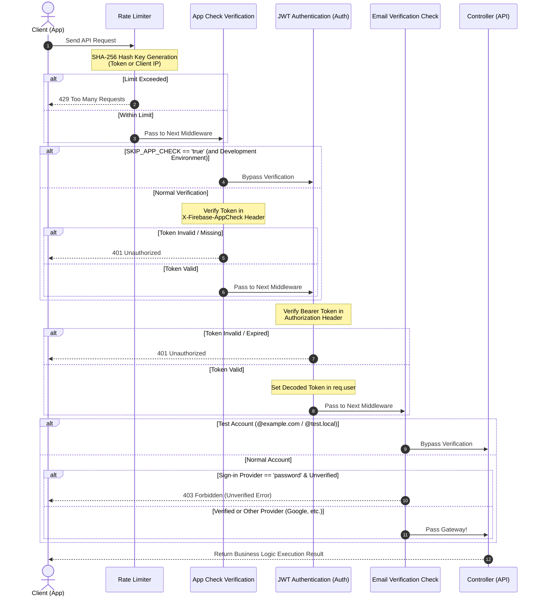

# 🔬 Detailed Explanation: App Check and API Gateway Protection Security

This document explains in detail the **"API Gateway Security"** that protects the Scripture Habit API server (Vercel Serverless) from malicious attacks and spam access, as well as the **"Exception Bypass Design"** that balances both development and testing in mobile environments.

---

## 🛡️ Defense-in-Depth Security Topology

The Scripture Habit backend API employs **Defense in Depth**, which progressively increases the security level at each stage. Before a request reaches the controller (business logic), it must pass through up to five layers of filters.

1. **CORS Verification**: Excludes browser-based access from unauthorized origins (domains).
2. **Rate Limiting**: Blocks DDoS attacks and excessive API calls. Uses a privacy-friendly hash-based scheme.
3. **Firebase App Check**: Strongly blocks unofficial apps and direct API requests (Curl, Postman, etc.).
4. **Bearer JWT Authentication (Firebase Auth)**: Identifies individual users who have signed in with valid credentials.
5. **Email Verification Check (Email Verified)**: Enforces email verification only for password-based users.

---

## 🔄 API Request Verification Sequence

Below is the atomic verification sequence for a request passing through the gateway to reach the controller (rendered with high contrast in mind, keeping background colors neutral for dark mode compatibility).



---

## 🔒 Firebase App Check Verification and Production Guard

Firebase **App Check** is a defense system that verifies whether requests are sent from officially registered applications (such as the Vite frontend or Capacitor mobile binaries).

### Robust "Production Security Guard" Design
During local development using mobile emulators, passing App Check can be challenging. Therefore, a `SKIP_APP_CHECK` environment variable is provided for development environments. However, **if this is accidentally enabled in the production environment (`NODE_ENV === 'production'`), it poses a major security risk by completely disabling backend defense.**

To prevent this, the `verifyAppCheck` middleware has a double-layered **"Production Guard"** built in.

```typescript
// 本番（production）かつ SKIP_APP_CHECK が有効な場合、警告を出しリクエストを強制ブロック
if (skipRequested) {
    if (isProduction) {
        console.error('[SECURITY ALERT] SKIP_APP_CHECK is enabled in production! This is forbidden.');
        return res.status(401).json({ error: 'Unauthorized: Security check required' });
    }
    console.warn('[AppCheck] Skipping verification (Development only)');
    return next();
}
```

---

## ⚙️ Bypass Decision Flow During Development and Testing

To maintain high security while balancing "development efficiency" and "complete automation of CI/CD E2E tests using Playwright," the bypass decision tree is designed as follows:

```mermaid
flowchart TD
    Request([API Request Received]) --> AppCheckStep{1. App Check Verification}
    
    %% App Check 分岐
    AppCheckStep --> SkipRequested{Is SKIP_APP_CHECK == 'true'?}
    SkipRequested -- Yes --> CheckProd{Is NODE_ENV == 'production'?}
    CheckProd -- Yes (Prod Error) --> Block401([Return 401 Unauthorized])
    CheckProd -- No (Dev Env) --> BypassAppCheck[Skip App Check Verification]
    
    SkipRequested -- No --> VerifyToken[Verify Token with Firebase Admin SDK]
    VerifyToken -- Verification Failed --> Block401
    VerifyToken -- Verification Succeeded --> AuthStep[2. JWT Authentication Step]
    BypassAppCheck --> AuthStep

    %% JWT & メール認証分岐
    AuthStep --> DecodedToken[Decode Token and Store in req.user]
    DecodedToken --> EmailStep{3. Email Verification Check}
    
    EmailStep --> ProviderCheck{Is Sign-in Method 'password'<br/>(Email/Password)?}
    ProviderCheck -- No (Google or Other Federated Identity) --> Allowed([Pass Processing to Controller])
    
    ProviderCheck -- Yes --> TestAccount{Is Test Domain Account<br/>(@example.com / @test.local)?}
    TestAccount -- Yes (Playwright Test) --> BypassEmail[Skip Email Verification]
    TestAccount -- No --> CheckVerified{Is email_verified == true?}
    
    CheckVerified -- Yes --> Allowed
    CheckVerified -- No --> Block403([Return 403 Forbidden])
    BypassEmail --> Allowed
```

---

## 🛡️ Privacy-Conscious Hash-Based Rate Limiting

When limiting requests sent to the API server, a standard IP address-based rate limit stores the **raw (plain text) IP address** in the server's logs or memory, which can be a concern under privacy regulations like GDPR. Additionally, it faces issues such as inaccurate identification when requests come through IPv6 or reverse proxies.

Scripture Habit employs an **cryptographic hash-based rate limit using SHA-256** (`aiLimiterKeyGenerator`).

### Benefits and Design Decisions
- **Cryptographic Hashing**: The `Authorization` token or the client IP address is hashed using SHA-256, and its hex string is used as the key. Since raw IP addresses and personal identifiable information (PII) are not retained in memory or logs, **high privacy** is guaranteed.
- **IPv6 and Proxy Standardization**: Client information extracted safely from proxy headers like `req.headers['x-forwarded-for']` is hashed. This ensures stable rate limiting even under serverless environments like Vercel or when routed via CDN load balancers.

---

## 💻 Core Code Explanation

Below is the core logic and detailed annotations of `api_internal/lib/middleware.ts`.

### 1. Privacy-Friendly Hash Key Generator (`aiLimiterKeyGenerator`)

```typescript
export const aiLimiterKeyGenerator = (req: Request) => {
    const authHeader = req.header('Authorization');
    
    // 1. 認証済みユーザーの場合は Bearer トークンを SHA-256 ハッシュ化して一意キーにする
    if (authHeader && authHeader.startsWith('Bearer ')) {
        return crypto.createHash('sha256').update(authHeader).digest('hex');
    }
    
    // 2. 未認証またはトークンがない場合は IP アドレスを取得
    const ip = (req.ip || req.headers['x-forwarded-for'] || req.socket.remoteAddress || 'unknown').toString();
    
    // 3. 生のIPをメモリに保持せず、ハッシュ化してプライバシーを保護しつつキー化
    return crypto.createHash('sha256').update(ip).digest('hex');
};

export const aiLimiter = rateLimit({
    windowMs: 60 * 60 * 1000, // 1時間制限窓
    limit: isProd ? 100 : 5000, // 本番は1時間100回、開発テスト時は5000回まで許可
    message: { error: 'AI limit reached. Please try again in an hour.' },
    standardHeaders: 'draft-7',
    legacyHeaders: false,
    keyGenerator: aiLimiterKeyGenerator,
    validate: { default: false } // IPv6 の逆引きに関する警告を無効化する安全設定
});
```

---

### 2. App Check Verification Middleware with Production Guard (`verifyAppCheck`)

```typescript
export const verifyAppCheck = async (req: Request, res: Response, next: NextFunction) => {
    const isProduction = process.env.NODE_ENV === 'production';
    const skipRequested = process.env.SKIP_APP_CHECK === 'true';

    // 1. 開発中のApp Checkスキップ処理と、本番での二重ガード
    if (skipRequested) {
        if (isProduction) {
            // 本番環境であるにもかかわらずSKIP環境変数が有効になっている場合、大至急ブロック
            console.error('[SECURITY ALERT] SKIP_APP_CHECK is enabled in production! This is forbidden.');
            return res.status(401).json({ error: 'Unauthorized: Security check required' });
        }
        console.warn('[AppCheck] Skipping verification (Development only)');
        return next();
    }

    // 2. ヘッダーから App Check トークンを抽出
    const token = req.header('X-Firebase-AppCheck');
    if (!token) {
        console.warn('[AppCheck] Security context missing from:', req.ip);
        // エラーハンドラー経由で410 Unauthorizedとして処理を引き渡す
        return next(new AppError('Unauthorized: Security context missing', 401, 'APP_CHECK_MISSING'));
    }

    try {
        if (!appCheck) {
            throw new Error('Firebase App Check service is unavailable.');
        }
        // 3. Firebase Admin SDK による公式暗号署名検証
        await appCheck.verifyToken(token);
        next();
    } catch (err: unknown) {
        const error = err as Error;
        console.warn('[AppCheck] Verification failed for token:', token.substring(0, 10) + '...', 'Error:', error.message);
        
        // サービス一時停止（503）または トークン無効（401）を的確にハンドリングしてエラー返却
        return next(new AppError('Unauthorized: Security check failed', error.message.includes('unavailable') ? 503 : 401, 'APP_CHECK_FAILED'));
    }
};
```

---

### 3. Email Verification Middleware with Test Bypass (`requireEmailVerified`)

```typescript
export const requireEmailVerified = (req: AuthenticatedRequest, res: Response, next: NextFunction) => {
    // 前段の authenticate ミドルウェアを通過していることを保証
    if (!req.user) {
        return res.status(401).json({ error: 'Unauthorized: Not authenticated' });
    }

    // 1. Playwright / CI パイプラインで使用されるテスト用アカウントの救済バイパス
    // メールアドレスが特定のテストドメインで終わる場合、メール確認済みのフローを自動で通過させる
    const isTestAccount = req.user.email?.endsWith('@example.com') || req.user.email?.endsWith('@test.local');
    if (isTestAccount) {
        return next();
    }

    // 2. パスワード認証アカウントの場合のみメール確認状況を強制
    // （OAuth連携（Googleなど）のアカウントは、連携時点で確認されているためチェックをスルー）
    if (req.user.firebase.sign_in_provider === 'password' && !req.user.email_verified) {
        return next(new AppError('Email not verified. Please verify your email.', 403, 'auth/email-not-verified'));
    }

    next();
};
```
