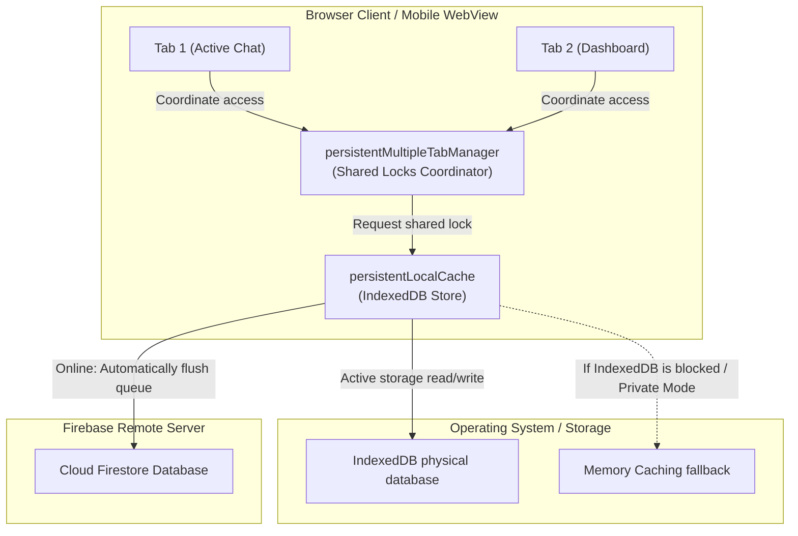
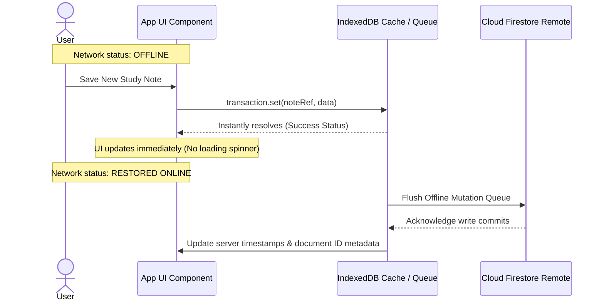

# Firestore Offline Persistence & Multi-Tab Synchronization — Deep-Dive

## Overview

Progressive Web Apps (PWAs) and hybrid mobile clients must remain functional under intermittent or completely severed network connectivity (e.g. when commuting through tunnels or on subways). To support this, **scripture-habit** integrates a robust, client-side offline storage and tab synchronization engine built on Google Cloud Firestore's persistent cache layer.

Managed directly inside [`firebase.ts`](../../scripture-habit/src/firebase.ts), the system implements an IndexedDB-backed write queue, dynamic browser-tab locking (Shared-Locks) to coordinate database access, automated background sync-state reconciliation, and robust fallback paths for incognito browser sandboxes.



---

## 1. Multi-Tab Synchronization & Shared-Locks Coordinator

In standard single-tab persistence setups, a browser locks the IndexedDB storage instance exclusively for the active page tab. When a user opens a second tab (e.g. holding the main dashboard open in one window while reading a group chat in another), the second tab is blocked from accessing IndexedDB. It is forced to fall back to a volatile in-memory cache, leading to data drift and double-billing as documents are fetched repeatedly.

To solve this, **scripture-habit** configures a multi-tab persistence coordinator:

```typescript
db = initializeFirestore(app, {
  localCache: persistentLocalCache({
    tabManager: persistentMultipleTabManager()
  })
});
```

### 1.1 Mutual Exclusion & Tab Coordination
The `persistentMultipleTabManager` manages access across browser windows using the browser's native **Web Locks API** or fallback LocalStorage tokens:

1. **Active Master Designation**: When multiple tabs are open, the manager elects one tab as the **Master Tab**. The Master Tab holds the active lock on the IndexedDB instance and handles all direct disk read/write mutations.
2. **Secondary Listeners**: The remaining tabs operate as **Secondary Tabs**. Instead of querying IndexedDB directly, they communicate mutations with the Master Tab through in-memory broadcast channels.
3. **Graceful Failover**: If the user closes the Master Tab, the remaining tabs detect the loss of the active lock. A new Master Tab is elected immediately to take over disk operations, ensuring continuous application performance without user interruption.

### 1.2 The Offline Mutation Queue & Background Reconciliation

When the client is offline, write operations (e.g. saving a study note, posting a message) are not rejected. Instead, the local Firestore SDK caches the document changes immediately and places them in an **Offline Mutation Queue** stored within IndexedDB.



This guarantees an instant, zero-latency user experience. The client app never displays blocking loaders while waiting for a network handshake.

---

## 2. Sandbox Environments & Incognito Fallback

Certain sandboxed environments (such as iOS Safari Private Browsing, sandboxed WebView shells, or restricted iframe contexts) block access to IndexedDB entirely for privacy and security. Attempting to initialize persistence in these environments throws a fatal browser error that crashes the entire initialization sequence.

To guarantee maximum reliability, **scripture-habit** wraps the database setup in an isolated try-catch block:

```typescript
let db: Firestore;
try {
  // 1. Attempt to initialize high-performance multi-tab offline cache
  db = initializeFirestore(app, {
    localCache: persistentLocalCache({
      tabManager: persistentMultipleTabManager()
    })
  });
} catch (e) {
  // 2. Fall back to standard memory caching if IndexedDB is blocked
  console.error("Firestore initialization with persistence failed, falling back to default:", e);
  db = getFirestore(app); 
}
```

### 2.1 Fallback Performance Matrix

| Metric | Normal Persistent Mode | Private/Incognito Fallback Mode |
|---|---|---|
| **Storage Engine** | IndexedDB Physical Cache | Volatile JS Memory Cache |
| **Offline Durability** | Persistent across restarts | Lost when browser tab is closed |
| **Tab Synchronization** | Shared via Broadcast Channels | Independent memory streams |
| **Network Read Cost** | Highly optimized (reads local disk) | Normal (re-fetches from remote on restart) |

This failover strategy ensures that regardless of the user's browser settings or private browsing choices, the application remains fully functional.

---

## 3. Automated E2E Testing Optimizations

During automated End-to-End (E2E) testing (e.g. running Playwright pipelines inside headless chromium), browsers boot up with completely clean profiles. By default, Firebase Authentication uses session-only memory. This forces test runners to sign in repeatedly before each test file, adding massive execution delays.

To bypass this and speed up pipelines, the initialization layer detects testing environments and enforces local storage persistence:

```typescript
// E2E Test Optimization: Force LocalStorage persistence so Playwright can capture it
if (typeof window !== 'undefined' && navigator.webdriver && auth) {
  window.firebaseAuth = auth;
  setPersistence(auth, browserLocalPersistence).catch(err => {
    console.error("Failed to set auth persistence:", err);
  });
}
```

### 3.1 Test Telemetry Acceleration
1. **Automation Detection**: Checks the global property `navigator.webdriver`. This boolean resolves as `true` only when the browser is controlled by a headless automation tool like Playwright, Selenium, or Puppeteer.
2. **Session Persistence**: When testing is detected, the app overrides standard session persistence and forces `browserLocalPersistence` (`localStorage`). This keeps test sessions authenticated across reloads.
3. **Direct Token Harvesting**: The auth instance is bound directly to the global window space (`window.firebaseAuth`). This allows Playwright scripts to query authentication states, inject test tokens, or retrieve active session details directly, slashing test times and reducing test suite flake.
