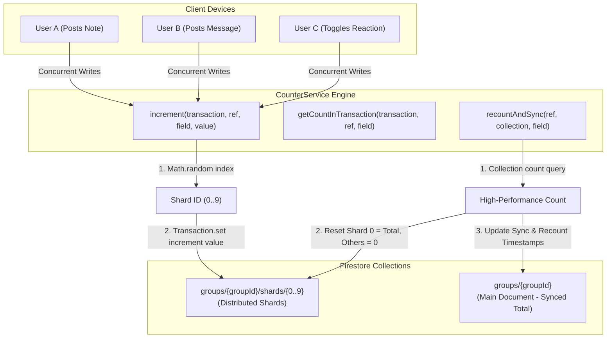
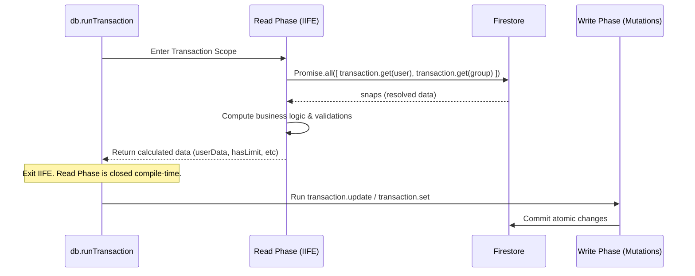

# Firestore Transactions & Counter Sharding — Deep-Dive

## Overview

The database layer of **scripture-habit** is designed for high concurrency, low read costs, and strict eventual consistency. Because Google Cloud Firestore imposes structural performance limitations—such as a limit of approximately **1 write per second** to a single document and the strict **Read-before-Write** rule in transactions—the app utilizes an advanced distributed sharding and transactional architecture.

This system is governed by the serverless **`CounterService`** ([`counter-service.ts`](../../scripture-habit/api_internal/services/counter-service.ts)) and strict compile-safe transactional boundaries. It ensures that operations like note sharing, streak updates, chat messaging, and membership changes scale to thousands of concurrent users without hotspotting or database contention.



---

## 1. The Distributed Counter Sharding Pattern

When hundreds of group members post study notes or send chat messages simultaneously, updating a single `messageCount` or `noteCount` field on a central group document will fail due to write contention (hotspotting). 

To scale write operations, the **`CounterService`** distributes increments across a dedicated subcollection of shard documents.

### 1.1 Dynamic Shard Hashing & Writes

The system uses **10 shards** (`NUM_SHARDS = 10`) per sharded field. When an increment occurs, the service selects a random shard ID from `0` to `9` and dispatches an atomic field increment using a Firestore transaction:

```typescript
private static NUM_SHARDS = 10;

static increment(
    transaction: admin.firestore.Transaction, 
    ref: admin.firestore.DocumentReference, 
    fieldName: string = 'count', 
    value: number = 1
) {
    // 1. Generate a random shard index between 0 and 9
    const shardId = Math.floor(Math.random() * this.NUM_SHARDS).toString();
    const shardRef = ref.collection('shards').doc(shardId);
    
    // 2. Perform merge-set utilizing the atomic field value increment operator
    transaction.set(shardRef, {
        [fieldName]: admin.firestore.FieldValue.increment(value)
    }, { merge: true });
}
```

By spreading writes across 10 distinct physical documents, the theoretical write throughput for this counter scales **10x** (from 1 write/sec to 10 writes/sec) without contention, as Firestore handles updates to separate documents in parallel.

### 1.2 Transacted and Non-Transacted Reads

Reading a sharded counter requires loading and summing all individual shard values. The system handles this in two ways:

#### A. Non-Transactional Consolidated Summing (`getCount`)
Used during non-critical background jobs or aggregations. It loads all shards via a standard collection read:
```typescript
static async getCount(ref: admin.firestore.DocumentReference, fieldName: string = 'count'): Promise<number> {
    const shards = await ref.collection('shards').get();
    let totalCount = 0;
    shards.forEach((doc) => {
        totalCount += doc.data()[fieldName] || 0;
    });
    return totalCount;
}
```

#### B. Transactional Read Consolidation (`getCountInTransaction`)
When the total count must be read *inside* a transaction (to perform validation or compute secondary states), sequential reads inside a loop would trigger multiple network roundtrips and violate read-before-write phases. 
Instead, the service builds references for all 10 shards and fetches them in a single parallel call using `transaction.getAll(...)`:

```typescript
static async getCountInTransaction(
    transaction: admin.firestore.Transaction, 
    ref: admin.firestore.DocumentReference, 
    fieldName: string = 'count'
): Promise<number> {
    const shardRefs = [];
    for (let i = 0; i < this.NUM_SHARDS; i++) {
        shardRefs.push(ref.collection('shards').doc(i.toString()));
    }
    
    // Parallel fetch: retrieves all 10 shard documents in a single roundtrip
    const snaps = await transaction.getAll(...shardRefs);
    let totalCount = 0;
    snaps.forEach((doc) => {
        if (doc.exists) {
            totalCount += doc.data()?.[fieldName] || 0;
        }
    });
    return totalCount;
}
```

---

## 2. Compile-Safe Read/Write Phase Segregation (IIFE Pattern)

Google Cloud Firestore transactions use optimistic concurrency control. This mandates that **all read operations (queries, gets) must execute and resolve before any write operations (sets, updates, deletes) are queued**. Inserting a read after a write results in a runtime error.

To enforce this constraint by construction and prevent regression bugs, the codebase wraps transactional operations in an **Asynchronous Immediately Invoked Function Expression (IIFE)** block representing **Phase 1: The Read Phase**.



### Code Architecture Example (`NoteService` / `MessageService`):
```typescript
const result = await db.runTransaction(async (transaction) => {
    // -----------------------------------------------------------------
    // PHASE 1: READ & PURE CALCULATION PHASE (Strictly No Writes Permitted)
    // -----------------------------------------------------------------
    const { userData, groupData, activeMembers } = await (async () => {
        // Parallel reads at the very top of the sequence
        const [userSnap, groupSnap] = await Promise.all([
            transaction.get(userRef),
            transaction.get(groupRef)
        ]);

        if (!userSnap.exists) throw new Error('User not found');
        if (!groupSnap.exists) throw new Error('Group not found');

        // Pure mathematical calculations (e.g. evaluating timezone offsets, local day boundaries)
        const timezone = userSnap.data()?.timeZone || 'UTC';
        const hasExceededLimit = (groupSnap.data()?.membersCount || 0) >= 100;

        // Return resolved payloads to the outer transaction scope
        return {
            userData: userSnap.data(),
            groupData: groupSnap.data(),
            hasExceededLimit
        };
    })(); // Immediately executed!

    // -----------------------------------------------------------------
    // PHASE 2: WRITE PHASE (Strictly Mutations only)
    // -----------------------------------------------------------------
    if (userData.hasExceededLimit) {
        throw new Error('Group capacity reached.');
    }

    transaction.update(userRef, { lastActivityAt: admin.firestore.FieldValue.serverTimestamp() });
    transaction.update(groupRef, { totalActiveMembers: activeMembers });
});
```

By separating reads and calculations into a dedicated, self-contained scope, it becomes impossible for a developer to accidentally insert a database query after a write mutation during future updates.

---

## 3. Eventual Data Integrity & Recount Pipelines

While sharded counters scale write throughput, a decentralized sum is susceptible to drift under extreme network failures or manual administrator interventions. Additionally, in-memory caches must occasionally sync back to the main document for indexing.

To solve this, the engine provides two self-healing recount and reconciliation pipelines:

### 3.1 Aggregation & Sync Loop (`aggregateAndSync`)

Periodic background workers read the decentralized shards, sum them, and write the verified total back to the main group document. This makes the total count available for cheap read queries without having to fetch the shard subcollection every time:

```typescript
static async aggregateAndSync(ref: admin.firestore.DocumentReference, fieldName: string) {
    const total = await this.getCount(ref, fieldName);
    await ref.update({
        [fieldName]: total,
        [`${fieldName}_syncedAt`]: admin.firestore.FieldValue.serverTimestamp()
    });
    return total;
}
```

### 3.2 High-Performance Document Recount (`recountAndSync`)

When a true recovery is requested, reading and listing every document in a collection to count them is highly inefficient. Instead, `CounterService` leverages Firestore's high-performance **`count()` aggregation query**. This runs entirely on the database server, counting millions of documents in milliseconds at a fraction of the cost of reading the full documents:

```typescript
static async recountAndSync(docRef: admin.firestore.DocumentReference, collectionName: string, fieldName: string) {
    // 1. High-performance server-side aggregation count
    const snapshot = await docRef.collection(collectionName).count().get();
    const actualTotal = snapshot.data().count;

    // 2. Reset shards to match actual total (Consolidate into shard 0 for simplicity)
    const batch = db.batch();
    for (let i = 0; i < this.NUM_SHARDS; i++) {
        batch.set(docRef.collection('shards').doc(i.toString()), {
            [fieldName]: i === 0 ? actualTotal : 0  // Shard 0 stores the total, others are zeroed out
        }, { merge: true });
    }
    
    batch.update(docRef, {
        [fieldName]: actualTotal,
        [`${fieldName}_syncedAt`]: admin.firestore.FieldValue.serverTimestamp(),
        [`${fieldName}_recountedAt`]: admin.firestore.FieldValue.serverTimestamp()
    });
    
    await batch.commit();
    return actualTotal;
}
```

### 3.3 Archive-Aware Counter Reconciliation (`recountMessageCountWithArchive`)

To save storage and keep real-time listener payloads lightweight, the chat system regularly archives old messages into compressed bucket documents. 

If the system only counted active messages in the `/messages` subcollection, the counter would drop back down to zero after an archiving run. To prevent this, the recount engine is **archive-aware**: it sums active messages and reads the index summaries from archived buckets to compute the true total:

```typescript
static async recountMessageCountWithArchive(groupRef: admin.firestore.DocumentReference) {
    // 1. Count individual active messages in the subcollection
    const msgSnapshot = await groupRef.collection('messages').count().get();
    const individualCount = msgSnapshot.data().count;

    // 2. Sum pre-calculated counts from all archived buckets
    const bucketSnapshot = await groupRef.collection('message_buckets').get();
    let archivedCount = 0;
    bucketSnapshot.forEach(doc => {
        archivedCount += (doc.data().count || 0);
    });

    const trueTotal = individualCount + archivedCount;

    // 3. Reset shards and main document with true total
    const batch = db.batch();
    for (let i = 0; i < this.NUM_SHARDS; i++) {
        batch.set(groupRef.collection('shards').doc(i.toString()), {
            'messageCount': i === 0 ? trueTotal : 0
        }, { merge: true });
    }

    batch.update(groupRef, {
        'messageCount': trueTotal,
        'messageCount_syncedAt': admin.firestore.FieldValue.serverTimestamp(),
        'messageCount_recountedAt': admin.firestore.FieldValue.serverTimestamp()
    });

    await batch.commit();
    return trueTotal;
}
```

---

## 4. Transactional Read Optimizations

To keep database costs low, the transactional engine actively minimizes document reads:

1. **Bypassing Shard Reads**: When a user joins a group, the engine needs to verify the current group capacity. Instead of reading all 10 counter shards inside the transaction, it reads the pre-aggregated `membersCount` field directly from the parent group document snapshot (which was already fetched to check the group's existence). This saves **10 document read operations** per join attempt.
2. **Snapshot Reuse**: When verifying a join code, the engine queries the `inviteCodes` collection. The returned `QueryDocumentSnapshot` already contains the full group metadata. The engine reuses this snapshot directly instead of performing a secondary `transaction.get(groupRef)` call, saving an extra read.

---

## 5. Read Budget Auditing System (`test-setup.ts`)

To ensure developers do not accidentally introduce inefficient database read patterns (such as N+1 queries in loops) during updates, the test environment includes an automated **Global Read Audit**.

Located in [`test-setup.ts`](../../scripture-habit/api_internal/test-setup.ts), this harness wraps the underlying Firestore driver prototypes during integration tests.

### 5.1 Prototype Interception

The harness intercepts every document read call made by the application, incrementing global telemetry counters:

```typescript
const originalGet = admin.firestore.Transaction.prototype.get;
admin.firestore.Transaction.prototype.get = function(ref) {
    incrementReadTelemetry(ref);  // Log collection category
    return originalGet.apply(this, arguments);
};
```

This tracking is fully immune to standard mock restorations (`vi.restoreAllMocks()`), guaranteeing absolute precision during test suite execution.

### 5.2 The 300-Read Budget Alert

At the end of a test run, the harness prints a telemetry report summarizing the database operations:

```text
📊 [Firestore Read Audit] -----------------------------
   Transaction GETs:    14
   Transaction GETALLs: 1
   Document GETs:       8
   👉 Total Reads:      23
   Collection Breakdown:
     - users: 8 reads
     - groups: 12 reads
     - message_buckets: 3 reads
-------------------------------------------------------
```

If a test file exceeds a budget of **300 Firestore reads**, `test-setup.ts` outputs a compiler warning urging the developer to review their query chains for N+1 queries. This keeps the codebase highly optimized and cost-efficient.
