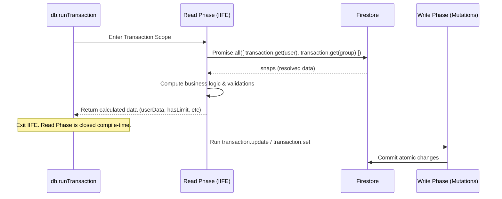

# Firestore Transactions & Performance Optimizations — Deep-Dive

## Overview

The database layer of **scripture-habit** is designed for high concurrency, low read costs, and strict eventual consistency. Because Google Cloud Firestore imposes structural performance limitations—such as the strict **Read-before-Write** rule in transactions—the app utilizes compile-safe transactional boundaries and optimizations.

This system is designed to handle note sharing, streak updates, chat messaging, and membership changes scaling to thousands of concurrent users without database contention or unnecessary read costs.

---

## 1. Compile-Safe Read/Write Phase Segregation (IIFE Pattern)

Google Cloud Firestore transactions use optimistic concurrency control. This mandates that **all read operations (queries, gets) must execute and resolve before any write operations (sets, updates, deletes) are queued**. Inserting a read after a write results in a runtime error.

To enforce this constraint by construction and prevent regression bugs, the codebase wraps transactional operations in an **Asynchronous Immediately Invoked Function Expression (IIFE)** block representing **Phase 1: The Read Phase**.



### Code Architecture Example (`NoteService` / `MessageService`):
```typescript
const result = await db.runTransaction(async (transaction) => {
    // -----------------------------------------------------------------
    // PHASE 1: READ & PURE CALCULATION PHASE (Strictly No Writes Permitted)
    // -----------------------------------------------------------------
    const { userData, groupData, activeMembers } = await (async () => {
        // Parallel reads at the very top of the sequence
        const [userSnap, groupSnap] = await Promise.all([
            transaction.get(userRef),
            transaction.get(groupRef)
        ]);

        if (!userSnap.exists) throw new Error('User not found');
        if (!groupSnap.exists) throw new Error('Group not found');

        // Pure mathematical calculations (e.g. evaluating timezone offsets, local day boundaries)
        const timezone = userSnap.data()?.timeZone || 'UTC';
        const hasExceededLimit = (groupSnap.data()?.membersCount || 0) >= 100;

        // Return resolved payloads to the outer transaction scope
        return {
            userData: userSnap.data(),
            groupData: groupSnap.data(),
            hasExceededLimit
        };
    })(); // Immediately executed!

    // -----------------------------------------------------------------
    // PHASE 2: WRITE PHASE (Strictly Mutations only)
    // -----------------------------------------------------------------
    if (userData.hasExceededLimit) {
        throw new Error('Group capacity reached.');
    }

    transaction.update(userRef, { lastActivityAt: admin.firestore.FieldValue.serverTimestamp() });
    transaction.update(groupRef, { totalActiveMembers: activeMembers });
});
```

By separating reads and calculations into a dedicated, self-contained scope, it becomes impossible for a developer to accidentally insert a database query after a write mutation during future updates.

---

## 2. Transactional Read Optimizations

To keep database costs low, the transactional engine actively minimizes document reads:

1. **Bypassing Array Length Reads**: When a user joins a group, the engine needs to verify the current group capacity. Instead of reading all member subdocuments, it checks the pre-aggregated `membersCount` or the length of the `members` UID array field directly from the parent group document snapshot (which was already fetched to check the group's existence). This saves database operations per join attempt.
2. **Snapshot Reuse**: When verifying a join code, the engine queries the `inviteCodes` collection. The returned `QueryDocumentSnapshot` already contains the full group metadata. The engine reuses this snapshot directly instead of performing a secondary `transaction.get(groupRef)` call, saving an extra read.

---

## 3. Read Budget Auditing System (`test-setup.ts`)

To ensure developers do not accidentally introduce inefficient database read patterns (such as N+1 queries in loops) during updates, the test environment includes an automated **Global Read Audit**.

Located in [`test-setup.ts`](../../scripture-habit/api_internal/test-setup.ts), this harness wraps the underlying Firestore driver prototypes during integration tests.

### 3.1 Proxy Wrapper Interception

The harness wraps the Firestore client methods using standard JavaScript `Proxy` objects during integration tests, tracking every document read call made by the application and incrementing global telemetry counters.

This tracking is fully immune to standard mock restorations (`vi.restoreAllMocks()`), guaranteeing absolute precision during test suite execution.

### 3.2 The 300-Read Budget Alert

At the end of a test run, the harness prints a telemetry report summarizing the database operations:

```text
📊 [Firestore Read Audit] -----------------------------
   Transaction GETs:    14
   Transaction GETALLs: 1
   Document GETs:       8
   👉 Total Reads:      23
   Collection Breakdown:
     - users: 8 reads
     - groups: 12 reads
-------------------------------------------------------
```

If a test file exceeds a budget of **300 Firestore reads**, `test-setup.ts` outputs a compiler warning urging the developer to review their query chains for N+1 queries. This keeps the codebase highly optimized and cost-efficient.
