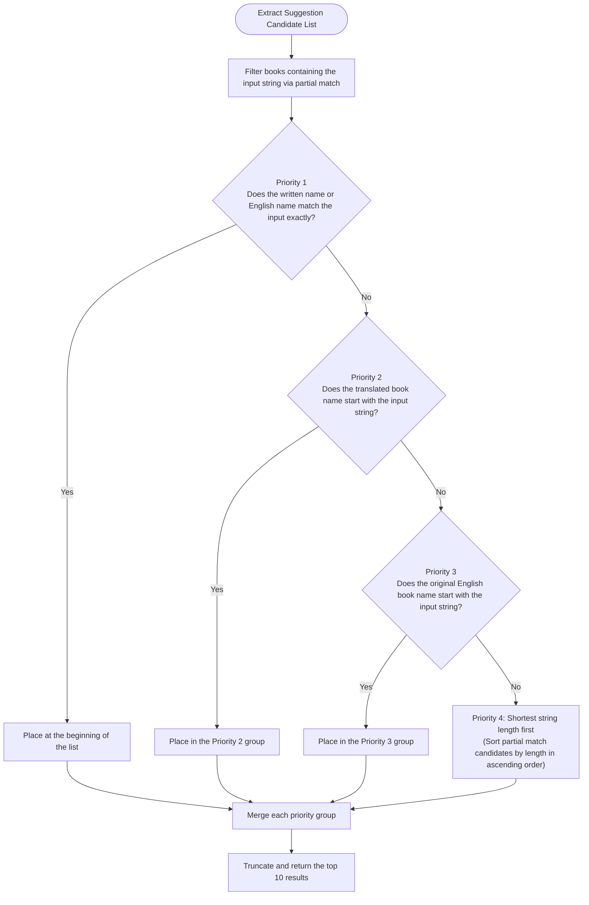

# 🔬 Technical Deep-Dive: Gospel Library Mapper & Multilingual Unicode Normalization Engine

This document provides a detailed explanation of two core utilities that strongly support the global expansion of Scripture Habit: the **"Gospel Library Official Link Auto-Generation Mapper"** and the **"Multilingual Book Suggestion (Auto-complete) Search Engine"** featuring Japanese Hiragana-to-Katakana conversion.

---

## 🗺️ Gospel Library Link Auto-Mapping (Gospel Library Mapper)

When a user inputs which scripture they read in a Study Note (e.g., `マタイ 3:13-17` or `1 Nephi 3`), the system automatically parses it and dynamically generates a **deep link (deep-highlight URL) that automatically scrolls to and highlights the corresponding "verses"** on the official website.

This feature supports 10 languages (Japanese, English, Spanish, Portuguese, Chinese, Korean, Thai, Tagalog, Vietnamese, and Swahili).

### Mapping Process Flowchart

Here is the pipeline showing how a complete official deep link URL is generated from raw user input.


---

## 🔍 Multilingual Book Autocomplete Suggestion Search Engine

This is a suggestion feature designed to help users quickly select scripture book names when writing a new Study Note.
Specifically in Japanese environments, it is equipped with a **"phonetic code shift (Hiragana-to-Katakana conversion)"** that enables extremely fast search and completion of the official book name "マタイ" (Katakana) even when the user inputs "またい" (Hiragana).

### 1. 4-Stage Priority Sorting Algorithm

By controlling the suggestion order based on the following priority for the characters entered in the search box, the candidates that best match the user's input intent are displayed at the top.



### 2. How the "Hiragana-to-Katakana" Phonetic Code Shift Works
In Unicode, there is an exact offset value of **`0x60` (96 in decimal)** between the "Hiragana" character code range (`\u3041` to `\u3096`) and the "Katakana" character code range.

By utilizing this characteristic, when a user enters Hiragana, the system detects Hiragana using a regular expression and adds `0x60` to each character code. This achieves a **perfect "Hiragana-to-Katakana conversion" using only a single line of high-speed regex replacement, without relying on any external dictionaries or heavy conversion libraries**.

---

## 💻 Core Code Explanation

Below is the core logic and Japanese comments of `src/utils/gospel-library-mapper.ts` and `src/utils/suggestion-utils.ts`.

### 1. 全角文字標準化と節ハイライト処理 (`gospel-library-mapper.ts`)

```typescript
export const getGospelLibraryUrl = (
    volume: string | null | undefined, 
    chapterInput: string | null | undefined, 
    language: string = 'en'
): string | null => {
    if (!chapterInput) return null;

    const baseUrl = "https://www.churchofjesuschrist.org/study/scriptures";
    
    // 1. 各言語に応じた公式のクエリパラメータの設定 (日本語は jpn)
    let langParam = "?lang=eng";
    if (language === 'ja') langParam = "?lang=jpn";
    else if (language === 'pt') langParam = "?lang=por";
    else if (language === 'es') langParam = "?lang=spa";
    else if (language === 'ko') langParam = "?lang=kor";
    // ... (他言語の設定)

    // 2. 文字の全角・半角正規化処理（マルチバイト入力時の揺れを吸収）
    let cleanChapterInput = chapterInput;
    
    // 全角英数字 [０-９] を半角 [0-9] に一括変換
    cleanChapterInput = cleanChapterInput.replace(/[０-９]/g, s => String.fromCharCode(s.charCodeAt(0) - 0xFEE0));
    
    // 各種記号の標準化
    cleanChapterInput = cleanChapterInput
        .replace(/：/g, ':')
        .replace(/[，、]/g, ',')
        .replace(/\u3000/g, ' ') // 全角スペースを半角へ
        .replace(/[－—―]/g, '-'); // 全角ハイフンを半角へ

    // 日本語特有の「〇〇章〇〇節」という表記を「〇〇:〇〇」に置換
    cleanChapterInput = cleanChapterInput
        .replace(/章\s*(?=\d)/g, ':')
        .replace(/章/g, '')
        .replace(/節/g, '');

    // 3. 正規表現による書籍名、章番号、節範囲の抽出
    // 例: "1 nephi 3:13-17" ➔ match[1]: "1 nephi", match[2]: "3", match[3]: "13-17"
    const match = cleanChapterInput.match(/(.*?)\s*(\d+)(?::([\d\s,-]+))?\s*$/);
    if (!match) return null;

    const bookName = match[1].trim().toLowerCase().replace(/[.]/g, '').replace(/^第(?=\d)/, '');
    const chapterNum = match[2];
    const verses = match[3];

    // 4. 多言語書籍マッピングから公式英語スラッグに変換 (10ヶ国語混在辞書)
    const bookUrlPart = bookMappings[bookName];
    if (!bookUrlPart) return null;

    // ボリューム（旧約、新約、モルモン書等）の解決
    let volumeUrlPart = detectVolume(volume, chapterInput);
    if (!volumeUrlPart) {
        // スラッグ名から所属ボリュームを推測するフォールバック
        volumeUrlPart = slugToVolume[bookUrlPart] || "";
    }
    if (!volumeUrlPart) return null;

    // 5. 節（Verses）ハイライトアンカーの自動生成
    // 公式サイトの仕様: 13節-17節のハイライトURL ➔ &id=p13-p17#p13
    let urlSuffix = langParam;
    if (verses) {
        // 数値の前に "p" を付加する正規表現置換
        const idValue = verses.replace(/\d+/g, m => `p${m}`);
        const firstVerse = verses.match(/\d+)?`.[0]; // 最初の開始節を取得してハッシュアンカーにする
        if (idValue) {
            urlSuffix += `&id=${idValue}`;
            if (firstVerse) urlSuffix += `#p${firstVerse}`;
        }
    }

    // 6. 最終的なディープリンクURLの組み立て
    if (volumeUrlPart === "dc-testament" && bookUrlPart === "dc") {
        return `${baseUrl}/dc-testament/dc/${chapterNum}${urlSuffix}`; // 教義と聖約専用のパスルール
    }
    return `${baseUrl}/${volumeUrlPart}/${bookUrlPart}/${chapterNum}${urlSuffix}`;
};
```

---

### 2. ひらがなコードシフトと4段階ソート (`suggestion-utils.ts`)

```typescript
export const getBookSuggestions = (
    volume: string | null | undefined,
    input: string | null | undefined,
    language: string,
    currentLanguageBooks: Record<string, string>
): BookSuggestion[] => {
    if (!volume || !input || !currentLanguageBooks) return [];

    const volumeList = volumeBooks[volume];
    if (!volumeList) return [];

    // 1. 正規化ヘルパー関数
    const normalize = (str: string | null | undefined): string => {
        if (!str) return '';
        // NFKC正規化で全角半角や合字の揺れを標準化
        let res = str.toLowerCase().normalize('NFKC');
        
        // 2. 【核心】日本語の「ひらがな ➔ カタカナ」コードシフト置換
        // ひらがなの文字コード（\u3041〜\u3096）に 0x60 (96) を加算するとカタカナコードに変換される
        if (language === 'ja') {
            res = res.replace(/[\u3041-\u3096]/g, m => String.fromCharCode(m.charCodeAt(0) + 0x60));
        }
        return res;
    };

    const normalizedInput = normalize(input);
    if (!normalizedInput) return [];

    // 各書籍オブジェクトの正規化名を準備
    const translatedList = volumeList.map(englishName => {
        const translatedName = currentLanguageBooks[englishName] || englishName;
        return {
            english: englishName,
            translated: translatedName,
            normalizedTranslated: normalize(translatedName),
            normalizedEnglish: normalize(englishName)
        };
    });

    // 3. 部分一致フィルタリングと 4段階カスケードソート
    return translatedList
        .filter(book =>
            book.normalizedTranslated.includes(normalizedInput) ||
            book.normalizedEnglish.includes(normalizedInput)
        )
        .sort((a, b) => {
            // 優先度 1: 完全一致
            if (a.normalizedTranslated === normalizedInput) return -1;
            if (b.normalizedTranslated === normalizedInput) return 1;

            // 優先度 2: 翻訳名が入力文字列で始まる（前方一致）
            const aStartsT = a.normalizedTranslated.startsWith(normalizedInput);
            const bStartsT = b.normalizedTranslated.startsWith(normalizedInput);
            if (aStartsT && !bStartsT) return -1;
            if (!aStartsT && bStartsT) return 1;

            // 優先度 3: 英語名が入力文字列で始まる
            const aStartsE = a.normalizedEnglish.startsWith(normalizedInput);
            const bStartsE = b.normalizedEnglish.startsWith(normalizedInput);
            if (aStartsE && !bStartsE) return -1;
            if (!aStartsE && bStartsE) return 1;

            // 優先度 4: 文字列長が短い順（「ニーファイ第一」と「ニーファイ第二」などのノイズ削減）
            return a.translated.length - b.translated.length;
        })
        .slice(0, 10); // 上位10件のみ表示
};
```
