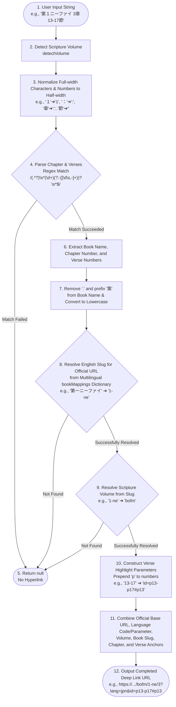

# Technical Deep-Dive: Gospel Library Mapper & Multilingual Unicode Normalization Engine

This document provides a detailed explanation of two core utilities that strongly support the global expansion of Scripture Habit: the **"Gospel Library Official Link Auto-Generation Mapper"** and the **"Multilingual Book Suggestion (Auto-complete) Search Engine"** featuring Japanese Hiragana-to-Katakana conversion.

---

## Gospel Library Link Auto-Mapping (Gospel Library Mapper)

When a user inputs which scripture they read in a Study Note (e.g., `マタイ 3:13-17` or `1 Nephi 3`), the system automatically parses it and dynamically generates a **deep link (deep-highlight URL) that automatically scrolls to and highlights the corresponding "verses"** on the official website.

This feature supports 10 languages (Japanese, English, Spanish, Portuguese, Chinese, Korean, Thai, Tagalog, Vietnamese, and Swahili).

### Mapping Process Flowchart

Here is the pipeline showing how a complete official deep link URL is generated from raw user input.



---

## Multilingual Book Autocomplete Suggestion Search Engine

This is a suggestion feature designed to help users quickly select scripture book names when writing a new Study Note.
Specifically in Japanese environments, it is equipped with a **"phonetic code shift (Hiragana-to-Katakana conversion)"** that enables extremely fast search and completion of the official book name "マタイ" (Katakana) even when the user inputs "またい" (Hiragana).

### 1. 4-Stage Priority Sorting Algorithm

By controlling the suggestion order based on the following priority for the characters entered in the search box, the candidates that best match the user's input intent are displayed at the top.


### 2. How the "Hiragana-to-Katakana" Phonetic Code Shift Works
In Unicode, there is an exact offset value of **`0x60` (96 in decimal)** between the "Hiragana" character code range (`\u3041` to `\u3096`) and the "Katakana" character code range.

By utilizing this characteristic, when a user enters Hiragana, the system detects Hiragana using a regular expression and adds `0x60` to each character code. This achieves a **perfect "Hiragana-to-Katakana conversion" using only a single line of high-speed regex replacement, without relying on any external dictionaries or heavy conversion libraries**.

---

## Core Code Explanation

Below is the core logic and Japanese comments of `src/utils/gospel-library-mapper.ts` and `src/utils/suggestion-utils.ts`.

### 1. Full-width Normalization and Verse Highlighting (`gospel-library-mapper.ts`)

```typescript
export const getGospelLibraryUrl = (
    volume: string | null | undefined, 
    chapterInput: string | null | undefined, 
    language: string = 'en'
): string | null => {
    if (!chapterInput) return null;

    const baseUrl = "https://www.churchofjesuschrist.org/study/scriptures";
    
    // 1. Configure official language-specific query parameters (Japanese is jpn)
    let langParam = "?lang=eng";
    if (language === 'ja') langParam = "?lang=jpn";
    else if (language === 'pt') langParam = "?lang=por";
    else if (language === 'es') langParam = "?lang=spa";
    else if (language === 'ko') langParam = "?lang=kor";
    // ... (other languages)

    // 2. Full-width and half-width normalization (absorbs variation in multibyte input)
    let cleanChapterInput = chapterInput;
    
    // Convert full-width alphanumeric [０-９] to half-width [0-9]
    cleanChapterInput = cleanChapterInput.replace(/[０-９]/g, s => String.fromCharCode(s.charCodeAt(0) - 0xFEE0));
    
    // Standardize symbols
    cleanChapterInput = cleanChapterInput
        .replace(/：/g, ':')
        .replace(/[，、]/g, ',')
        .replace(/\u3000/g, ' ') // Full-width space to half-width
        .replace(/[－—―]/g, '-'); // Full-width hyphen to half-width

    // Convert Japanese-style "chapter/verse" format (e.g. 〇〇章〇〇節) to "〇〇:〇〇"
    cleanChapterInput = cleanChapterInput
        .replace(/章\s*(?=\d)/g, ':')
        .replace(/章/g, '')
        .replace(/節/g, '');

    // 3. Extract book name, chapter number, and verse ranges using regex
    // e.g. "1 nephi 3:13-17" -> match[1]: "1 nephi", match[2]: "3", match[3]: "13-17"
    const match = cleanChapterInput.match(/(.*?)\s*(\d+)(?::([\d\s,-]+))?\s*$/);
    if (!match) return null;

    const bookName = match[1].trim().toLowerCase().replace(/[.]/g, '').replace(/^第(?=\d)/, '');
    const chapterNum = match[2];
    const verses = match[3];

    // 4. Resolve official English slug from bookMappings (10-language mixed dictionary)
    const bookUrlPart = bookMappings[bookName];
    if (!bookUrlPart) return null;

    // Resolve volume (OT, NT, Book of Mormon, etc.)
    let volumeUrlPart = detectVolume(volume, chapterInput);
    if (!volumeUrlPart) {
        // Fallback to infer the volume based on the slug name
        volumeUrlPart = slugToVolume[bookUrlPart] || "";
    }
    if (!volumeUrlPart) return null;

    // 5. Auto-generate highlight anchors for verses
    // Official website specification: highlight link for v13-17 -> &id=p13-p17#p13
    let urlSuffix = langParam;
    if (verses) {
        // Regex replace to prepend "p" before numbers
        const idValue = verses.replace(/\d+/g, m => `p${m}`);
        const firstVerse = verses.match(/\d+/)?.[0]; // Extract the start verse to use as hash anchor
        if (idValue) {
            urlSuffix += `&id=${idValue}`;
            if (firstVerse) urlSuffix += `#p${firstVerse}`;
        }
    }

    // 6. Assemble the final deep link URL
    if (volumeUrlPart === "dc-testament" && bookUrlPart === "dc") {
        return `${baseUrl}/dc-testament/dc/${chapterNum}${urlSuffix}`; // Specific path routing rules for Doctrine and Covenants
    }
    return `${baseUrl}/${volumeUrlPart}/${bookUrlPart}/${chapterNum}${urlSuffix}`;
};
```

---

### 2. Hiragana Code Shift and 4-Stage Sorting (`suggestion-utils.ts`)

```typescript
export const getBookSuggestions = (
    volume: string | null | undefined,
    input: string | null | undefined,
    language: string,
    currentLanguageBooks: Record<string, string>
): BookSuggestion[] => {
    if (!volume || !input || !currentLanguageBooks) return [];

    const volumeList = volumeBooks[volume];
    if (!volumeList) return [];

    // 1. Normalization helper function
    const normalize = (str: string | null | undefined): string => {
        if (!str) return '';
        // Standardize full-width/half-width and ligature variations using NFKC normalization
        let res = str.toLowerCase().normalize('NFKC');
        
        // 2. [Core] Japanese "Hiragana-to-Katakana" code shift replacement
        // Adding 0x60 (96 in decimal) to Hiragana code points (\u3041 to \u3096) converts them directly to Katakana
        if (language === 'ja') {
            res = res.replace(/[\u3041-\u3096]/g, m => String.fromCharCode(m.charCodeAt(0) + 0x60));
        }
        return res;
    };

    const normalizedInput = normalize(input);
    if (!normalizedInput) return [];

    // Prepare normalized names for each book object
    const translatedList = volumeList.map(englishName => {
        const translatedName = currentLanguageBooks[englishName] || englishName;
        return {
            english: englishName,
            translated: translatedName,
            normalizedTranslated: normalize(translatedName),
            normalizedEnglish: normalize(englishName)
        };
    });

    // 3. Partial-match filtering and 4-stage cascade sorting
    return translatedList
        .filter(book =>
            book.normalizedTranslated.includes(normalizedInput) ||
            book.normalizedEnglish.includes(normalizedInput)
        )
        .sort((a, b) => {
            // Priority 1: Exact match
            if (a.normalizedTranslated === normalizedInput) return -1;
            if (b.normalizedTranslated === normalizedInput) return 1;

            // Priority 2: Translated name starts with input (prefix match)
            const aStartsT = a.normalizedTranslated.startsWith(normalizedInput);
            const bStartsT = b.normalizedTranslated.startsWith(normalizedInput);
            if (aStartsT && !bStartsT) return -1;
            if (!aStartsT && bStartsT) return 1;

            // Priority 3: English name starts with input
            const aStartsE = a.normalizedEnglish.startsWith(normalizedInput);
            const bStartsE = b.normalizedEnglish.startsWith(normalizedInput);
            if (aStartsE && !bStartsE) return -1;
            if (!aStartsE && bStartsE) return 1;

            // Priority 4: Shortest string length first (reduces noise among similar prefixes)
            return a.translated.length - b.translated.length;
        })
        .slice(0, 10); // Return the top 10 suggestion candidates
};
```
