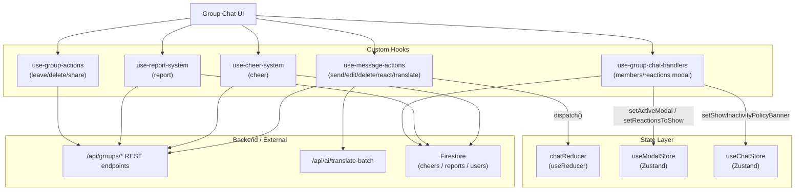
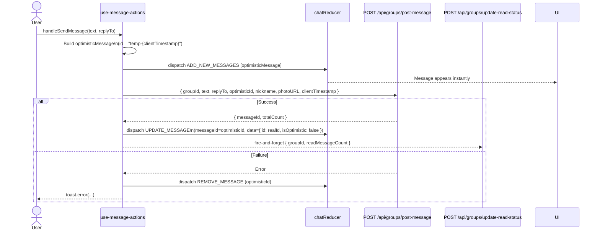
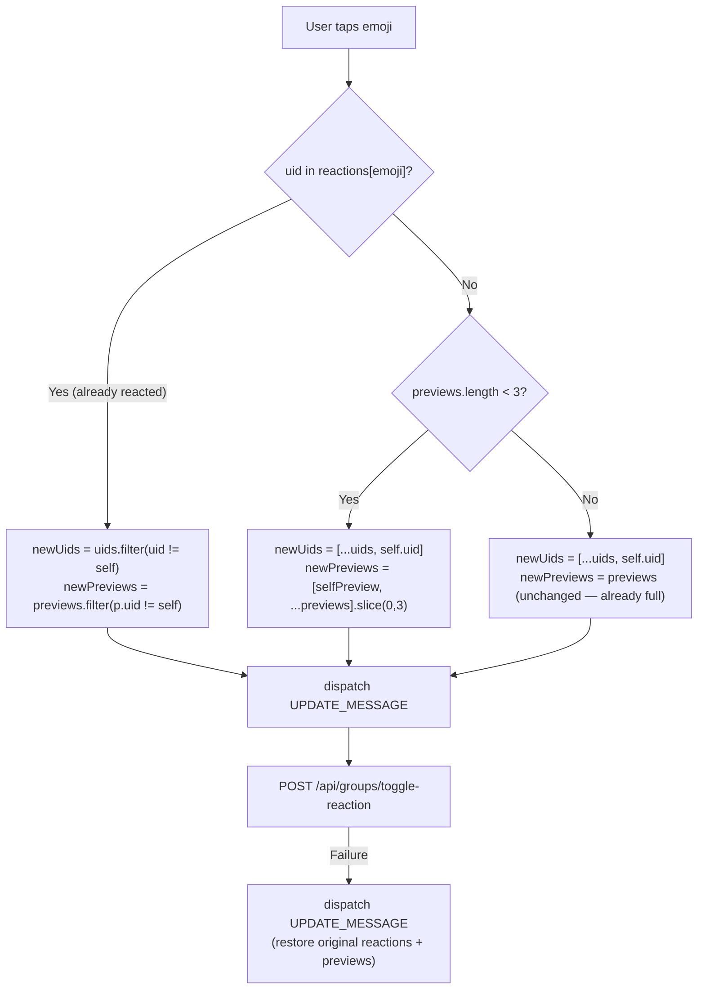
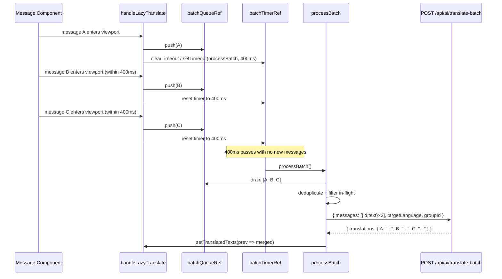
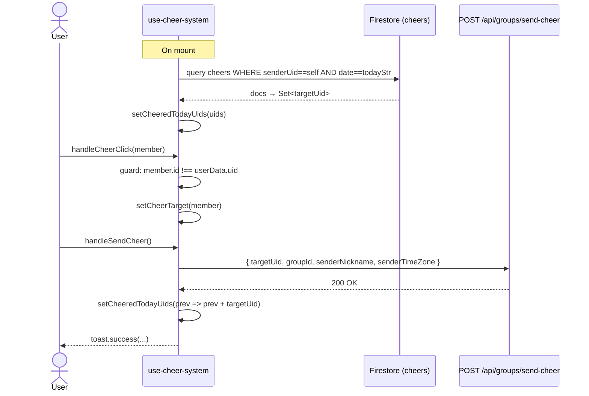

# Group Chat Interaction Engine — Deep-Dive

## Overview

The group chat interaction engine of the **scripture-habit** app is composed of five focused custom React hooks. Together they handle every user-facing interaction inside a group chat room: sending, editing and deleting messages, reacting, translating, cheering members, reporting content, and managing the group itself.

### Hook Inventory

| Hook file | Location | Responsibility |
|---|---|---|
| `use-message-actions.ts` | `hooks/api/` | Send / edit / delete messages, emoji reactions, lazy batch translation |
| `use-cheer-system.ts` | `hooks/interaction/` | One-cheer-per-day encouragement system |
| `use-report-system.ts` | `hooks/api/` | User-generated content moderation reports |
| `use-group-actions.ts` | `hooks/api/` | Leave / delete group, name & description updates, public toggle, social share |
| `use-group-chat-handlers.ts` | `hooks/interaction/` | Members modal lazy-load, reactions detail modal, inactivity banner |

All mutable chat state lives in a central `chatReducer` ([`chat-reducer.ts`](../../scripture-habit/src/components/groupchat/hooks/core/chat-reducer.ts)) which is driven by a `React.useReducer`. The hooks receive the `dispatch` function and call it to apply optimistic updates without waiting for the server.

### Architecture Overview



---

## 1. Optimistic Message Pipeline

All write operations in `use-message-actions.ts` follow the same pattern:

1. **Optimistic dispatch** — apply the change to local state immediately so the UI is instant.
2. **API call** — persist the change on the server.
3. **Resolve or rollback** — on success, replace the temporary state with the authoritative server response; on failure, undo the optimistic change.

### 1.1 Sending a Message

#### Sequence Diagram



#### The Optimistic Message Object

The temporary message constructed before the API call ([`use-message-actions.ts:56–74`](../../scripture-habit/src/components/groupchat/hooks/api/use-message-actions.ts#L56-L74)):

```typescript
const clientTimestamp = Date.now();
const optimisticId = `temp-${clientTimestamp}`;

const optimisticMessage: Message = {
  id: optimisticId,                          // Temporary — replaced on success
  text: text.trim(),
  senderId: userData.uid,
  senderNickname: userData.nickname || 'Member',
  senderPhotoURL: userData.photoURL || null,
  createdAt: new Date(clientTimestamp),      // Local clock — used for sorting
  clientTimestamp,                           // Numeric ms — preferred sort key
  isOptimistic: true,                        // UI flag: show pending indicator
  optimisticId: optimisticId,               // Retained so reducer can match it
  // Only included when the user is replying:
  ...(replyTo ? {
    replyTo: {
      id: replyTo.id,
      senderNickname: replyTo.senderNickname || 'Member',
      text: replyTo.text,
      isNote: replyTo.messageType === 'studyNote'  // true for study note replies
    }
  } : {})
};
```

> [!NOTE]
> `clientTimestamp` is a plain Unix millisecond value. The reducer uses `clientTimestamp || parseTimestampToMillis(createdAt)` when sorting, so optimistic messages slot into the correct chronological position even before the server assigns a Firestore timestamp.

#### The `ADD_NEW_MESSAGES` Reducer Case

The reducer ([`chat-reducer.ts:76–114`](../../scripture-habit/src/components/groupchat/hooks/core/chat-reducer.ts#L76-L114)) handles deduplication between the optimistic message and any server-pushed copy that might arrive via a real-time listener:

```typescript
case 'ADD_NEW_MESSAGES': {
  // 1. Collect optimisticIds from incoming messages
  const optimisticIdsToResolve = new Set(
    newMessages.map(m => m.optimisticId).filter(Boolean)
  );

  // 2. Remove any existing optimistic placeholders being replaced
  const existingMessages = state.messages.filter(m => {
    const isResolvedOptimistic = optimisticIdsToResolve.has(m.id);
    const matchesServerOptimisticId = m.optimisticId && optimisticIdsToResolve.has(m.optimisticId);
    return !isResolvedOptimistic && !matchesServerOptimisticId;
  });

  // 3. Merge and sort by clientTimestamp / createdAt
  const allMessagesMap = new Map<string, Message>();
  existingMessages.forEach(m => allMessagesMap.set(m.id, m));
  newMessages.forEach(m => allMessagesMap.set(m.id, m));

  const finalMessages = Array.from(allMessagesMap.values()).sort((a, b) => {
    const timeA = a.clientTimestamp || parseTimestampToMillis(a.createdAt);
    const timeB = b.clientTimestamp || parseTimestampToMillis(b.createdAt);
    return timeA - timeB;
  });
  // ...
}
```

#### The `UPDATE_MESSAGE` Resolution

After the API returns a real `messageId` ([`use-message-actions.ts:93–98`](../../scripture-habit/src/components/groupchat/hooks/api/use-message-actions.ts#L93-L98)):

```typescript
dispatch({
  type: 'UPDATE_MESSAGE',
  messageId: optimisticId,          // Find the temp-{ts} entry
  data: {
    id: response.data.messageId,    // Swap in the real Firestore document ID
    isOptimistic: false             // Remove pending indicator
  }
});
```

The reducer's `UPDATE_MESSAGE` case ([`chat-reducer.ts:156–160`](../../scripture-habit/src/components/groupchat/hooks/core/chat-reducer.ts#L156-L160)) maps over all messages and returns a new array only when something actually changed (shallow equality guard).

#### Fire-and-Forget Read-Status Sync

Immediately after resolving the optimistic message, the hook makes a second non-blocking call ([`use-message-actions.ts:102–109`](../../scripture-habit/src/components/groupchat/hooks/api/use-message-actions.ts#L102-L109)):

```typescript
// Fire-and-forget: errors are intentionally swallowed
apiClient.post('/api/groups/update-read-status', {
  groupId,
  readMessageCount: response.data.totalCount || 0
});
```

> [!TIP]
> This ensures the sender's own unread badge clears instantly after they post. The `try/catch` inside swallows any errors because this is a non-critical UX optimisation — a failure simply means the badge might show briefly until the next real-time sync.

#### Failure Rollback

```typescript
// On network / server error:
dispatch({ type: 'REMOVE_MESSAGE', messageId: optimisticId });
toast.error(errorMessage);
```

The `REMOVE_MESSAGE` reducer case filters by `message.id`, removing the placeholder atomically ([`chat-reducer.ts:161–162`](../../scripture-habit/src/components/groupchat/hooks/core/chat-reducer.ts#L161-L162)).

---

### 1.2 Editing a Message

The edit flow is a simpler optimistic pattern ([`use-message-actions.ts:130–162`](../../scripture-habit/src/components/groupchat/hooks/api/use-message-actions.ts#L130-L162)):

```typescript
const handleSaveEdit = async (message: Message, newText: string) => {
  const originalText = message.text;  // Snapshot for rollback

  // 1. Optimistic update
  dispatch({ type: 'UPDATE_MESSAGE', messageId: message.id, data: { text: newText, isEdited: true } });

  try {
    await apiClient.post('/api/groups/edit-message', { groupId, messageId: message.id, text: newText });
    return true;
  } catch {
    // 2. Rollback: restore original text, strip isEdited flag
    dispatch({ type: 'UPDATE_MESSAGE', messageId: message.id, data: { text: originalText } });
    return false;
  }
};
```

> [!NOTE]
> The `originalText` is captured before the dispatch so the closure retains the pre-edit value for rollback. `isEdited: true` is set optimistically and is **not** rolled back on failure — the server is the source of truth and any real-time listener will correct the flag if necessary.

---

### 1.3 Deleting a Message

The delete flow inverts the add/remove pattern ([`use-message-actions.ts:164–187`](../../scripture-habit/src/components/groupchat/hooks/api/use-message-actions.ts#L164-L187)):

```typescript
const handleConfirmDeleteMessage = async (message: Message) => {
  // 1. Optimistic remove — message disappears immediately
  dispatch({ type: 'REMOVE_MESSAGE', messageId: message.id });

  try {
    await apiClient.post('/api/groups/delete-message', { groupId, messageId: message.id });
    return true;
  } catch {
    // 2. Rollback — re-add the original message object
    dispatch({ type: 'ADD_NEW_MESSAGES', newMessages: [message] });
    toast.error(errorMessage);
    return false;
  }
};
```

> [!WARNING]
> The rollback uses `ADD_NEW_MESSAGES` with the original `message` object. This means the reducer's deduplication and sorting logic is re-invoked. If a real-time listener has concurrently pushed the same message (because the server delete failed), the reducer's Map-based deduplication ensures it appears only once.

---

## 2. Reaction & Reply System

### 2.1 Toggle Reaction Logic

`handleToggleReactionDirect` ([`use-message-actions.ts:189–241`](../../scripture-habit/src/components/groupchat/hooks/api/use-message-actions.ts#L189-L241)) computes the new reaction state entirely on the client before dispatching:

```typescript
const handleToggleReactionDirect = async (message: Message, emoji: string) => {
  const uids = message.reactions?.[emoji] || [];
  const currentPreviews = message.reactionPreviews?.[emoji] || [];
  const hasReacted = uids.includes(userData.uid);

  // Toggle uid in/out of the array
  const newUids = hasReacted
    ? uids.filter(uid => uid !== userData.uid)   // REMOVE
    : [...uids, userData.uid];                    // ADD

  // Maintain ≤3 preview objects
  const newPreviews = hasReacted
    ? currentPreviews.filter(p => p.uid !== userData.uid)
    : (currentPreviews.length < 3
        ? [{ uid: userData.uid, nickname: userData.nickname, photoURL: userData.photoURL }, ...currentPreviews].slice(0, 3)
        : currentPreviews);                        // Already full — don't add self

  dispatch({
    type: 'UPDATE_MESSAGE',
    messageId: message.id,
    data: {
      reactions: { ...message.reactions, [emoji]: newUids },
      reactionPreviews: { ...message.reactionPreviews, [emoji]: newPreviews }
    }
  });

  await apiClient.post('/api/groups/toggle-reaction', { groupId, messageId: message.id, emoji, nickname, photoURL });
  // On failure: rollback to message.reactions / message.reactionPreviews
};
```

#### Toggle Decision Flowchart



> [!NOTE]
> `reactionPreviews` is a lightweight display cache: at most 3 `{ uid, nickname, photoURL }` objects per emoji. It allows the UI to render avatars/nicknames without re-fetching member documents. `handleToggleReaction` (no suffix) is a convenience wrapper that always passes `'👍'` as the emoji ([`use-message-actions.ts:243–245`](../../scripture-habit/src/components/groupchat/hooks/api/use-message-actions.ts#L243-L245)).

### 2.2 Reply-To Structure

When a user replies, `handleSendMessage` embeds a `replyTo` snapshot inside the outgoing message. The shape stored in the `Message` type ([`chat.ts:50–55`](../../scripture-habit/src/types/chat.ts#L50-L55)):

```typescript
replyTo?: {
  id: string;                // Firestore document ID of the quoted message
  senderNickname: string;    // Snapshot of the original sender's nickname
  text: string;              // Snapshot of the original message text
  isNote: boolean;           // true when the quoted message is a study note
} | string | null;
```

> [!IMPORTANT]
> The `replyTo` field stores a **snapshot** of the original message at the time of reply. This means the quoted preview remains stable even if the original message is later edited or deleted.

---

## 3. Lazy Batch Translation Engine

The translation subsystem in `use-message-actions.ts` is designed to translate many messages at once rather than one at a time, minimising API calls when a user scrolls through a chat history in a foreign language.

### 3.1 State & Refs

```typescript
const [translatingIds, setTranslatingIdsState] = useState<Set<string>>(new Set());
const [translatedTexts, setTranslatedTexts] = useState<Record<string, string>>({});

const translatingIdsRef = useRef<Set<string>>(new Set()); // Sync ref — avoids stale closures
const batchQueueRef    = useRef<Message[]>([]);            // Accumulates messages to translate
const batchTimerRef    = useRef<ReturnType<typeof setTimeout> | null>(null); // Debounce handle
const prevGroupIdRef   = useRef<string>(groupId);         // Detects group switches
```

> [!NOTE]
> `translatingIdsRef` is a `useRef` mirror of `translatingIds` state. Closures inside `handleLazyTranslate` and `processBatch` need **synchronous** access to the current set — reading from the ref avoids reading a stale closure-captured state value.

### 3.2 Language Detection Skip

Before queuing a message, `handleLazyTranslate` checks whether translation is even needed ([`use-message-actions.ts:31–36`](../../scripture-habit/src/components/groupchat/hooks/api/use-message-actions.ts#L31-L36)):

```typescript
const isLikelyAlreadyInLanguage = (text: string, targetLang: string) => {
  // Unicode ranges: Hiragana [\u3040-\u309F], Katakana [\u30A0-\u30FF], CJK [\u4E00-\u9FAF]
  const hasJapanese = /[\u3040-\u309F\u30A0-\u30FF\u4E00-\u9FAF]/.test(text);
  if (targetLang === 'ja' && hasJapanese) return true;   // Already Japanese
  if (targetLang === 'en' && !hasJapanese && /[a-zA-Z]/.test(text)) return true; // Likely English
  return false;
};
```

A message is **skipped** from the queue if any of the following are true ([`use-message-actions.ts:280–285`](../../scripture-habit/src/components/groupchat/hooks/api/use-message-actions.ts#L280-L285)):

| Condition | Reason |
|---|---|
| `!message.text` | Nothing to translate |
| `message.translations?.[language]` | Pre-translated by the backend during storage |
| `translatedTexts[message.id]` | Already translated in this session (in-memory cache) |
| `translatingIdsRef.current.has(message.id)` | Currently in-flight |
| `isLikelyAlreadyInLanguage(text, language)` | Heuristic: text already in target language |

### 3.3 The 400ms Debounce Queue

```typescript
const handleLazyTranslate = (message: Message) => {
  // Skip checks (see above)...

  batchQueueRef.current.push(message);           // Enqueue
  if (batchTimerRef.current) clearTimeout(batchTimerRef.current); // Reset timer
  batchTimerRef.current = setTimeout(processBatch, 400);          // Re-arm
};
```

Each time a new message enters the viewport and calls `handleLazyTranslate`, the 400ms timer is reset. `processBatch` only fires once the user stops triggering new translations for 400ms — i.e., after they finish scrolling.

### 3.4 Batch Processing & Deduplication

[`use-message-actions.ts:247–277`](../../scripture-habit/src/components/groupchat/hooks/api/use-message-actions.ts#L247-L277):

```typescript
const processBatch = async () => {
  const queue = [...batchQueueRef.current];
  batchQueueRef.current = [];                     // Drain the queue atomically
  if (queue.length === 0) return;

  // Deduplicate: keep first occurrence of each id, exclude already-translating
  const toProcess = queue.filter((m, index, self) =>
    self.findIndex(t => t.id === m.id) === index &&
    !translatingIdsRef.current.has(m.id)
  );
  if (toProcess.length === 0) return;

  const ids = toProcess.map(m => m.id);
  ids.forEach(id => translatingIdsRef.current.add(id));   // Mark in-flight
  setTranslatingIdsState(new Set(translatingIdsRef.current));

  try {
    const response = await apiClient.post('/api/ai/translate-batch', {
      messages: toProcess.map(m => ({ id: m.id, text: m.text })),
      targetLanguage: language,
      groupId
    });

    if (response.data?.translations) {
      // Merge into local cache: { [messageId]: translatedText }
      setTranslatedTexts(prev => ({ ...prev, ...response.data.translations }));
    }
  } catch (e) {
    console.error('Batch translation error:', e);
  } finally {
    ids.forEach(id => translatingIdsRef.current.delete(id));  // Unmark in-flight
    setTranslatingIdsState(new Set(translatingIdsRef.current));
  }
};
```

### 3.5 Cache Clear on Group Switch

When the user navigates to a different group, the `groupId` prop changes and the effect clears all translation state ([`use-message-actions.ts:39–49`](../../scripture-habit/src/components/groupchat/hooks/api/use-message-actions.ts#L39-L49)):

```typescript
useEffect(() => {
  if (prevGroupIdRef.current !== groupId) {
    setTranslatedTexts({});               // Clear the in-memory translation cache
    translatingIdsRef.current.clear();   // Reset the in-flight set
    setTranslatingIdsState(new Set());
    prevGroupIdRef.current = groupId;
  }
  return () => {
    if (batchTimerRef.current) clearTimeout(batchTimerRef.current); // Cleanup on unmount
  };
}, [groupId]);
```

### 3.6 Queue Flush Sequence Diagram



> [!TIP]
> There is also a `handleTranslateMessage` function (used for manual/forced single translation) that calls `POST /api/ai/translate` (singular) and similarly uses the `translatingIdsRef` guard to prevent duplicates.

---

## 4. Cheer System

The cheer system ([`use-cheer-system.ts`](../../scripture-habit/src/components/groupchat/hooks/interaction/use-cheer-system.ts)) lets group members send a one-time daily encouragement to each other, enforced client-side via a Firestore query on mount.

### 4.1 Timezone-Aware Day Boundary

```typescript
const timeZone = userData.timeZone || 'UTC';
const todayStr = new Date().toLocaleDateString('sv-SE', { timeZone });
// 'sv-SE' locale formats as YYYY-MM-DD — identical to ISO date format
```

This ensures that "today" is resolved in the **user's own timezone**, not the server's. A user in Tokyo (JST, UTC+9) and a user in New York (EST, UTC-5) have different "today" values even at the same instant.

### 4.2 On-Mount Firestore Query

```typescript
useEffect(() => {
  const fetchCheers = async () => {
    const q = query(
      collection(db, 'cheers'),
      where('senderUid', '==', userData.uid),  // Only this user's sent cheers
      where('date', '==', todayStr)             // Only today (in user's timezone)
    );
    const snapshot = await getDocs(q);
    const uids = new Set<string>();
    snapshot.forEach(doc => uids.add(doc.data().targetUid));
    setCheeredTodayUids(uids);                  // Set of UIDs already cheered today
  };
  fetchCheers();
}, [userData?.uid, userData?.timeZone]);         // Re-run if user identity changes
```

### 4.3 Send Cheer Flow

```typescript
const handleCheerClick = (member: UserProfileBrief) => {
  if (member.id === userData?.uid) return;  // Cannot cheer yourself
  setCheerTarget(member);                   // Opens confirmation modal
};

const handleSendCheer = async () => {
  if (!cheerTarget || isSendingCheer) return;  // Guard against double-tap
  setIsSendingCheer(true);

  await apiClient.post('/api/groups/send-cheer', {
    targetUid:       cheerTarget.id,
    groupId,
    senderNickname:  userData.nickname,
    senderTimeZone:  userData.timeZone       // Backend uses this for the 'date' field
  });

  // Optimistic: add to the already-cheered set so button disables immediately
  setCheeredTodayUids(prev => {
    const next = new Set(prev);
    next.add(cheerTarget.id);
    return next;
  });
};
```

> [!IMPORTANT]
> The `cheeredTodayUids` Set is the **only client-side enforcement** of the one-cheer-per-day rule. On page refresh, the Firestore query re-runs and re-populates it from the server, so the guard is durable across sessions.

### 4.4 Cheer Flow Summary



---

## 5. Content Moderation: Report System

The report system ([`use-report-system.ts`](../../scripture-habit/src/components/groupchat/hooks/api/use-report-system.ts)) writes directly to Firestore from the client. No REST endpoint is involved.

### 5.1 Report Flow

```typescript
const handleReportClick = (message: Message) => {
  setReportedMessage(message);   // Store the message being reported
  setShowReportModal(true);      // Open the report modal
};
```

When the user confirms in the modal ([`use-report-system.ts:17–38`](../../scripture-habit/src/components/groupchat/hooks/api/use-report-system.ts#L17-L38)):

```typescript
const confirmReport = async () => {
  await addDoc(collection(db, 'reports'), {
    messageId:   reportedMessage.id,
    groupId:     groupId,
    reporterUid: userData.uid,
    reason:      reportReason,        // Default: 'inappropriate'
    createdAt:   serverTimestamp(),   // Firestore server time, not client clock
    text:        reportedMessage.text,
    senderId:    reportedMessage.senderId
  });
};
```

### 5.2 Schema of a `reports` Document

| Field | Type | Description |
|---|---|---|
| `messageId` | `string` | Firestore ID of the reported message |
| `groupId` | `string` | Group the message belongs to |
| `reporterUid` | `string` | UID of the user filing the report |
| `reason` | `string` | Report category; default `'inappropriate'` |
| `createdAt` | `Timestamp` | Server-generated timestamp (not client clock) |
| `text` | `string` | Snapshot of the reported message text |
| `senderId` | `string` | UID of the original message author |

> [!WARNING]
> The `reason` field is initialised to `'inappropriate'` and the user can change it via `setReportReason`. If the modal does not expose reason selection in the current UI, the default will always be written. The hook is designed to be extensible.

> [!CAUTION]
> Because `addDoc` is called directly from the client using the Firestore SDK, Firestore Security Rules are the sole enforcement layer for rate-limiting and access control on the `reports` collection. Ensure rules prevent a user from reading or deleting others' reports.

---

## 6. Group Management Actions

All destructive actions in `use-group-actions.ts` share a single `actionInProgress` ref guard that prevents double-invocation from rapid taps.

### 6.1 Double-Tap Guard Pattern

```typescript
const actionInProgress = useRef(false);

const handleLeaveGroup = async () => {
  if (!userData || actionInProgress.current) return;  // Early exit if already running
  actionInProgress.current = true;                    // Acquire "lock"
  setIsLeaving(true);
  try {
    await apiClient.post('/api/groups/leave-group', { groupId });
    navigate(`/${language}/dashboard`, { replace: true });
  } catch (err) {
    toast.error(errorMessage);
  } finally {
    setIsLeaving(false);
    actionInProgress.current = false;                 // Release "lock"
  }
};
```

`handleDeleteGroup` follows the identical pattern without the `userData` guard (only the owner can reach the delete UI, enforced upstream).

> [!NOTE]
> Using a `useRef` for the guard (rather than `useState`) is intentional: the ref update is **synchronous** and doesn't trigger a re-render, so a second tap within the same event loop tick is blocked correctly. A `useState` boolean would not be visible to the second call until the next render cycle.

### 6.2 Leave vs Delete

| | `handleLeaveGroup` | `handleDeleteGroup` |
|---|---|---|
| Endpoint | `POST /api/groups/leave-group` | `POST /api/groups/delete-group` |
| Who can call | Any group member | Group owner only (enforced by backend) |
| Post-success | Navigate to `/{language}/dashboard` | Navigate to `/{language}/dashboard` |
| Callback override | `onLeaveSuccess?()` | `onDeleteSuccess?()` |

### 6.3 Name & Description Update with Translation Payload

[`use-group-actions.ts:95–129`](../../scripture-habit/src/components/groupchat/hooks/api/use-group-actions.ts#L95-L129):

```typescript
const handleUpdateGroupName = async (newName, newDesc, newTransName, newTransDesc) => {
  const payload: {
    groupId: string;
    name?: string;
    description?: string;
    translations?: Record<string, { name?: string; description?: string }>;
  } = { groupId };

  if (newName !== undefined) payload.name = newName;
  if (newDesc !== undefined) payload.description = newDesc;

  // Only include translations block if at least one translated field is provided
  if (newTransName || newTransDesc) {
    payload.translations = {
      [language]: {
        ...(newTransName ? { name: newTransName } : {}),
        ...(newTransDesc ? { description: newTransDesc } : {})
      }
    };
  }

  await apiClient.post('/api/groups/update-group', payload);
};
```

The `translations` field allows the group owner to supply locale-specific names/descriptions (e.g., a Japanese name for a group primarily shown to Japanese users) without overwriting the canonical name. The key is the active `language` string (e.g., `'ja'`, `'en'`).

### 6.4 Public/Private Toggle

```typescript
const togglePublicStatus = async () => {
  await apiClient.post('/api/groups/update-group', {
    groupId,
    isPublic: !groupData.isPublic   // Simple boolean flip
  });
};
```

No optimistic update is applied here — the toggle waits for the server to confirm before the UI reflects the change (the calling component listens to the Firestore real-time listener for `groupData`).

### 6.5 Social Share Handlers

All four share handlers build an `inviteLink` from `groupData.inviteCode` and `window.location.origin`:

```typescript
// LINE — uses the line.me universal link scheme with encoded invite message text
const handleShareLine = () => {
  const inviteLink = `${window.location.origin}/${language}/join/${groupData?.inviteCode}`;
  window.open(
    `https://line.me/R/msg/text/?${encodeURIComponent(t('groupChat.inviteMessage', { groupName, inviteLink }))}`,
    '_blank'
  );
};

// WhatsApp — uses the wa.me universal link with encoded text
const handleShareWhatsApp = () => {
  window.open(`https://wa.me/?text=${encodeURIComponent(inviteMessage)}`, '_blank');
};

// Messenger — uses the fb-messenger:// deep link scheme (mobile-only)
const handleShareMessenger = () => {
  const inviteLink = `${window.location.origin}/join/${groupData?.inviteCode}`;
  window.open(`fb-messenger://share?link=${encodeURIComponent(inviteLink)}`, '_blank');
};

// Instagram — no direct share API; copies link to clipboard then opens instagram.com
const handleShareInstagram = () => {
  navigator.clipboard.writeText(inviteLink).then(() => {
    toast.info(t('groupChat.linkCopiedForInstagram'));
    window.open('https://www.instagram.com/', '_blank');
  });
};
```

> [!NOTE]
> LINE and WhatsApp both use language-aware invite links (`/{language}/join/{code}`). Messenger and Instagram use a language-agnostic path (`/join/{code}`) — likely because the join landing page handles language detection independently.

> [!TIP]
> The Instagram handler requires the user to manually paste the copied link into their story or DM. The `toast.info` notifies the user that the link is in their clipboard before Instagram opens.

---

## 7. Member List & Reactions Modal

### 7.1 Lazy Member Loading

`handleShowMembers` in [`use-group-chat-handlers.ts:35–52`](../../scripture-habit/src/components/groupchat/hooks/interaction/use-group-chat-handlers.ts#L35-L52) uses an additive fetch strategy: it only requests Firestore documents for UIDs that are **not already** in the local `membersList`:

```typescript
const handleShowMembers = async () => {
  setActiveModal('members');
  setMembersLoading(true);

  // Diff: which UIDs from groupData.members are missing from current list?
  const missingUids = groupData.members.filter(
    uid => !membersList.some(m => m.id === uid)
  );

  if (missingUids.length > 0) {
    // Parallel fetch — one getDoc per missing UID
    const snapshots = await Promise.all(
      missingUids.map(uid => getDoc(doc(db, 'users', uid)))
    );
    const newMembers = snapshots.map(snap =>
      snap.exists()
        ? { id: snap.id, ...snap.data() } as UserProfileBrief
        : { id: snap.id, nickname: 'Unknown' } as UserProfileBrief   // Fallback
    );
    setMembersList(prev => [...prev, ...newMembers]);  // Append, don't replace
  }
};
```

> [!TIP]
> The additive approach means re-opening the members modal is instant after the first load — no redundant Firestore reads. The `membersList` array persists in parent component state for the lifetime of the chat room.

### 7.2 Reactions Detail Flattening

`handleShowReactions` ([`use-group-chat-handlers.ts:54–69`](../../scripture-habit/src/components/groupchat/hooks/interaction/use-group-chat-handlers.ts#L54-L69)) transforms the compact storage format into a flat list suitable for display:

**Input shape** (stored on the message document):
```typescript
reactions:        Record<emoji, string[]>          // { "👍": ["uid1", "uid2"], "❤️": ["uid3"] }
reactionPreviews: Record<emoji, ReactionPreview[]> // { "👍": [{ uid, nickname, photoURL }×3] }
```

**Output shape** (for the reactions modal):
```typescript
type ReactionItem = {
  userId:   string;  // The reactor's UID
  emoji:    string;  // Which emoji
  nickname: string;  // Display name (membersMap > preview fallback > 'Unknown')
};
```

**Flattening logic:**
```typescript
const handleShowReactions = (reactions, previews) => {
  const reactionsList: ReactionItem[] = [];

  Object.entries(reactions).forEach(([emoji, uids]) => {
    uids.forEach(uid => {
      // Nickname lookup priority: live membersMap → reactionPreview → 'Unknown'
      const preview = previews?.[emoji]?.find(p => p.uid === uid);
      reactionsList.push({
        userId:   uid,
        emoji,
        nickname: membersMap[uid]?.nickname || preview?.nickname || 'Unknown'
      });
    });
  });

  setReactionsToShow(reactionsList);
  setActiveModal('reactions');
};
```

The nickname resolution priority is significant:

| Source | When used |
|---|---|
| `membersMap[uid]?.nickname` | Preferred — up-to-date nickname from the live members map |
| `preview?.nickname` | Fallback — cached nickname snapshot from `reactionPreviews` |
| `'Unknown'` | Last resort — UID exists but no nickname data is available |

### 7.3 Dismissing the Inactivity Banner

```typescript
const handleDismissInactivityBanner = () => {
  setShowInactivityPolicyBanner(false);   // Zustand store — hides immediately
  safeStorage.set('hasDismissedInactivityPolicy', 'true');  // Persists across sessions
};
```

The banner is stored in both Zustand (for the current session) and `safeStorage` (a localStorage wrapper) so that the banner does not reappear after a page refresh.

---

## Appendix: Reducer Action Reference

The following `ChatAction` types are used by the interaction hooks above ([`chat-reducer.ts:18–32`](../../scripture-habit/src/components/groupchat/hooks/core/chat-reducer.ts#L18-L32)):

| Action type | Payload | Effect |
|---|---|---|
| `ADD_NEW_MESSAGES` | `newMessages: Message[]` | Merges with dedup + sort; resolves optimistic IDs |
| `UPDATE_MESSAGE` | `messageId: string`, `data: Partial<Message>` | Patches one message by ID |
| `REMOVE_MESSAGE` | `messageId: string` | Filters the message out of the list |
| `UPDATE_GROUP` | `groupData: GroupData` | Replaces group metadata; skips if content is identical |
| `SET_READ_COUNT` | `count: number` | Sets `userReadCount` to `max(current, count)` |
