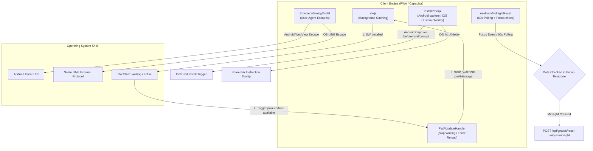
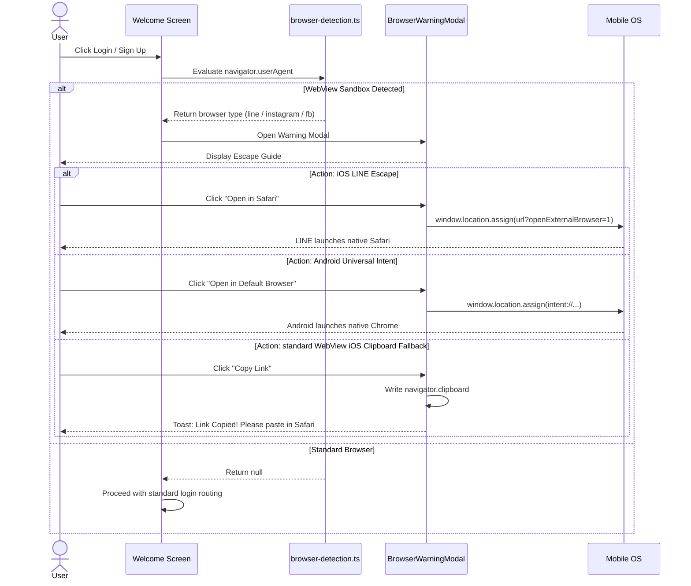

# PWA & Capacitor Hybrid Mobile Lifecycle — Deep-Dive

## Overview

The **scripture-habit** application runs under a hybrid architecture: it is served as a Progressive Web App (PWA) on standard web browsers and wrapped via **Capacitor** to run as native iOS and Android packages. 

This multi-platform deployment introduces challenges around update management, platform-specific installations, sandbox WebView constraints, and cross-timezone daily state resets. This document provides a technical deep-dive into the lifecycle hooks, event controllers, and WebView escape gates that keep the app running.



---

## 1. PWA Update & SW Control Lifecycle

To deliver updates instantly without breaking in-progress user sessions (such as typing a study note), **scripture-habit** implements an active update-available listener inside [`PWAUpdateHandler`](../../scripture-habit/src/components/pwaupdatehandler/pwa-update-handler.tsx).

### 1.1 Non-Block Waiting Pattern

When the host browser pulls down a new Service Worker compilation:
1. **Dormant Registration**: The new SW is downloaded and compiled. It is placed into a `waiting` state to prevent displacing the current page controller.
2. **Notification Event**: The PWA dispatching engine fires a custom `pwa-update-available` event, passing the waiting `ServiceWorkerRegistration` object as detail payload.
3. **Interactive Toast**: The `PWAUpdateHandler` intercepts the event and pops a non-dismissible, bottom-centered info toast.

### 1.2 Skip Waiting & 3-Second Fallback Latch

When the user clicks the "Update" button, the handler disables inputs, shows an inline loading spinner, and issues a `SKIP_WAITING` payload directly to the dormant worker. To cover edge cases where standard controller transitions are blocked, a 3-second recovery timer enforces a manual page reload:

```typescript
toast.info(
  <div className="pwa-update-toast-container">
    <span className="pwa-update-message">{updateMessage}</span>
    <button
      onClick={(e) => {
        // Immediate visual lock
        const btn = e.currentTarget;
        btn.disabled = true;
        btn.innerHTML = '<span class="loading-spinner" style="... animation:spin 1s linear infinite;"></span> Updating...';
        btn.style.opacity = '0.7';

        if (registration) {
          const worker = registration.waiting || registration.installing;
          if (worker) {
            // Signal dormant worker to take control
            worker.postMessage({ type: 'SKIP_WAITING' });
            // Fallback reload if controllerchange takes too long
            setTimeout(() => window.location.reload(), 3000);
          } else {
            window.location.reload();
          }
        } else {
          window.location.reload();
        }
      }}
      className="pwa-update-button"
    >
      {updateButtonText}
    </button>
  </div>,
  {
    toastId: 'pwa-update',
    position: "bottom-center",
    autoClose: false,
    closeOnClick: false,
    draggable: false,
    closeButton: false
  }
);
```

---

## 2. Platform-Adaptive PWA Installations

To encourage users to install the app on their home screen, the system triggers custom, adaptive install banners depending on the host OS.

### 2.1 Display Criteria (Co-existence Safety)
Banners are heavily throttled to maintain high UX standards:
* **Standalone Check**: Returns early if running inside standalone mode (`window.matchMedia('(display-mode: standalone)').matches`).
* **Cooldown Buffer**: If a user dismisses the prompt, the action is saved in local storage. The prompt is suppressed for **7 days** before presenting again.
* **UI Shielding**: Only shows on the `/dashboard` screen when no modal windows are open.

### 2.2 Adaptive Strategies

#### A. Android beforeinstallprompt Capture
On Chromium browsers (Android/Chrome), the banner listens for the browser's native `beforeinstallprompt` event. It captures the event, displays a custom call-to-action button, and triggers the native install prompt:

```typescript
window.addEventListener('beforeinstallprompt', (e) => {
    e.preventDefault();
    deferredPromptRef.current = e; // Store for later execution
    setIsPromptReady(true);
});

const handleInstallApp = async () => {
    const promptEvent = deferredPromptRef.current;
    if (!promptEvent) return;
    
    // Trigger Chrome native prompt
    promptEvent.prompt();
    const { outcome } = await promptEvent.userChoice;
    console.log(`User installation outcome: ${outcome}`);
    
    deferredPromptRef.current = null;
    setIsPromptReady(false);
};
```

#### B. iOS sharebar Instruction Overlay
Apple iOS Safari does not support the native `beforeinstallprompt` event. The system falls back to a custom guide:
1. **4-Second Entry Delay**: Wait 4 seconds on dashboard entry to let the main interface load without visual overlaps.
2. **Action Highlight**: An overlay points toward the Safari **Share** button (located on the bottom bar for iPhones, and the top bar for iPads).
3. **Step-by-step Tutorial**: Guides the user to click "Share" and select **"Add to Home Screen"**.

---

## 3. WebView Sandboxes & Escape Protocols

When users open links from LINE, Facebook, Instagram, or Telegram, the apps spawn sandboxed In-App WebViews. These sandboxes are severely restricted: they block Service Workers, prohibit push notifications, restrict file access, and delete IndexedDB caches on app close.

To maintain account safety and data integrity, the system implements an active **WebView Escape Protocol**.



### 3.1 Sandbox User-Agent Signatures
The detector ([`browser-detection.ts`](../../scripture-habit/src/utils/browser-detection.ts)) checks user-agent strings for specific sandbox signatures:
* **LINE**: `/Line\//i`
* **Instagram**: `/Instagram/i`
* **Facebook**: `/FBAN|FBAV/i` (iOS) and `/FB_IAB/i` (Android)
* **WhatsApp**: `/WhatsApp/i`

### 3.2 Automated Escape Vectors
Standard page redirects can crash WebViews. Instead, the warning modal disables standard buttons and provides native OS escape vectors:

* **iOS LINE Protocol**: Appends `?openExternalBrowser=1` to the URL. LINE iOS intercepts this query parameter and opens the URL in the system's native Safari browser.
* **Android Universal Intent**: Redirects using an Android intent scheme. This forces the Android OS to open the URL in the user's default browser (like Google Chrome):
  ```
  intent://[host_and_path]#Intent;scheme=https;action=android.intent.action.VIEW;end
  ```
* **Clipboard Fallback**: If the app sandbox blocks standard intent schemes, the modal copies the clean join URL using `navigator.clipboard.writeText` and displays a toast advising the user to paste the URL directly into their standard browser.

---

## 4. Timezone-Aware Midnight UI Resets

In group chats, the daily participation percentage resets to 0% at midnight. Because members can live in different timezones, this date transition must be resolved dynamically on the client side using [`useUnityMidnightReset.ts`](../../scripture-habit/src/hooks/use-unity-midnight-reset.ts).

### 4.1 Hybrid Resumption & Focus Polling

If a user keeps the app open in the background or locks their phone, standard background timers (`setInterval`) are suspended by the OS. 

To ensure the UI is updated immediately when they wake their device, the hook listens for both a **60-second polling interval** and the **window focus event**:

```typescript
useEffect(() => {
    // Check immediately on load/mount
    checkAndReset();

    // Polling backup
    const interval = setInterval(checkAndReset, 60000);

    // Focus Listener: triggers when phone wakes up or user returns to tab
    const handleFocus = () => {
        checkAndReset();
    };
    window.addEventListener('focus', handleFocus);

    return () => {
        clearInterval(interval);
        window.removeEventListener('focus', handleFocus);
    };
}, [checkAndReset]);
```

### 4.2 Group Timezone Resolution

The reset evaluator uses high-precision timezone conversion. It converts the client's current system clock to the group's specific timezone to check if a new day has started:

```typescript
const checkAndReset = useCallback(async () => {
    if (!groupId || isResettingRef.current) return;

    // 1. Calculate today's date in group's timezone
    const now = new Date();
    const todayStr = formatDateInTimeZone(now, groupTimeZone || 'UTC');
    const normalizedToday = normalizeDateString(todayStr);

    // 2. Skip if already checked for today
    if (lastCheckedDateRef.current === normalizedToday) return;

    // 3. Resolve group's last active date from Firestore
    let normalizedActivityDate = null;
    if (dailyActivityDate) {
        const rawDate = dailyActivityDate;
        const dateObj = typeof rawDate === 'string' ? null : parseTimestampToDate(rawDate);
        const dateStr = dateObj ? formatDateInTimeZone(dateObj, groupTimeZone) : String(rawDate);
        normalizedActivityDate = normalizeDateString(dateStr);
    }
    
    // 4. Midnight Check: Has midnight passed in the group's timezone?
    if (normalizedActivityDate && normalizedActivityDate !== normalizedToday) {
        isResettingRef.current = true;
        try {
            // Trigger secure API handshake...
            onReset?.(); // Reset UI total locally
            lastCheckedDateRef.current = normalizedToday;
        } finally {
            isResettingRef.current = false;
        }
    } else {
        lastCheckedDateRef.current = normalizedToday;
    }
}, [groupId, groupTimeZone, dailyActivityDate, onReset]);
```

### 4.3 App Check Protected Handshake

To prevent malicious users from resetting group statistics arbitrarily, the endpoint `/api/groups/reset-unity-if-midnight` requires two verification headers:
1. **User Token**: A fresh Firebase ID token verifying the user's group membership.
2. **App Integrity Token**: A Firebase App Check JWT verifying the request comes from an authentic, untampered PWA or Capacitor app:

```typescript
const currentUser = auth.currentUser;
const idToken = await currentUser.getIdToken();

let appCheckToken = '';
if (appCheck) {
    const tokenResponse = await getToken(appCheck, false);
    appCheckToken = tokenResponse.token;
}

const headers: Record<string, string> = {
    'Content-Type': 'application/json',
    'Authorization': `Bearer ${idToken}`,
};
if (appCheckToken) {
    headers['X-Firebase-AppCheck'] = appCheckToken;
}

await fetch('/api/groups/reset-unity-if-midnight', {
    method: 'POST',
    headers,
    body: JSON.stringify({ groupId })
});
```
This guarantees that resets occur securely, timezone-accurately, and with zero performance impact.
