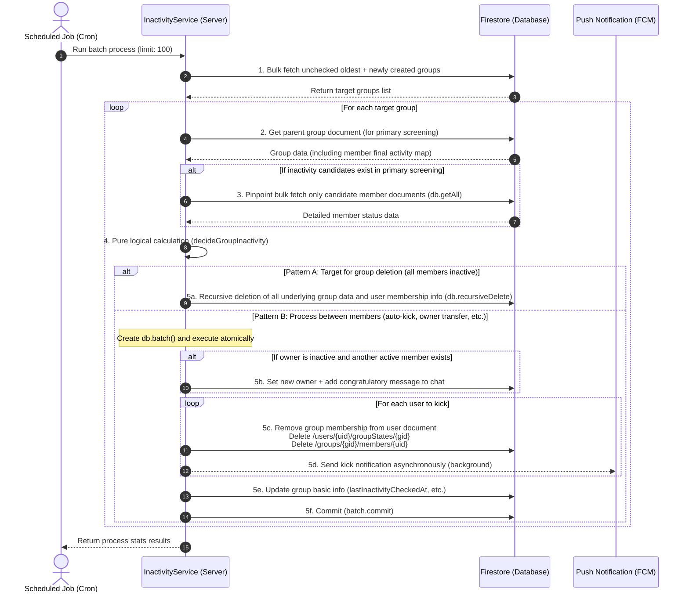
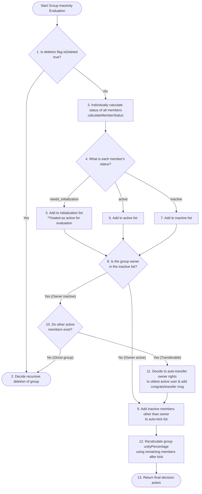

# 🔬 Detailed Explanation: Inactivity Sweep & Auto-Kick / Owner Transfer Engine

This document provides a detailed explanation of the **"Inactivity Sweep Middleware"** that completely automates background operations for Scripture Habit, the **"Two-Stage Query Optimization"** that dramatically reduces Firestore read costs, and the **"Owner Transfer & Auto-Dissolution Engine"** that prevents groups from becoming ghost groups.

---

## 🔄 Batch Check & Double Rotation Strategy

The inactivity detection process is a backend batch process called daily via a cron job. To scan hundreds or thousands of groups efficiently and evenly, it combines two scanning strategies: **"Rotation"** and **"The Net."**

1. **Rotation**:
   Groups are sorted and batch-processed starting from the one with the oldest last checked timestamp (`lastInactivityCheckedAt`). This ensures all groups are scanned evenly.
2. **The Net**:
   Newly created groups do not have the `lastInactivityCheckedAt` field, so they might be missed by a simple "oldest-first" sort. To catch (and self-heal) these, recently created groups are fetched separately, and those not yet checked are appended to the end of the rotation batch.

---

## 🛡️ 2-Stage Read Optimization (Firestore Read Optimization)

Firestore's pricing model is based on the number of document reads. When checking the activity status of tens of thousands of users daily, reading every single user's document individually would result in enormous read costs.

Scripture Habit adopts an advanced two-stage optimization design to **"determine multiple statuses in a single read."**

*   **Stage 1: Primary Screening via the Parent Group Document**
    The parent document of each group (`/groups/{groupId}`) maintains map objects (`memberLastActive` and `memberLastReadAt`) that synchronize the final activity status of each member.
    The sweeper first **reads only a single parent group document and calculates the status of members based on this map information**. For members determined to be "definitely active" at this stage, **reading their underlying individual documents is completely skipped**.
*   **Stage 2: Pinpoint Retrieval of Only Inactivity Candidates (getAll)**
    Only for users determined as "potentially inactive (or uninitialized) in the primary screening," their underlying member status documents (`/groups/{groupId}/members/{uid}`) are fetched in parallel batches of 100 using `db.getAll()`.
    This successfully **reduces database read operations by more than 90%** compared to a naive approach.

---

## 🔄 Sweep & Kick Transaction Process Flow

The following is the sequence from when the cron job starts until the inactivity kicks, automatic group dissolutions, and owner transfers are completed as Firestore transactions.



---

## 📅 Inactivity Detection & Owner Transfer Decision Tree

The decision logic that determines the fate of a group is processed entirely within `decideGroupInactivity`, which is a completely I/O-free **pure function**. This allows for perfect unit test execution simply by mocking time and test data.



---

## 💻 Core Code Explanation

### 1. Preparing for Inactivity Evaluation via Two-Stage Read (`inactivity-service.ts`)

This is the core logic that leverages the primary screening map to minimize Firestore reads.

```typescript
export class InactivityService {
    static async processGroupInactivity(groupId: string, groupSnap?: admin.firestore.DocumentSnapshot) {
        const groupRef = db.collection('groups').doc(groupId);
        const actualSnap = groupSnap || await groupRef.get();
        if (!actualSnap.exists) return { removedCount: 0, initializedCount: 0, transferCount: 0, groupDeleted: false };

        const groupData = actualSnap.data() as GroupDocument;
        const membersArray = groupData.members || [];
        const now = new Date();

        // 1. サブコレクションの自己修復機能（セルフヒーリング）
        // ドキュメント同期エラー等でmembers配下が空になった場合、limit(1)で安価に検知し、バッチで自己修復
        if (membersArray.length > 0) {
            const oneMemberSnap = await groupRef.collection('members').limit(1).get();
            if (oneMemberSnap.empty) {
                const healBatch = db.batch();
                for (const uid of membersArray) {
                    const memberRef = groupRef.collection('members').doc(uid);
                    const joinedAt = groupData.memberJoinedAt?.[uid] || groupData.createdAt || admin.firestore.FieldValue.serverTimestamp();
                    healBatch.set(memberRef, {
                        uid, joinedAt,
                        lastActiveAt: groupData.memberLastActive?.[uid] || joinedAt,
                        lastReadAt: groupData.memberLastReadAt?.[uid] || joinedAt,
                        kickThreshold: groupData.memberKickThresholds?.[uid] || 3,
                        readMessageCount: 0
                    });
                }
                await healBatch.commit();
            }
        }

        // 2. 【第1段階：グループ親文書マップによるスクリーニング】
        const allPossibleUids = new Set([
            ...membersArray,
            ...Object.keys(groupData.memberLastActive || {}),
            ...Object.keys(groupData.memberJoinedAt || {})
        ]);

        const activeMemberIds = new Set<string>();
        const potentiallyInactiveUids = new Set<string>();

        for (const uid of allPossibleUids) {
            const joinedAt = groupData.memberJoinedAt?.[uid];
            const lastActive = groupData.memberLastActive?.[uid];
            const lastRead = groupData.memberLastReadAt?.[uid];
            
            if (!joinedAt && !lastActive && !lastRead) {
                potentiallyInactiveUids.add(uid); // マップ情報がない場合は詳細確認へ
            } else {
                // グループ親文書のマップ情報を元に、モックデータで一旦アクティブ判定を試みる
                const mockMemberData: InactivityMemberData = { joinedAt, lastActiveAt: lastActive, lastReadAt: lastRead };
                const result = calculateMemberStatus(uid, mockMemberData, groupData, now);
                if (result.status === 'active') {
                    activeMemberIds.add(uid); // 親データだけで「確実にアクティブ」と分かれば終了
                } else {
                    potentiallyInactiveUids.add(uid); // 不活動の疑いがあれば詳細取得へ
                }
            }
        }

        const memberList: any[] = [];
        // 確実にアクティブなユーザーは親文書のデータで確定（ドキュメント読み込み回避！）
        for (const uid of activeMemberIds) {
            memberList.push({
                uid,
                data: {
                    joinedAt: groupData.memberJoinedAt?.[uid],
                    lastActiveAt: groupData.memberLastActive?.[uid],
                    lastReadAt: groupData.memberLastReadAt?.[uid],
                }
            });
        }

        // 【第2段階：不活動予備軍のみサブコレクションを db.getAll() でピンポイント取得】
        const uidsToFetch = Array.from(potentiallyInactiveUids);
        if (uidsToFetch.length > 0) {
            for (let i = 0; i < uidsToFetch.length; i += 100) {
                const chunk = uidsToFetch.slice(i, i + 100);
                const refs = chunk.map(uid => groupRef.collection('members').doc(uid));
                const docs = await db.getAll(...refs); // FirestoreのgetAllで超高速バルク取得
                for (let j = 0; j < docs.length; j++) {
                    const doc = docs[j];
                    const uid = chunk[j];
                    if (doc.exists) {
                        memberList.push({ uid, data: doc.data(), createTime: doc.createTime });
                    } else {
                        memberList.push({ uid, data: {} }); // ゴーストメンバー
                    }
                }
            }
        }

        // 3. 純粋関数による判定処理
        const decision = decideGroupInactivity(groupData, memberList, now);

        // ... (判定結果に基づき、アトミックなバッチ書き込みを実行)
    }
}
```

---

### 2. Pure Inactivity & Owner Transfer Decision Logic (`inactivity-utils.ts`)

This is a completely deterministic decision engine that allows you to test statuses without mocking the network or Firestore.

```typescript
export function decideGroupInactivity(
    groupData: InactivityGroupData,
    members: { uid: string, data: InactivityMemberData, createTime?: any }[],
    now: Date = new Date()
): GroupInactivityDecision {
    const decision: GroupInactivityDecision = {
        shouldDeleteGroup: false,
        membersToRemove: [],
        membersToInitialize: [],
        membersToRepair: []
    };

    // グループ削除フラグがある場合は即解散
    if (groupData.isDeleted === true) {
        decision.shouldDeleteGroup = true;
        return decision;
    }

    const activeMemberIds: string[] = [];
    const inactiveMemberIds: string[] = [];
    const ownerUserId = groupData.ownerUserId;

    // 各メンバーのステータスを集約
    for (const member of members) {
        const memberId = member.uid;
        const memberData = member.data;

        // 【自己修復】joinedAt がサーバー遅延等で破損している場合の自動補正
        if (memberData.joinedAt && member.createTime) {
            const joinedMs = toMillis(member.createTime);
            const storedJoinedMs = toMillis(memberData.joinedAt);
            if (storedJoinedMs > joinedMs && joinedMs > 0) {
                // 登録日時が作製日時より未来になっているバグを検知し、修復対象に指定
                decision.membersToRepair.push({ uid: memberId, joinedAt: joinedMs });
                memberData.joinedAt = joinedMs;
            }
        }

        const result = calculateMemberStatus(memberId, memberData, groupData, now);

        if (result.status === 'needs_initialization') {
            decision.membersToInitialize.push(memberId);
            activeMemberIds.push(memberId); // 未初期化者は猶予期間としてアクティブ扱い
        } else if (result.status === 'inactive') {
            inactiveMemberIds.push(memberId);
        } else {
            activeMemberIds.push(memberId);
        }
    }

    // 【オーナーの不活動判定と移譲処理】
    if (ownerUserId && inactiveMemberIds.includes(ownerUserId)) {
        // 自分自身以外の「アクティブな残存メンバー」を抽出
        const otherActiveMembers = activeMemberIds.filter(id => id !== ownerUserId);

        if (otherActiveMembers.length > 0) {
            // アクティブなメンバーがいれば、最古参のユーザーへオーナー権限を自動移譲
            decision.newOwnerId = otherActiveMembers[0];
        } else {
            // アクティブなメンバーが一人もいない場合、グループ自体を安全に自動消滅させる
            decision.shouldDeleteGroup = true;
            return decision;
        }
    }

    // オーナー以外の不活動メンバーをキック対象に決定
    const finalOwnerId = decision.newOwnerId || ownerUserId;
    decision.membersToRemove = inactiveMemberIds.filter(uid => uid !== finalOwnerId);

    return decision;
}
```
