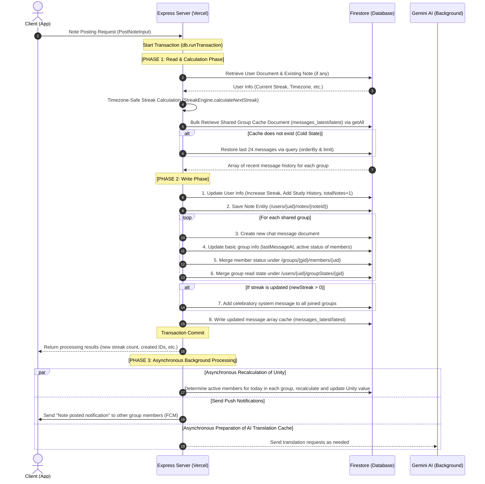
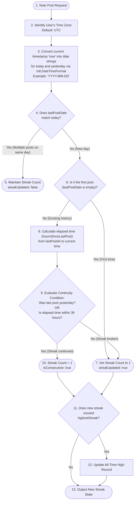

# 🔬 Detailed Explanation: Note Posting and Streak Calculation Logic

This document provides a detailed explanation of the sequence of processing designs, from the core event of Scripture Habit, **"Posting a Study Note,"** to the accompanying **"Streak Calculation,"** and finally to the **"Real-Time Aggregation of Group Unity."**

---

## 🏗️ Database Design & Entity Relationships

The Firestore schema and collection structure affected during note posting are as follows:

```
/users/{uid}                           [User's main document: Streak count, timezone, study date history]
  └── /notes/{noteId}                  [User's personal note history: Body text, scripture, speaker, shared destination info]
  └── /groupStates/{groupId}           [User's member group state: Read count, last active date/time]

/groups/{groupId}                      [Group's main document: Affiliated members, message count, unity]
  └── /messages/{messageId}            [All chat messages in group: Posted notes, streak announcements]
  └── /messages_latest/latest          [Message cache document: Array for fast loading of the most recent 25 messages]
  └── /members/{uid}                   [Group member activity metadata: Last post date, read count]
```

---

## 🔄 Post Transaction Processing Flow

When a user posts a note, the server starts a **Firestore transaction (`db.runTransaction`)**. To prevent conflicts, Firestore transactions strictly adhere to the design rule of completing the entire **"Read Phase (strict Read-before-Write)"** before transitioning to the **"Write Phase."**

### Transaction Sequence Diagram



---

## 📅 Streak (Continuous Days) Calculation Algorithm

Even when users access the service from different time zones (such as Japan, the United States, or the Philippines), **determining streaks based on "server time" can cause discrepancies in determining when a date changes**.

To prevent this, Scripture Habit calculates calendar dates based on the **"local time zone"** configured by the user (or retrieved from the device) and dynamically determines streak continuity with a **36-hour grace period** for a more forgiving user experience.

### Streak Evaluation Flowchart



---

## 💻 Core Code Explanation

### 1. Streak Engine (`streak-engine.ts`)

The following is the core logic of the streak evaluation engine combining time zones and the 36-hour rule.

```typescript
export class StreakEngine {
    static calculateNextStreak(
        currentState: StreakState,
        options: { now: Date; clientTimeZone?: string | null }
    ): StreakResult {
        const { now } = options;
        const { streakCount, highestStreak, lastPostDate, lastPostAt, timeZone } = currentState;

        // 1. Resolve timezone (prefer client's, fallback to database, last resort is UTC)
        const effectiveTimeZone = timeZone || 'UTC';
        
        let today: string;
        let yesterday: string;

        // 2. Safely calculate 'YYYY-MM-DD' for 'today' and 'yesterday' in the resolved timezone using Intl API
        try {
            const formatter = new Intl.DateTimeFormat('sv-SE', { 
                timeZone: effectiveTimeZone, 
                year: 'numeric', 
                month: '2-digit', 
                day: '2-digit' 
            });
            today = formatter.format(now);
            
            // Subtract 24 hours in milliseconds to format yesterday's date
            const yesterdayDate = new Date(now.getTime() - 24 * 60 * 60 * 1000);
            yesterday = formatter.format(yesterdayDate);
        } catch {
            // Exception fallback (simple extraction based on UTC)
            today = now.toISOString().split('T')[0];
            const yesterdayDate = new Date(now.getTime() - 24 * 60 * 60 * 1000);
            yesterday = yesterdayDate.toISOString().split('T')[0];
        }

        let newStreak = Number(streakCount || 0);
        let currentHighest = Number(highestStreak || newStreak);
        let streakUpdated = false;
        let isConsecutive = false;

        // 3. Double-post guard: do not increment streak if the last post was already made "today"
        if (lastPostDate === today) {
            return {
                newStreak,
                currentHighest,
                today,
                streakUpdated: false,
                isConsecutive: false
            };
        }

        // 4. Check if this is the first post ever
        if (!lastPostDate) {
            newStreak = 1;
            streakUpdated = true;
        } else {
            // 5. Check if the last post was yesterday
            const isTargetDay = lastPostDate === yesterday;
            
            // 6. 36-hour (1.5 days) grace period check
            // A recovery mechanism for calendar date mismatches caused by timezone offsets or late study schedules
            const getMillisSafely = (ts: any): number => {
                if (!ts) return 0;
                if (ts instanceof Date) return ts.getTime();
                if (ts.toMillis) return ts.toMillis();
                if (ts.seconds) return ts.seconds * 1000;
                return Number(ts) || 0;
            };

            const lastTimeMillis = getMillisSafely(lastPostAt);
            const hoursSinceLastPost = (now.getTime() - lastTimeMillis) / (1000 * 60 * 60);
            const withinGracePeriod = lastTimeMillis > 0 && hoursSinceLastPost <= 36;

            // If posted yesterday or within 36 hours, treat as streak continued
            if (isTargetDay || withinGracePeriod) {
                newStreak += 1;
                isConsecutive = true;
                streakUpdated = true;
            } else {
                // Reset streak if too much time has passed
                newStreak = 1;
                streakUpdated = true;
            }
        }

        // 7. Update all-time high record
        if (newStreak > currentHighest) {
            currentHighest = newStreak;
        }

        return {
            newStreak,
            currentHighest,
            today,
            streakUpdated,
            isConsecutive
        };
    }
}
```

---

### 2. Transaction Processing (`note-service.ts`)

The following is the main part of the Firestore transaction code that achieves atomic writes at the time of posting.

```typescript
export class NoteService {
    static async postNote(input: PostNoteInput) {
        const { uid, messageText, comment, shareOption, selectedShareGroups, clientTimeZone } = input;
        
        try {
            const result = await db.runTransaction(async (transaction) => {
                const userRef = db.collection('users').doc(uid);
                const noteRef = db.collection('users').doc(uid).collection('notes').doc();

                // === PHASE 1: Strict Reads and State Calculations ===
                const userSnap = await transaction.get(userRef);
                if (!userSnap.exists) throw new NotFoundError('User not found.');
                const userData = userSnap.data()!;

                const userGroupIds: string[] = userData.groupIds || [];
                let groupsToPost: string[] = [];
                // Resolve destination groups based on sharing configuration
                if (shareOption === 'all') groupsToPost = userGroupIds;
                else if (shareOption === 'specific') groupsToPost = selectedShareGroups || [];
                // (Deduplicate and enforce a maximum limit of 20 groups)
                groupsToPost = [...new Set(groupsToPost.filter(gid => !!gid))].slice(0, 20);

                const currentNow = new Date();
                
                // Evaluate streak update
                const streakResult = StreakEngine.calculateNextStreak({
                    streakCount: Number(userData.streakCount || 0),
                    highestStreak: Number(userData.highestStreak || 0),
                    lastPostDate: userData.lastPostDate || null,
                    lastPostAt: userData.lastPostAt ? (userData.lastPostAt.toDate ? userData.lastPostAt.toDate() : new Date(userData.lastPostAt)) : null,
                    timeZone: userData.timeZone || 'UTC'
                }, { now: currentNow, clientTimeZone });

                const { newStreak, currentHighest, today, streakUpdated } = streakResult;

                // === PHASE 2: Atomic Bulk Writes ===
                const userUpdate: any = {
                    lastPostAt: admin.firestore.Timestamp.fromDate(currentNow),
                    totalNotes: admin.firestore.FieldValue.increment(1)
                };

                if (streakUpdated) {
                    userUpdate.daysStudiedCount = admin.firestore.FieldValue.increment(1);
                    userUpdate.streakCount = newStreak;
                    userUpdate.lastPostDate = today;
                    userUpdate.studiedDates = admin.firestore.FieldValue.arrayUnion(today);
                    if (newStreak > currentHighest) userUpdate.highestStreak = newStreak;
                }

                // Update user document
                transaction.update(userRef, userUpdate);

                // Write note post messages to each shared group
                for (const gid of groupsToPost) {
                    const gRef = db.collection('groups').doc(gid);
                    const msgRef = gRef.collection('messages').doc();

                    const msgData = {
                        text: messageText,
                        senderId: uid,
                        senderNickname: userData.nickname || 'Member',
                        createdAt: admin.firestore.Timestamp.fromDate(currentNow),
                        isNote: true,
                        originalNoteId: noteRef.id,
                    };

                    transaction.set(msgRef, msgData);
                    
                    // Update last updated timestamps and message/note counters on the group document
                    transaction.update(gRef, {
                        lastMessageAt: admin.firestore.Timestamp.fromDate(currentNow),
                        lastNoteAt: admin.firestore.Timestamp.fromDate(currentNow),
                        messageCount: admin.firestore.FieldValue.increment(1),
                        noteCount: admin.firestore.FieldValue.increment(1),
                        [`memberLastActive.${uid}`]: admin.firestore.Timestamp.fromDate(currentNow)
                    });
                }

                // Save personal note document
                transaction.set(noteRef, {
                    text: messageText,
                    createdAt: admin.firestore.Timestamp.fromDate(currentNow),
                    comment,
                    shareOption,
                    sharedWithGroups: groupsToPost,
                });

                // Add celebratory system messages for streak accomplishments
                if (streakUpdated && newStreak > 0) {
                    for (const gid of userGroupIds) {
                        const msgRef = db.collection('groups').doc(gid).collection('messages').doc();
                        transaction.set(msgRef, {
                            text: `🎉 ${userData.nickname} さんが ストリーク ${newStreak} 日を達成しました！`,
                            senderId: 'system',
                            createdAt: admin.firestore.Timestamp.fromDate(new Date(currentNow.getTime() + 1000)),
                            isSystemMessage: true,
                        });
                    }
                }

                return { personalNoteId: noteRef.id, newStreak, streakUpdated };
            });

            return result;
        } catch (error) {
            console.error('[NoteService] PostNote Transaction Error:', error);
            throw error;
        }
    }
}
```

---

## 📈 Level Up & XP (Experience Points) Calculation Model

To encourage motivation to continue learning, Scripture Habit introduces a system where levels increase in response to note posts.

1. **Base XP Earned**: Earn **100 XP** for each Note posted.
2. **Streak Bonus**:
   - An additional bonus of `Streak × 10 XP` is granted.
   - Example: A post on a 10-day streak day yields `100 XP (Base) + 100 XP (Bonus) = 200 XP`.
3. **Level-Up Formula**:
   - The cumulative XP required to reach Level $L$ is defined by the following formula:
     $$\text{Cumulative XP Required} = 500 \times (L - 1)$$
   - Progress to the next level is animated in the client-side UI (progress bar on the dashboard).

---

## ⚡ Isolated Design of Asynchronous Background Processing

Why are **"Unity Recalculation"** and **"Sending FCM Push Notifications"** executed outside the transaction (asynchronously)?

### Reason 1: Minimizing Processing Time (Latency) Within Transactions
Firestore transactions temporarily lock documents accessed during execution. If FCM push notification delivery or the "Unity" recalculation logic—which references all group member data—is placed inside the transaction, the lock duration increases. Consequently, **when other users in the same group post notes simultaneously, transaction conflicts (Aborted/Timeout errors) are highly likely to occur**.

### Reason 2: Preventing Duplicate Requests to External APIs
When Firestore detects a transaction conflict, it **automatically retries from the beginning**. If notification delivery or external service invocations are written within the transaction, the user could receive **duplicate or triplicate push notifications** for every retry that occurs.

Therefore, we establish a clear design boundary as follows:
- **Within Transactions (Guaranteed Atomicity)**: Writes that require "direct data consistency," such as user profiles, notes, and group post counters.
- **Outside Transactions (Event-Driven/Background)**: Unity calculation (`unityPercentage`), push notifications (`NotificationService.notifyNotePosted`), and preparations for Gemini AI automated translation.
