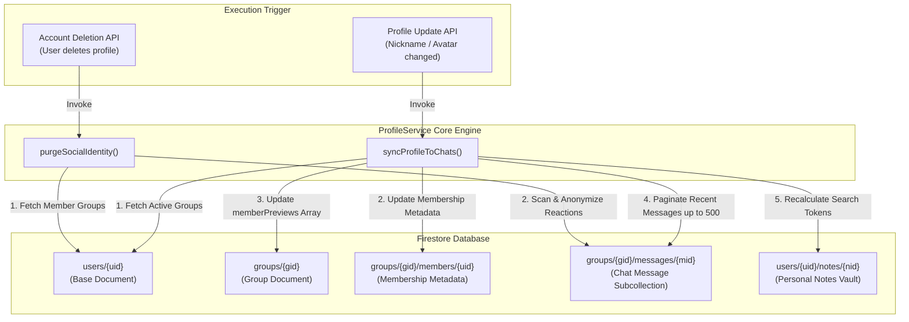

# User Profile Sync & Account Deletion Pipeline — Deep-Dive

## Overview

The user profile synchronization and account deletion pipelines of **scripture-habit** are managed by a centralized serverless coordinator, **`ProfileService`** ([`profile-service.ts`](../../scripture-habit/api_internal/services/profile-service.ts)). This coordinator ensures that user profile modifications (nicknames and avatars) propagate safely and efficiently across the system, while also ensuring that when a user deletes their account, their personal identifiable information (PII) is securely scrubbed without corrupting historical group discussions.

The system utilizes advanced high-speed batching, pagination cursors, and localized search index rebuilds to keep execution costs low and prevent performance bottlenecks in large group chats.



---

## 1. Profile Synchronization Engine (`syncProfileToChats`)

When a user modifies their nickname or avatar photo, updating every historical document in their group chats would generate high read/write operations and slow down performance. To prevent this, the engine applies a strict **Active Horizon** policy.

### 1.1 Scope Boundaries & Exhaustive Batching

The synchronization scope is limited and batched to guarantee completion:
- **Scope Restriction**: The sync scanner only processes the **500 most recent messages** in each group the user participates in. This ensures active chats look correct without wasting operations on old archives.
- **Batching Threshold**: Operations are batched using Firestore's bulk-writer pipeline, committing transactions in chunks of **450 operations** to stay safely under Firestore's 500-operation transaction cap.
- **Paginated Cursor**: Document querying is managed in segments of **100 messages** using pagination offsets (`startAfter`) to keep memory usage low.

```typescript
let messagesProcessed = 0;
let lastMsgDoc = null;
const MAX_MESSAGES_PER_GROUP = 500; 

while (messagesProcessed < MAX_MESSAGES_PER_GROUP) {
    let query = db.collection('groups').doc(gid).collection('messages')
        .where('senderId', '==', uid)
        .orderBy('createdAt', 'desc')
        .limit(100);
    
    if (lastMsgDoc) {
        query = query.startAfter(lastMsgDoc);
    }

    const messagesSnap = await query.get();
    if (messagesSnap.empty) break;

    for (const mDoc of messagesSnap.docs) {
        // Process & queue batch...
    }
    
    messagesProcessed += messagesSnap.size;
    lastMsgDoc = messagesSnap.docs[messagesSnap.size - 1];
}
```

### 1.2 Multi-Target Entity Synchronization

The synchronization updates several distinct documents across the database:

#### A. Group Membership Documents
The membership metadata document (`groups/{gid}/members/{uid}`) is updated immediately:
```typescript
const memberUpdate: Record<string, string | undefined> = {};
if (updates.nickname) memberUpdate.nickname = updates.nickname;
if (updates.photoURL) memberUpdate.photoURL = updates.photoURL;

if (Object.keys(memberUpdate).length > 0) {
    currentBatch.set(gSnap.ref.collection('members').doc(uid), memberUpdate, { merge: true });
    currentBatchSize++;
}
```

#### B. Group Document Previews (`memberPreviews`)
To render the group members list rapidly without querying the subcollection, a preview cache is kept on the main group document. The engine syncs the correct profile to this cache:
```typescript
const previews = gData.memberPreviews || [];
const userIdx = previews.findIndex((p: MemberPreview) => p.uid === uid);
if (userIdx !== -1) {
    const newPreviews = [...previews];
    if (updates.nickname) newPreviews[userIdx].nickname = updates.nickname;
    if (updates.photoURL) newPreviews[userIdx].photoURL = updates.photoURL;
    groupUpdates.memberPreviews = newPreviews;
}
```

#### C. Last Activity Footprints
If this user is the author of the last message or last shared study note in the group, the summary attributes on the group parent document are updated:
```typescript
if (updates.nickname && gData.lastNoteByUid === uid) {
    groupUpdates.lastNoteByNickname = updates.nickname;
}
if (updates.nickname && gData.lastMessageByUid === uid) {
    groupUpdates.lastMessageByNickname = updates.nickname;
}
```

#### D. In-Flight Reaction Previews
To show who reacted to a message without performing heavy document joins, messages store a lightweight `reactionPreviews` cache. The sync engine scans this cache on recent messages, updating the user's nickname and avatar while preserving other reactors' metadata:

```typescript
if (mData.reactionPreviews) {
    const rp = { ...mData.reactionPreviews };
    let rpChanged = false;
    for (const emoji of Object.keys(rp)) {
        const previews = (rp[emoji] || []) as ReactionPreview[];
        const myIdx = previews.findIndex(p => p.uid === uid);
        if (myIdx !== -1) {
            if (updates.nickname) previews[myIdx].nickname = updates.nickname;
            if (updates.photoURL) previews[myIdx].photoURL = updates.photoURL;
            rp[emoji] = previews;
            rpChanged = true;
        }
    }
    if (rpChanged) msgUpdate.reactionPreviews = rp;
}
```

---

## 2. Search Index Reconstruction

Each user study note includes a `searchTokens` array of prefix strings for real-time autocomplete queries (e.g. searching for a note by a speaker's name).

When a user changes their nickname, all their historical study notes are updated. This ensures search remains accurate:

```typescript
const updatedTokens = buildNoteSearchTokens({
    scripture: nData.scripture || '',
    chapter:   nData.chapter || '',
    comment:   nData.comment || '',
    title:     nData.title || '',
    speaker:   updates.nickname  // Sync the new name into the search token array
});

currentBatch.update(nDoc.ref, {
    speaker: updates.nickname,
    searchTokens: updatedTokens
});
```

---

## 3. Social Identity Purging & Anonymization (`purgeSocialIdentity`)

When a user deletes their account, GDPR and privacy rules require their personal information to be scrubbed. However, deleting their message bubbles or reaction tallies would disrupt group discussion threads and make older conversations confusing to read.

The solution is an **Anonymization Pipeline** that replaces personal data with generic placeholders, preserving the flow of conversation while deleting personal identifiers.

```
[Active Message Reaction Previews]
  👍 Reaction: { uid: "user_999", nickname: "Jane Doe", photoUrl: "https://jane.jpg" }
                 │
                 ▼ (Account Deletion Callback Triggered)
  👍 Reaction: { uid: "user_999", nickname: "...", photoUrl: "" }
```

When `purgeSocialIdentity` is invoked:
1. **Locate Membership**: It reads the target user's profile to extract their active group IDs.
2. **Scan Active Chats**: It loops through messages within those active groups in 100-document intervals.
3. **Anonymize Reaction Previews**: Wherever the user's `uid` appears in a reaction preview array, their personal metadata is replaced:
   - `nickname` is replaced with a generic placeholder (`"..."`).
   - `photoURL` is cleared (`""`).
4. **Preserve Reaction Aggregates**: The total reaction count is unchanged. The user's UID remains in the raw `reactions[emoji]` array to prevent duplicate reaction toggles if they re-register, but their public identity is completely removed.

```typescript
for (const mDoc of recentMsgs.docs) {
    const mData = mDoc.data() as MessageDocument;
    if (mData.reactionPreviews) {
        const rp = { ...mData.reactionPreviews };
        let rpChanged = false;

        for (const emoji of Object.keys(rp)) {
            const previews = (rp[emoji] || []) as ReactionPreview[];
            const myIdx = previews.findIndex(p => p.uid === uid);
            if (myIdx !== -1) {
                previews[myIdx].nickname = '...';  // Redact Name
                previews[myIdx].photoURL = '';     // Clear Avatar
                rp[emoji] = previews;
                rpChanged = true;
            }
        }

        if (rpChanged) {
            batch.update(mDoc.ref, { reactionPreviews: rp });
            hasChanges = true;
            opsInBatch++;
        }
    }
}
```

This ensures a robust, secure, and privacy-compliant user lifecycle, keeping active chats looking great while keeping data management costs low.
