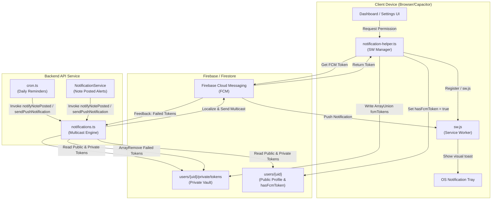
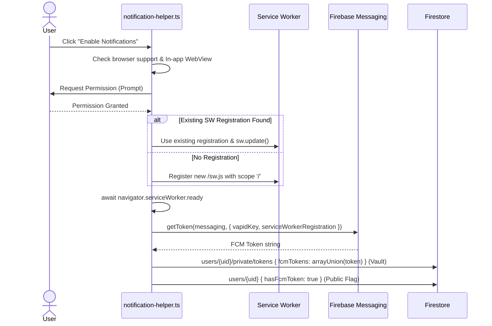
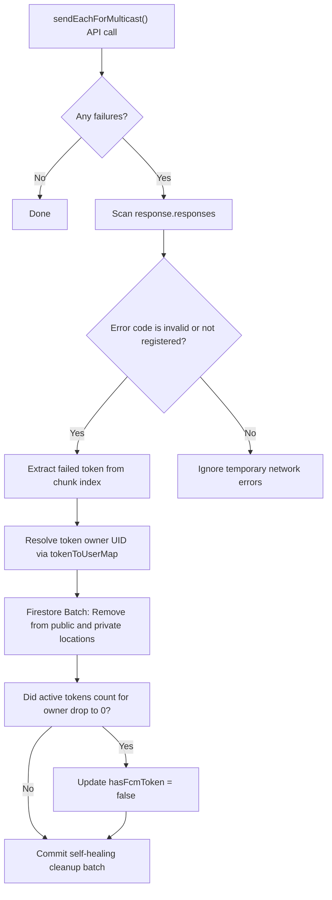

# Push Notification System — Deep-Dive

## Overview

The push notification system of **scripture-habit** is a secure, timezone-aware, multi-language delivery engine built on Firebase Cloud Messaging (FCM). It keeps users engaged by sending daily study reminders, streak warnings, and real-time updates when study notes are shared.

The system is split into a frontend manager that handles permissions, service worker lifecycle, and OS tray sanitation, and a robust backend multicast service that handles localized delivery, 500-token chunking, and self-healing token cleanup.



---

## 1. Frontend Token Lifecycle & SW Management

All client-side interactions with the push notification APIs are orchestrated by [`notification-helper.ts`](../../scripture-habit/src/utils/notification-helper.ts).

### 1.1 Support Checks & In-App WebView Guard

Before launching any native prompt, the helper evaluates if notifications are supported and warns users in restricted sandbox environments:

- **Browser Capabilities**: Checks `'serviceWorker'`, `'Notification'`, and `'PushManager'` in the global namespace.
- **WebView Sandbox Detector**: Checks for in-app browser signatures (such as LINE, Facebook, Instagram, or Telegram) using user-agent string matches. Since WebViews in these platforms block background push registrations, it displays a toast advising the user to open in their native Safari/Chrome browser.

```typescript
const isInAppBrowser = (): boolean => {
    const ua = window.navigator.userAgent || window.navigator.vendor || (window as any).opera || '';
    return (ua.indexOf('FBAN') > -1) || (ua.indexOf('FBAV') > -1) ||
           (ua.indexOf('Instagram') > -1) || (ua.indexOf('Line') > -1) ||
           (ua.indexOf('Twitter') > -1) || (ua.indexOf('Telegram') > -1);
};
```

### 1.2 Permission & Multi-Layer Firestore Registration

If the browser supports notifications and permission is granted by the user via `Notification.requestPermission()`, the helper coordinates Service Worker registration and token storage:



```typescript
// 1. Service Worker Initialization & Readiness
let registration: ServiceWorkerRegistration;
const existingRegs = await navigator.serviceWorker.getRegistrations();
const ourReg = existingRegs.find(r => r.scope.includes(window.location.host));

if (ourReg) {
    registration = ourReg;
    await registration.update();
} else {
    registration = await navigator.serviceWorker.register('/sw.js', { scope: '/' });
}
await navigator.serviceWorker.ready;

// 2. Fetch token via VAPID key mapped to the service worker
const token = await getToken(messaging, {
    vapidKey: VAPID_KEY,
    serviceWorkerRegistration: registration
});
```

To secure and speed up queries, tokens are registered in two distinct places:
1. **Private Token Vault** (`users/{uid}/private/tokens`): Stored in a private document restricted by security rules to the authenticated owner. This prevents malicious actors or group members from harvesting other users' raw registration tokens.
2. **Public Status Flag** (`users/{uid}/hasFcmToken`): Stored as a simple boolean on the user's public profile document. This flag allows server-side background processors (such as the daily reminder cron) to run cheap index queries to find notification-eligible users without performing expensive subcollection lookups.

### 1.3 Self-Healing Flag Synchronization (`syncFcmTokenFlag`)

If a user has already granted notification permissions natively but database flags are missing or out of sync (for example, after database migrations or restores), the client triggers a background self-healing process:

```typescript
export const syncFcmTokenFlag = async (userId: string | null | undefined, currentFlagStatus?: boolean): Promise<void> => {
    if (!userId) return;
    if (!('serviceWorker' in navigator) || !('Notification' in window) || !('PushManager' in window)) return;
    
    // Only proceed if permission is already granted natively
    if (Notification.permission === 'granted') {
        try {
            const registration = await navigator.serviceWorker.getRegistration();
            if (registration && messaging) {
                const token = await getToken(messaging, {
                    vapidKey: VAPID_KEY,
                    serviceWorkerRegistration: registration
                });
                
                if (token) {
                    // Verify if this token is actually registered in the database
                    const privateRef = doc(db, 'users', userId, 'private', 'tokens');
                    const privateSnap = await getDoc(privateRef);
                    const existingTokens: string[] = privateSnap.exists() ? (privateSnap.data()?.fcmTokens || []) : [];
                    
                    const isTokenRegistered = existingTokens.includes(token);
                    
                    if (!isTokenRegistered || currentFlagStatus !== true) {
                        console.log('[NotificationHelper] Token not registered or flag mismatch. Syncing...');
                        
                        await setDoc(privateRef, {
                            fcmTokens: arrayUnion(token)
                        }, { merge: true });
                        
                        const userRef = doc(db, 'users', userId);
                        await updateDoc(userRef, {
                            hasFcmToken: true
                        });
                        console.log('[NotificationHelper] Successfully healed missing/expired FCM token flag and registered token for user.');
                    }
                }
            }
        } catch (e) {
            console.warn('[NotificationHelper] Failed to sync FCM token flag', e);
        }
    }
};
```

---

## 2. Programmatic Tray Control & Cleanups

To maintain a tidy system drawer, **scripture-habit** actively sanitizes active alerts in the OS tray.

### 2.1 App Launch Streak Sanitization

Daily study reminder/streak alerts are immediately obsolete when a user launches the app (as they are active and reading scripture):

```typescript
export const clearAllNotifications = async (): Promise<void> => {
    if (!('serviceWorker' in navigator)) return;
    try {
        const registration = await navigator.serviceWorker.getRegistration();
        if (registration) {
            const notifications = await registration.getNotifications();
            let clearedCount = 0;
            notifications.forEach(notification => {
                // Selectively close streak reminders only, leaving chat messages untouched
                if (notification.data?.type === 'streak_reminder') {
                    notification.close();
                    clearedCount++;
                }
            });
        }
    } catch (e) {
        console.warn('[NotificationHelper] Failed to clear notifications', e);
    }
};
```

### 2.2 Context-Aware Chat Drawer Sanitization

When a user opens a group chat, they do not want to see historical message push banners for *that* specific group cluttering their lock screen. However, notifications for other groups or systems must be preserved. 

```typescript
export const clearGroupNotifications = async (groupId: string): Promise<void> => {
    if (!('serviceWorker' in navigator) || !groupId) return;
    try {
        const registration = await navigator.serviceWorker.getRegistration();
        if (registration) {
            const notifications = await registration.getNotifications();
            notifications.forEach(notification => {
                // Selectively target notifications matching active group context
                if (notification.data?.groupId === groupId) {
                    notification.close();
                }
            });
        }
    } catch (e) {
        console.warn(`[NotificationHelper] Failed to clear notifications for group ${groupId}`, e);
    }
};
```

---

## 3. Multicast Delivery Architecture

When events occur (e.g. a note is shared), the backend leverages [`notifications.ts`](../../scripture-habit/api_internal/lib/notifications.ts) to resolve user identities, localize payloads, and dispatch multicasts.

### 3.1 Resolving Public and Private Token Pools

The resolver queries both historical public fields and the secure private token vault subcollection for a given user, joining them into a deduplicated array:

```typescript
export async function getUserFcmTokensAndLanguage(uid: string): Promise<{ tokens: string[], language?: string }> {
    const tokens: string[] = [];
    const userDoc = await db.collection('users').doc(uid).get();
    const userData = userDoc.data();
    let language: string | undefined;
    if (userDoc.exists && userData) {
        language = userData.language;
        if (userData.fcmTokens) {
            tokens.push(...(userData.fcmTokens as string[]));
        }
    }
    const privateDoc = await db.collection('users').doc(uid).collection('private').doc('tokens').get();
    const privateData = privateDoc.data();
    if (privateDoc.exists && privateData && privateData.fcmTokens) {
        tokens.push(...(privateData.fcmTokens as string[]));
    }
    return { tokens: [...new Set(tokens)], language };
}
```

### 3.2 500-Token Chunking & Parallel Multicast Dispatch

Firebase Cloud Messaging restricts multicast requests to a maximum of **500 registration tokens** per call. To handle larger groups, the system divides the array and schedules chunks:

```typescript
const CHUNK_SIZE = 500;
for (let i = 0; i < uniqueTokens.length; i += CHUNK_SIZE) {
    const chunk = uniqueTokens.slice(i, i + CHUNK_SIZE);
    const message = {
        notification: {
            title: payload.title,
            body: payload.body,
        },
        data: {
            title: payload.title,
            body: payload.body,
            ...(payload.data || {}),
        },
        tokens: chunk,
    };
    
    // sendEachForMulticast returns success/failure metrics along with individual token index reports
    const response = await messaging.sendEachForMulticast(message);
    totalSuccess += response.successCount;
    totalFailure += response.failureCount;
}
```

### 3.3 Multi-Language Context Mapping

When a note is posted, group members might speak different languages. The system groups targets by language, translates keys on the fly using backend locale catalogs, and sends language-specific payloads:

```typescript
const tokensByLang = new Map<string, string[]>();

memberDocs.forEach((uDoc, idx) => {
    const userData = uDoc.data();
    const lang = (userData?.language || 'en').split('-')[0].toLowerCase();
    
    if (!tokensByLang.has(lang)) tokensByLang.set(lang, []);
    const langTokens = tokensByLang.get(lang)!;
    
    // Add public & private tokens to language-specific pool...
});

for (const [lang, langTokens] of tokensByLang.entries()) {
    if (langTokens.length === 0) continue;

    // Localize Title and Body on the fly using local i18n
    const resolvedTitle = payload.titleKey ? t(lang, payload.titleKey) : payload.title;
    const resolvedBody = payload.bodyKey ? t(lang, payload.bodyKey, payload.bodyReplacements) : payload.body;

    const payloadWithLang = {
        title: resolvedTitle,
        body: resolvedBody,
        data: { ...(payload.data || {}), lang }
    };

    await sendPushNotification(langTokens, payloadWithLang);
}
```

---

## 4. Self-Healing Token Lifecycle

Invalid tokens due to app uninstalls or expired registrations degrade query efficiency and trigger platform API limits. To combat this, the delivery engine implements an automated self-healing feedback loop.



During multicast validation:
1. **Error Inspection**: If `response.failureCount > 0`, the system inspects the multicast response array.
2. **Identification**: It isolates indices where the error code corresponds to permanent failures:
   - `messaging/invalid-registration-token`
   - `messaging/registration-token-not-registered`
3. **Database Pruning**: The failed tokens are resolved back to their original owners using `tokenToUserMap` and `tokenSourceMap`, and deleted from both `users/{uid}` and `users/{uid}/private/tokens` inside an atomic batch update:
4. **Public Flag Self-Healing**: If all registration tokens fail for a user and their active token count drops to 0, their public profile document's `hasFcmToken` flag is updated to `false` to prevent future redundant distribution scans.

```typescript
if (failedTokens.length > 0) {
    const batch = db.batch();
    failedTokens.forEach(t => {
        const uid = tokenToUserMap.get(t);
        const source = tokenSourceMap.get(t);
        if (uid) {
            const targetRef = source === 'private'
                ? db.collection('users').doc(uid).collection('private').doc('tokens')
                : db.collection('users').doc(uid);
            batch.update(targetRef, { fcmTokens: admin.firestore.FieldValue.arrayRemove(t) });

            // Track user's remaining active tokens and update hasFcmToken to false when it hits 0
            const activeTokensSet = userActiveTokens.get(uid);
            if (activeTokensSet) {
                activeTokensSet.delete(t);
                if (activeTokensSet.size === 0) {
                    batch.update(db.collection('users').doc(uid), {
                        hasFcmToken: false
                    });
                }
            }
        }
    });
    await batch.commit();
}
```

### 4.1 Independent Token Cleanup Helper (`cleanupTokens`)

Apart from the delivery flow, the standalone utility function `cleanupTokens` is provided to clean up failed tokens from other API routes or batch jobs. This function also implements self-healing to toggle `hasFcmToken = false` when no tokens remain:

```typescript
export async function cleanupTokens(uid: string, failedTokens: string[]) {
    if (!failedTokens.length) return;
    const batch = db.batch();
    const userRef = db.collection('users').doc(uid);
    const privateRef = userRef.collection('private').doc('tokens');

    // Retrieve current state to check remaining tokens
    const { tokens } = await getUserFcmTokensAndLanguage(uid);
    const remainingTokens = tokens.filter(t => !failedTokens.includes(t));

    failedTokens.forEach(token => {
        batch.update(userRef, { fcmTokens: admin.firestore.FieldValue.arrayRemove(token) });
        batch.update(privateRef, { fcmTokens: admin.firestore.FieldValue.arrayRemove(token) });
    });

    if (remainingTokens.length === 0) {
        batch.update(userRef, { hasFcmToken: false });
    }

    await batch.commit();
}
```

This guarantees the token database remains entirely free of dead weight, preserving notification delivery performance without manual database maintenance.
