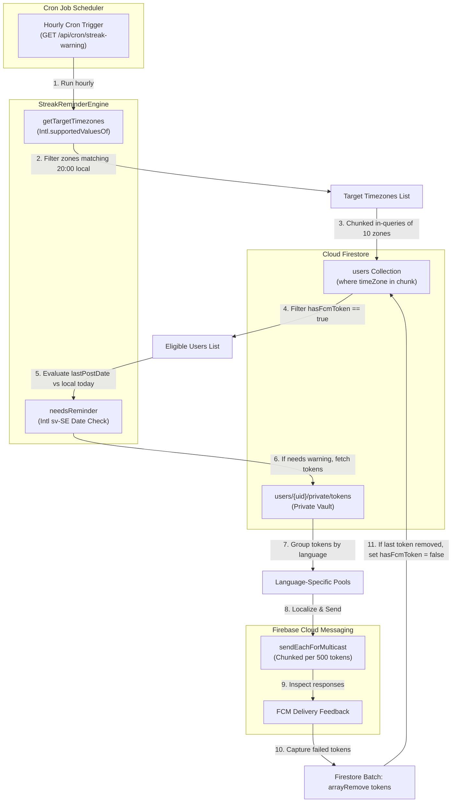

# Timezone-Aware Streak Reminder System — Deep-Dive

## Overview

The daily participation loop of **scripture-habit** is driven by streaks—consecutive days of scripture reading and note sharing. Because users are distributed globally, the system must deliver warnings at a consistent local time (exactly **8:00 PM / 20:00 local time**) rather than a single unified UTC hour.

This system is managed by the serverless cron handler `/api/streak-warning` inside [`cron.ts`](../../scripture-habit/api_internal/routes/cron.ts) and the core timezone calculator **`StreakReminderEngine`** ([`streak-reminder.ts`](../../scripture-habit/api_internal/lib/streak-reminder.ts)). It leverages the native JavaScript Internationalization (Intl) API, partitioned queries to bypass Firestore's limitations, and an automated self-healing multicast feedback loop.



---

## 1. High-Precision Timezone Evaluation & Local Hour Mapping

Static hour offsets fail to account for Daylight Saving Time (DST) changes, causing push alerts to be sent too early or too late. To resolve this, `StreakReminderEngine` dynamically maps active timezones using the browser/Node native Internationalization (Intl) specifications.

### 1.1 Finding Active Timezones (`getTargetTimezones`)
On every hourly cron invocation, the scheduler queries all standard global timezones supported by the runtime environment via `Intl.supportedValuesOf('timeZone')`. It evaluates which zones currently experience 8:00 PM local time:

```typescript
static getTargetTimezones(now: Date, targetHour: number): string[] {
    // 1. Fetch all system-supported standard timezones
    const allTimezones = (Intl as any).supportedValuesOf('timeZone') as string[];
    const targetZones: string[] = [];

    for (const tz of allTimezones) {
        try {
            // 2. Instantiate a 24-hour localized formatter for the specific zone
            const formatter = new Intl.DateTimeFormat('en-US', {
                timeZone: tz,
                hour: 'numeric',
                hour12: false, // Force 24-hour format
            });
            
            const hourStr = formatter.format(now);
            let hour = parseInt(hourStr, 10);
            
            // 3. Normalize: Intl API sometimes returns 24 for midnight
            if (hour === 24) hour = 0; 

            // 4. Match check
            if (hour === targetHour) {
                targetZones.push(tz);
            }
        } catch {
            // Absorb unrecognized/invalid timezones silently
        }
    }
    return targetZones;
}
```

This guarantees that timezone changes are calculated dynamically based on astronomical time, eliminating manual offset database tables.

### 1.2 Local Date Completion Check (`needsReminder`)
Evaluating if a user has completed their study requires mapping the current instant to their local day. The engine converts the current time into `sv-SE` locale format, which outputs a standardized `YYYY-MM-DD` date string, and compares it to the user's `lastPostDate`:

```typescript
static needsReminder(lastPostDate: string | null | undefined, now: Date, timeZone: string): boolean {
    let today: string;
    try {
        // Format to Swedish locale which naturally returns YYYY-MM-DD
        const formatter = new Intl.DateTimeFormat('sv-SE', { 
            timeZone: timeZone, 
            year: 'numeric', 
            month: '2-digit', 
            day: '2-digit' 
        });
        today = formatter.format(now);
    } catch {
        today = now.toISOString().split('T')[0]; // Fallback to UTC
    }

    // If the user's last post matches today in their local timezone, they are safe
    if (lastPostDate === today) {
        return false;
    }

    return true; // Needs reminder
}
```

---

## 2. Partitioned Firestore Queries

Firestore restricts queries using the `in` array operator to a maximum of **10 values**. Because the list of active timezones reaching 8:00 PM at any hour often exceeds 10, the cron job divides the timezone list into arrays of 10 elements and executes parallel reads:

```typescript
const MAX_TIMEZONES_PER_QUERY = 10;
const eligibleUsers: { id: string, data: admin.firestore.DocumentData }[] = [];

// Partition timezones list into chunks of 10
for (let i = 0; i < targetTimezones.length; i += MAX_TIMEZONES_PER_QUERY) {
    const tzChunk = targetTimezones.slice(i, i + MAX_TIMEZONES_PER_QUERY);
    
    // Execute query in parallel for the timezone chunk
    const snapshot = await db.collection('users')
        .where('timeZone', 'in', tzChunk)
        .get();

    snapshot.forEach(doc => {
        const data = doc.data();
        // Read public flag: ignore users without registered FCM tokens
        if (data.hasFcmToken === true) {
            eligibleUsers.push({ id: doc.id, data });
        }
    });
}
```

By querying only users with the public status flag `hasFcmToken === true`, the system avoids reading the private token subcollections of users who have notifications disabled, saving thousands of read operations per run.

---

## 3. Language-Localized Multicast Delivery

Once the engine identifies users who need a reminder, they are grouped by their preferred language. This allows the system to fetch the correct localized translations from the backend i18n catalogs and send them in batch:

```typescript
// Group tokens by language
const tokensByLang: Record<string, { token: string, uid: string }[]> = {};

for (const user of eligibleUsers) {
    const { data } = user;
    const needsReminder = StreakReminderEngine.needsReminder(data.lastPostDate, now, data.timeZone);
    
    if (needsReminder) {
        // Fetch tokens from private vault
        const tokensDoc = await db.collection('users').doc(user.id).collection('private').doc('tokens').get();
        const fcmTokens = tokensDoc.data()?.fcmTokens || [];

        if (fcmTokens.length === 0) continue;

        const lang = data.language || 'en';
        if (!tokensByLang[lang]) tokensByLang[lang] = [];

        for (const token of fcmTokens) {
            tokensByLang[lang].push({ token, uid: user.id });
        }
    }
}
```

---

## 4. Self-Healing FCM Token Cleanup Loop

Device tokens expire when users uninstall the app or reset their phones. Attempting to send messages to these invalid tokens slows down the system. The delivery engine uses a self-healing loop to catch these failures and automatically remove stale tokens from Firestore:

```typescript
// Send localized multicast notifications in chunks of 500 (FCM limit)
for (const [lang, allTokensToSend] of Object.entries(tokensByLang)) {
    if (allTokensToSend.length === 0) continue;

    const title = t(lang, 'notifications.streak_warning_title');
    const body = t(lang, 'notifications.streak_warning_body');

    for (let i = 0; i < allTokensToSend.length; i += 500) {
        const chunkMapping = allTokensToSend.slice(i, i + 500);
        const chunk = chunkMapping.map(tk => tk.token);

        const message = {
            notification: { title, body },
            data: { type: 'streak_reminder' },
            tokens: chunk
        };

        const response = await messaging.sendEachForMulticast(message);

        if (response.failureCount > 0) {
            for (let idx = 0; idx < response.responses.length; idx++) {
                const resp = response.responses[idx];
                if (!resp.success) {
                    const errorString = resp.error?.code;
                    // Detect stale or invalid tokens
                    if (errorString === 'messaging/invalid-registration-token' ||
                        errorString === 'messaging/registration-token-not-registered') {
                        
                        const invalidToken = chunk[idx];
                        const uid = chunkMapping[idx].uid;
                        
                        // Queue deletion in a Firestore batch
                        batch.update(db.collection('users').doc(uid).collection('private').doc('tokens'), {
                            fcmTokens: admin.firestore.FieldValue.arrayRemove(invalidToken)
                        });
                        batchOpCount++;

                        // Check if the user has any active tokens left
                        const activeTokensSet = userActiveTokens.get(uid);
                        if (activeTokensSet) {
                            activeTokensSet.delete(invalidToken);
                            if (activeTokensSet.size === 0) {
                                // Self-healing: if no tokens remain, set public hasFcmToken flag to false
                                batch.update(db.collection('users').doc(uid), {
                                    hasFcmToken: false
                                });
                                batchOpCount++;
                            }
                        }

                        if (batchOpCount >= 400) {
                            await batch.commit();
                            batch = db.batch();
                            batchOpCount = 0;
                        }
                    }
                }
            }
        }
    }
}
```

This guarantees the database remains free of dead weight, preserving notification delivery speed and query efficiency without manual maintenance.
