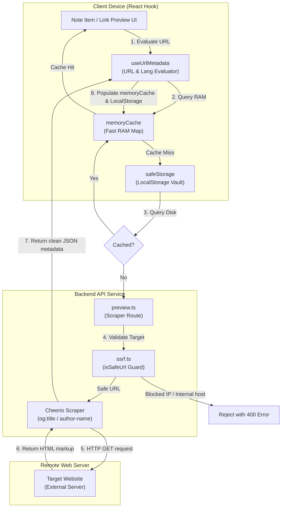
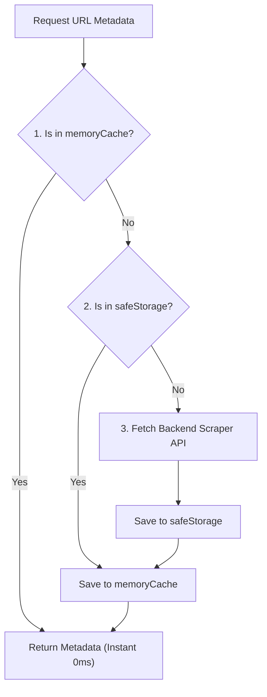

# URL Metadata Extraction & Speaker Auto-Analysis — Deep-Dive

## Overview

When users share study notes containing links (e.g. YouTube talks, General Conference pages, blogs), the application automatically parses and extracts metadata (such as titles, summaries, icons, and authors). To ensure this process is fast, safe, and efficient, **scripture-habit** uses a secure backend scraper accompanied by a client-side **Two-Tier Cache**.

This system is managed by the client-side React hook **`useUrlMetadata`** ([`use-url-metadata.ts`](../../scripture-habit/src/hooks/use-url-metadata.ts)) and the serverless Express router **`preview.ts`** ([`preview.ts`](../../scripture-habit/api_internal/routes/preview.ts)). It includes Server-Side Request Forgery (SSRF) filters to prevent infrastructure scanning and dual-fetch mechanisms to handle language localization fallbacks.



---

## 1. Client-Side Two-Tier Caching Pipeline

Scraping metadata on every render would generate hundreds of network requests and slow down the user interface. To prevent this, the client implements a strict **Two-Tier Caching** pipeline:

### 1.1 In-Memory Caching (Tier 1)
At the highest tier, a fast, non-persistent global JavaScript map stores active metadata in memory:
```typescript
const memoryCache: Record<string, UrlMetadata> = {};
```
Since this map resides in RAM, reading a cached URL is instant (0ms latency) and does not require disk I/O operations.

### 1.2 LocalStorage Caching (Tier 2)
If the memory map misses, the hook queries the disk-backed client localStorage via `safeStorage` (which handles secure JSON parsing and prevents crashes in restricted environments):
```typescript
const cached = safeStorage.get<UrlMetadata>(cacheKey);
if (cached) {
    memoryCache[cacheKey] = cached; // Hydrate memory cache for subsequent reads
    setData(cached);
    return;
}
```

### 1.3 Caches Hierarchy Matrix
When the hook `useUrlMetadata` is mounted:



---

## 2. Server-Side Request Forgery (SSRF) Protection Filter

If a backend scraper fetches any arbitrary URL supplied by a client without validation, a malicious user could exploit it to make the server request private internal networks (e.g. `http://localhost:8080` or AWS metadata endpoints `http://169.254.169.254`). This vulnerability is known as **Server-Side Request Forgery (SSRF)**.

To protect the server infrastructure, **scripture-habit** routes all external requests through the safety filter **`isSafeUrl`** ([`ssrf.ts`](../../scripture-habit/api_internal/lib/ssrf.ts)):

```typescript
export function isSafeUrl(urlStr: string): boolean {
    try {
        const parsedUrl = new URL(urlStr);
        // 1. Force HTTP/HTTPS protocol schemes only
        if (parsedUrl.protocol !== 'http:' && parsedUrl.protocol !== 'https:') return false;

        let hostname = parsedUrl.hostname.toLowerCase();
        if (hostname.startsWith('[') && hostname.endsWith(']')) {
            hostname = hostname.slice(1, -1); // Strip IPv6 wrapping brackets
        }

        // 2. Comprehensive blocklist of private domains, local interfaces, and loopback ranges
        const blockedPatterns: (string | RegExp)[] = [
            'localhost',
            '::1',
            /^127\./,                                      // Loopback IPv4
            /^169\.254\./,                                  // Link-local / Cloud Metadata services
            /^10\./,                                        // Private RFC 1918 Class A
            /^172\.(1[6-9]|2[0-9]|3[0-1])\./,               // Private RFC 1918 Class B
            /^192\.168\./,                                  // Private RFC 1918 Class C
            /^fe80:/,                                       // IPv6 Link-Local
            /^fc00:/,                                       // IPv6 Unique Local Unicast
            /^fd00:/,                                       // IPv6 Private Unique Local
            /\.internal$/,                                  // Internal DNS domains
            /\.local$/                                      // Local network domains
        ];

        // 3. Match hostname against block patterns
        return !blockedPatterns.some(pattern => {
            if (typeof pattern === 'string') return hostname === pattern;
            return pattern.test(hostname);
        });
    } catch {
        return false; // Safely block unparseable URLs
    }
}
```

Any URL that resolves to a blocked range is immediately rejected with an HTTP 400 Bad Request error, preventing unauthorized internal access.

---

## 3. Dual-Fetch Fallback & Language Parameter Mapping

When fetching scriptures or articles from the Church website, content is localized. The system maps the app's internal 2-letter language codes to the Church's 3-letter API query parameters:

```typescript
const LANGUAGE_MAP: Record<string, string> = {
  'en': 'eng', 'ja': 'jpn', 'pt': 'por', 'es': 'spa',
  'zho': 'zho', 'vi': 'vie', 'th': 'tha', 'ko': 'kor',
  'tl': 'tgl', 'sw': 'swa'
};
```

If the initially requested localized page is not found or fails to load, the backend scraper automatically initiates a **Dual-Fetch Fallback**, stripping the language parameter and falling back to the default English version of the page instead of throwing an error:

```typescript
let response;
try {
    // Attempt localized fetch first
    response = await axios.get(targetUrl.toString(), {
        headers: { 'User-Agent': USER_AGENT },
        timeout: 5000,
        maxContentLength: 512 * 1024 // Cap content length to prevent memory bloating (512 KB)
    });
} catch (axiosError) {
     if (language) {
        // Fallback: strip localization query param and retry
        console.warn(`Initial fetch with lang=${language} failed, trying fallback...`);
        targetUrl.searchParams.delete('lang');
        response = await axios.get(targetUrl.toString(), {
            headers: { 'User-Agent': USER_AGENT },
            timeout: 5000,
            maxContentLength: 512 * 1024
        });
     } else {
         throw axiosError;
     }
}
```

---

## 4. Metadata Parsing Scraper & Author Extractor

Once the HTML markup is successfully loaded, the scraper parses the page layout using `cheerio` (a high-performance server-side implementation of jQuery). It extracts OpenGraph metadata or page headings, and isolates speakers by sanitizing byline author prefixes:

```typescript
const $ = cheerio.load(response.data);

// 1. Resolve Title (Og:title meta -> heading -> page title)
let title = $('meta[property="og:title"]').attr('content') || 
            $('h1').first().text().trim() || 
            $('title').text().trim();
if (title && title.includes('|')) title = title.split('|')[0].trim();

// 2. Resolve Speaker using common css classes on general conference structures
let speaker = $('div.byline p.author-name').first().text().trim() || 
              $('p.author-name').first().text().trim() || 
              $('a.author-name').first().text().trim() || 
              $('div.byline p').first().text().trim() || '';

// 3. Clean localized byline prefixes (e.g. "By President Nelson" -> "President Nelson")
if (speaker) {
    speaker = speaker.replace(/^(By|Par|De|Por)\s+/i, '').trim();
}
```

---

## 5. Secure Token Handshakes

Since metadata requests utilize server resources, the endpoints `/fetch-church-metadata` and `/url-preview` are protected against scraping abuse. The client hook automatically attaches authentication and integrity tokens to outgoing headers:

1. **Bearer Token Authentication**: Retrieves a fresh Firebase ID Token and injects it into the `Authorization` header.
2. **App Check Verification**: Generates a verified App Check token using the global `appCheck` provider and injects it into the `X-Firebase-AppCheck` header, ensuring requests originate exclusively from genuine app instances.

```typescript
const headers: Record<string, string> = { 'Accept': 'application/json' };

// 1. App Authentication
if (auth?.currentUser) {
    const idToken = await auth.currentUser.getIdToken();
    headers['Authorization'] = `Bearer ${idToken}`;
}

// 2. App Check Verification
if (appCheck) {
    const acToken = await getToken(appCheck, false);
    if (acToken?.token) {
        headers['X-Firebase-AppCheck'] = acToken.token;
    }
}
```
This guarantees an exceptionally secure, fast, and robust link preview experience across the application.
