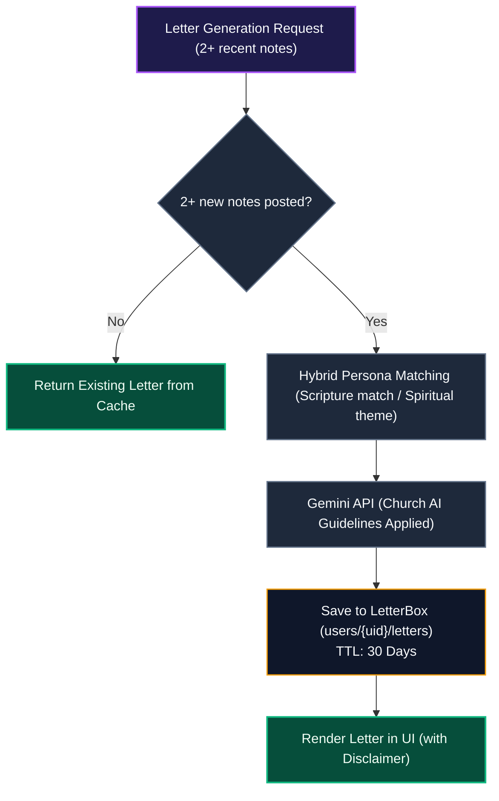

# AI Integration (Gemini)

::: tip Interactive Architecture Tour
Explore the live data-flow blueprint and guided walkthrough for this feature:
- **Online (GitHub Browser Preview)**: [Open Interactive Tour (Gemini AI Insights & Notes)](https://htmlpreview.github.io/?https://github.com/ScriptureHabit/scripture-habit/blob/main/docs/public/architecture-tour.html?tour=tour-newnote&lang=en)
- **VitePress / Local**: [Open Gemini AI Insights & Notes Tour](/architecture-tour.html?tour=tour-newnote&lang=en)
:::

This document details the architecture, translation pipeline, prompt design, and safety guidelines for the Gemini AI subsystem in Scripture Habit.

---

## 1. Role & System Objectives

The AI subsystem operates as an encouraging facilitator that bridges multilingual barriers and reinforces personal study habits:
- **Tone**: Empathetic, supportive, plainspoken, and concise.
- **Focus**: Centered on daily personal application rather than speculative theological debate.

---

## 2. Model Configuration

- **Model**: **Gemini 3.1 Flash-Lite**
- **Latency Optimization**: Configured with minimal thinking levels (`thinkingLevel: "minimal"`) to optimize turnaround latency for message translations and reflection generation.

---

## 3. Translation Caching & Batching

To minimize API cost and latency, the system utilizes two optimization layers:

### ① MD5 Persistent Cache
Generates MD5 hash keys from `OriginalText + TargetLanguage` and queries the `translation_cache` collection. Cached translations resolve in under 50ms.

### ② Batch Translation Pipeline (`/api/ai/translate-batch`)
When loading message feeds with multiple foreign entries:
1. **Parallel Cache Lookup**: Queries all message hashes concurrently via `Promise.all()`.
2. **Single Structured Dispatch**: Aggregates cache-missed items into a single JSON payload for Gemini.
3. **Batch Persistence**: Commits translations directly to respective Firestore message documents in an atomic batch write.

---

## 4. Reflection Letters (LetterBox) & Scriptural Persona Architecture

Analyzes recent study notes to generate personalized reflection letters **written from the perspective of an AI embodying a figure from the Four Standard Works (Old Testament, New Testament, Book of Mormon, Doctrine & Covenants, Pearl of Great Price)**:

### Pipeline Breakdown

1. **Eligibility Evaluation & Cache Gate**  
   If fewer than 2 new notes have been submitted since the previous generation, the API returns the cached letter to conserve quotas.

2. **Hybrid Scriptural Persona Matching**  
   Prioritizes figures directly associated with studied chapters (e.g., 1 Nephi $\rightarrow$ Nephi, D&C 25 $\rightarrow$ Emma Smith). If no direct match exists, the model matches the note's spiritual theme to a relevant scriptural figure (excluding the Savior and living leaders).

3. **Church AI Guideline Enforcement**  
   Executes generation against safety-engineered prompt directives, saving outputs to `users/{uid}/letters` before UI delivery.

---

## 5. Daily Scripture Comment Generation (`scripts/generate-ai-daily-comments.ts`)

Pre-generates daily reflection commentary across **11 languages** for the *Come, Follow Me* curriculum:

- **Dynamic 4 Everyday Lenses**: Alternates among Relatable Human Struggles, Breath of Relief & Grace, Raw & Vivid Realness, and Unfiltered Soul to prevent tone fatigue.
- **Engineering Principles**: 100% English system directives with bilingual few-shot models to ensure high inference quality and natural localized phrasing.

---

## 6. Alignment with Church AI Guidelines (General Handbook 38.8.47)

In alignment with General Handbook Section 38.8.47 ("Appropriate Use of Artificial Intelligence"), prompts incorporate strict safety boundaries:

1. **Respect for Personal Revelation**: Disclaimers emphasize that AI does not replace personal revelation from the Holy Ghost or ecclesiastical guidance.
2. **Transparency**: Salutations and signatures explicitly identify the text as AI-generated roleplay.
3. **Priesthood Boundaries**: Refrains from speculating on unrevealed doctrines, pronouncing forgiveness, or assessing worthiness.
4. **Professional Boundaries**: Avoids providing medical, clinical mental health, legal, or financial counsel.
5. **Reverence for Sacred Matters**: Prohibits impersonating Jesus Christ or living authorities, and avoids discussing sacred temple ordinance wording.
6. **Word of Wisdom Compliance**: Strictly forbids references to coffee, tea, alcohol, or tobacco in metaphors, using wholesome habits instead.

---

## 7. Related Documentation

- [AI Reflection Letters & Retention Psychology](./ux-ai-reflection-letters.md)
- [Internationalization (i18n)](./logic-i18n.md)
- [Note Creation (NewNote) Guide](./newnote-construction-guide.md)
