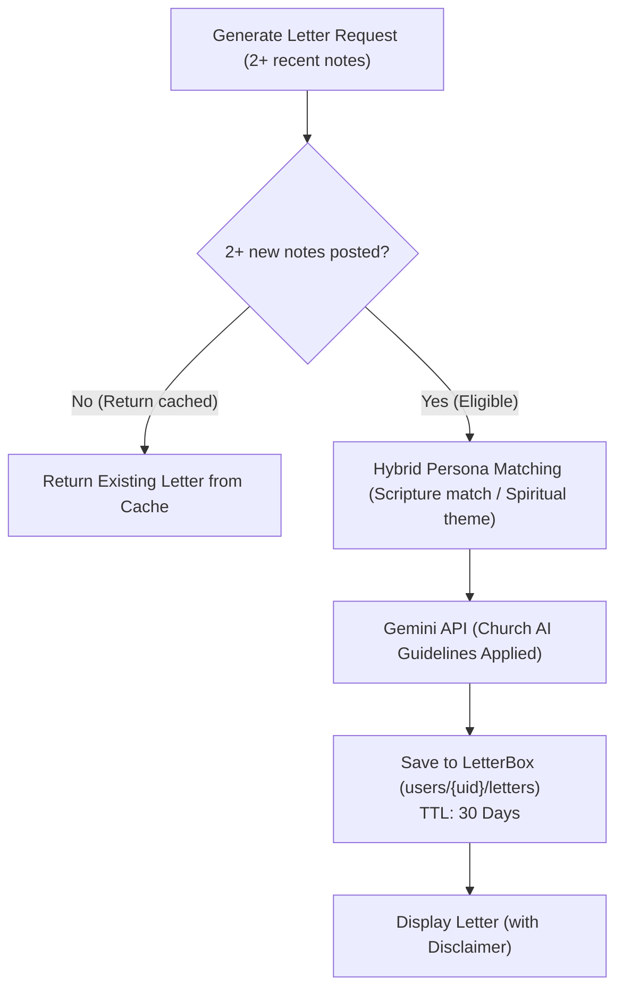

# AI Integration (Gemini)

This document details how the Gemini AI subsystem handles dynamic message translations, question prompts, and weekly reflection letters.

---

## 1. Role & Persona Design

AI functions as an encouraging facilitator that bridges language gaps and validates personal study efforts:
- **Tone**: Warm, supportive, plainspoken, and concise.
- **Focus**: Emphasizes daily personal application rather than complex theological debate.

---

## 2. Model Configuration

- **Model**: **Gemini 3.1 Flash-Lite**
- **Optimization**: Configured with minimal thinking levels (`thinkingLevel: "minimal"`) to maximize response speed for translations and question generation.

---

## 3. Translation Caching & Batching

To minimize API costs and optimize response times, the app employs two optimization strategies:

### ① MD5 Persistent Cache
Hashes request parameters (`OriginalText + TargetLanguage`) to check the `translation_cache` collection. Cached translations resolve in under 50ms.

### ② Batch Translation (`/api/ai/translate-batch`)
When loading chat streams with multiple foreign messages:
1. **Parallel Cache Lookup**: Queries all message hashes concurrently via `Promise.all()`.
2. **Single Structured Request**: Bundles only cache-missed messages into a single JSON payload for Gemini, reducing network latency to a single round-trip.
3. **Atomic Persistence**: Commits translations directly to the respective message documents via a Firestore batch.

---

## 4. Reflection Letters (LetterBox) & Scriptural Persona Architecture

Analyzes recent study notes to generate personalized reflection letters **written from the perspective of an AI embodying a figure from the Four Standard Works (Old Testament, New Testament, Book of Mormon, Doctrine & Covenants, Pearl of Great Price)**:

### ① Standard Works Persona Pool (Excluding Jesus Christ & Living Leaders)
- **Old Testament**: Adam, Enoch, Noah, Abraham, Moses, Elijah, Isaiah, Daniel, etc.
- **New Testament**: John the Baptist, Peter, James, John, Paul, Matthew, Stephen, etc. *(Jesus Christ excluded)*
- **Book of Mormon**: Lehi, Nephi, Alma, King Benjamin, Mormon, Moroni, Enos, etc.
- **Doctrine & Covenants / Early Restoration (19th Century)**: Joseph Smith Jr., Hyrum Smith, Emma Smith, Oliver Cowdery, Eliza R. Snow, Brigham Young, etc.
- **Pearl of Great Price**: Moses, Abraham, Enoch

### ② Hybrid Selection Logic
1. **Priority 1 (Scriptural Context Match)**: If the user studied a specific book/chapter featuring a figure (e.g. 1 Nephi → Nephi, D&C 25 → Emma Smith), that person is selected.
2. **Priority 2 (Spiritual Theme Match)**: If no direct author exists, the AI dynamically selects the figure whose life experiences and teachings best resonate with the user's emotional and spiritual insights.

### ③ Letter Structure & Two-Phase Progression (Humor vs Spiritual Emotion)
- **Salutation**: `"Dear ${userName}, I, the AI, am embodying [Persona Name] as I read your two latest study notes."` (Transparent AI roleplay)
- **Phase 1 (Warm Icebreaker & Human Relatability)**: Shares scriptural self-deprecation (Peter sinking/dozing, Nephi's broken bow, Jonah's runaway boat, Alma passing out) or modern relatable struggles to build rapport and relieve pressure.
- **Phase 2 (Sincere Christ-Centered Reflection)**: Shifts to a reverent, touching tone without jokes, validating the user's sincere spiritual thoughts and testifying of Christ's grace.
- **Poem & P.S.**: A clean 3–4 line poem formatted without markdown symbols (`*` or `---`), followed optionally by a heartwarming P.S. (postscript).
- **Signature**: `"— From AI (embodying [Persona Name])"`
- **Disclaimer**: `"[Note] AI reflection letters are intended to encourage your daily study by reflecting on the faith of scriptural figures, and do not replace personal revelation from the Holy Ghost or official Church guidance. Because AI can make mistakes, please use your own prayerful judgment and official Church resources for doctrinal accuracy."`
- **No Structural Labels**: The letter flows naturally without printing bracketed headings (e.g. `[Part 1]` or `[Icebreaker]`).

---

## 5. Daily Scripture Comment Generation (`scripts/generate-ai-daily-comments.ts`)

Pre-generates daily study comments in 10 languages for the Come, Follow Me curriculum:
- **Strategy**: Replaces generic textbook sermons with punchy 1-line observations, witty modern parallels, and empathetic humor focusing on human realities in the scriptures.
- **Rules**: Zero emojis, no rhetorical homework questions, single punchy line.
- **Cultural Localization**: Localized culturally so the humor and cadence sound natural to native speakers across all 10 supported languages.

---

## 6. Church AI Guidelines (General Handbook 38.8.47) Alignment

In alignment with General Handbook Section 38.8.47 ("Appropriate Use of Artificial Intelligence") and foundational Church principles, the prompt incorporates the following safety guidelines:

1. **Respect for Personal Revelation**: Clarifies in both the letter notice and Terms of Service that AI does not replace personal revelation from the Holy Ghost or official Church guidance.
2. **Transparency**: Explicitly identifies AI roleplay in both the opening greeting and signature to prevent confusion.
3. **Priesthood & Doctrinal Boundaries**: Avoids speculating on unrevealed mysteries, pronouncing forgiveness of sins, assessing personal worthiness, or directing ecclesiastical callings.
4. **Professional Boundaries (Handbook 38.8.47)**: Refrains from offering medical, clinical mental health, legal, or financial advice.
5. **Reverence for Sacred Matters**: Avoids impersonating the Savior or living leaders; refrains from discussing sacred temple ordinance wording or confidential ceremonies.
6. **Agency & Teaching Principles**: Avoids imposing rigid micro-rules; teaches principles to encourage prayerful personal decisions.
7. **Interfaith Respect (11th Article of Faith)**: Maintains charity and respect for people of all faith backgrounds, avoiding criticism of other denominations.
8. **Hope & Peace**: Focuses on peace, spiritual courage, and hope in Christ rather than inciting anxiety around warfare or apocalyptic topics.
9. **Accessibility for Youth & All Ages**: Uses clear, natural, and respectful language suitable for learners of all ages.
10. **Real-World Connections**: Encourages personal prayer and fostering meaningful connections with family and the faith community.
11. **Word of Wisdom Compliance (D&C 89)**: Strictly prohibits referencing coffee, tea, alcohol, tobacco, or prohibited substances in metaphors or icebreakers, favoring wholesome universal habits (drinking water, eating breakfast, walking).

---

## 6. Related Documentation

- [AI Reflection Letters & Retention Psychology](./ux-ai-reflection-letters.md)
- [Internationalization (i18n)](./logic-i18n.md)
- [Note Creation (NewNote) Guide](./newnote-construction-guide.md)
