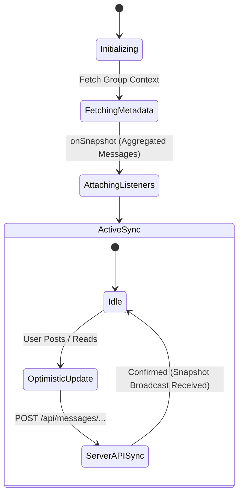

# Chat & Dashboard Synchronization

::: tip Interactive Architecture Tour
Explore the live data-flow blueprint and guided walkthrough for this feature:
- **Online (GitHub Browser Preview)**: [Open Interactive Tour (Group Chat & Multilingual Translation)](https://htmlpreview.github.io/?https://github.com/ScriptureHabit/scripture-habit/blob/main/docs/public/architecture-tour.html?tour=tour-groupchat&lang=en)
- **VitePress / Local**: [Open Group Chat & Multilingual Translation Tour](/architecture-tour.html?tour=tour-groupchat&lang=en)
:::

This document explains the real-time Firestore listener architecture (`onSnapshot`), read marker synchronization, and media upload optimization across chat and dashboard surfaces.

---

## 1. Real-Time Synchronization Architecture

Eliminating polling overhead, the client maintains active WebSocket connections (`onSnapshot`) with Firestore to mirror remote mutations into local state with sub-second latency.



### Synchronization Lifecycle Breakdown

1. **Initialization & Listener Connection**  
   Upon mounting a group view, the client fetches parent document metadata before subscribing to the aggregated message document (`messages_latest/latest`).

2. **Optimistic Local Mutation**  
   User actions (posting a note, sending a reaction, updating read state) immediately apply to local React state, followed by an asynchronous API dispatch.

3. **Remote Reconciliation**  
   When the backend transaction commits, Firestore broadcasts the updated snapshot, reconciling and finalizing client state.

---

## 2. Read Marker Management

Read states adhere to a server-authoritative synchronization model:

1. **Local Immediate Clear**: Navigating into a group resets the local unread badge count to `0`.
2. **Asynchronous Server Dispatch**: Invokes `/api/update-read-status` to update `lastReadAt` in the user's `groupStates` subcollection.
3. **Automatic Fault Recovery**: If network interruptions delay the API dispatch, the subsequent Firestore snapshot reconciles local unread counts automatically.

---

## 3. Media & Image Processing

- **Client-Side Canvas Compression**: Images are resized and JPEG-compressed directly within the browser before upload to Firebase Storage, conserving mobile data.
- **Immediate Local Previews**: Captured photos render immediately using `URL.createObjectURL`, seamlessly swapping to the permanent Storage URL once upload completes.

---

## 4. Best Practices & Anti-Pattern Prevention

### ① Preventing Subscription Loops (Stable Ref Pattern)
Including the dynamic `messages` array in the dependency list of an `onSnapshot` `useEffect` triggers an infinite unsubscribe-resubscribe cycle.
Message state is stored in a `useRef` to decouple data consumption from listener lifecycles:

```typescript
const currentMessagesRef = useRef<Message[]>(currentMessages);
useEffect(() => {
  currentMessagesRef.current = currentMessages;
}, [currentMessages]);
```

### ② Preventing Group Transition Race Conditions (Synchronous Reset)
Resetting group state asynchronously via effects during route changes causes visual artifacting and stale data leaks.
Detecting `groupId` mutations during the render phase and resetting state synchronously guarantees clean navigation transitions.

---

## 5. Related Documentation

- [Group Chat Architecture & Implementation](./groupchat-construction-guide.md)
- [Dashboard & MyNotes Guide](./dashboard-mynotes-construction-guide.md)
- [Firestore Transactions & Counters](./firestore-transactions-counters.md)
