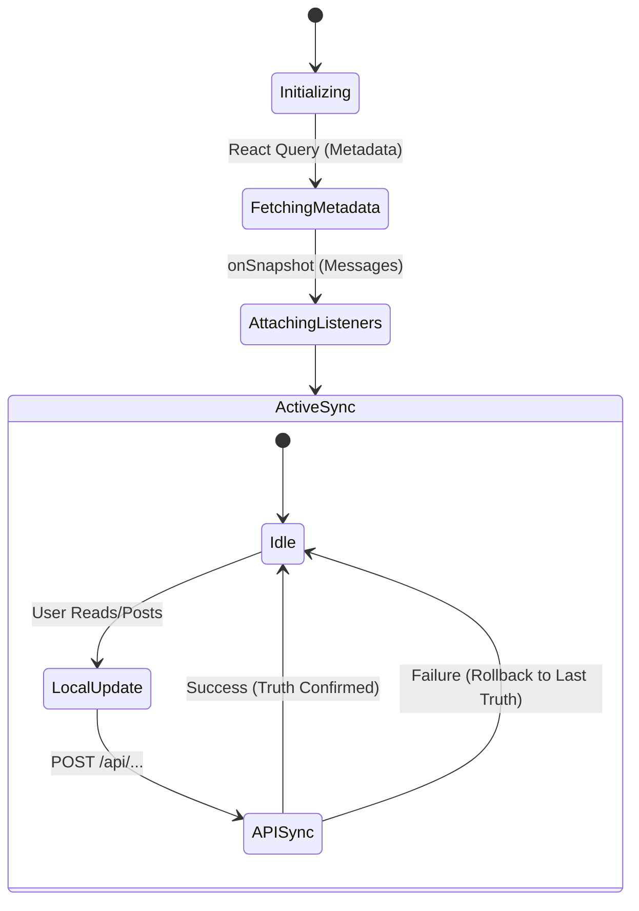

# Chat & Dashboard Synchronization

The **Chat Dashboard** is an important UI component in **scripture-habit**. It handles real-time messages, image uploads, and unread status markers across multiple groups.

---

## Real-time Core: `onSnapshot` Architecture

We avoid traditional polling or manual fetch patterns. Instead, the UI reflects the Firestore database using persistent WebSocket listeners.

### Sync Engine & Delta Handling

The synchronization engine (in `src/components/groupchat/hooks/core/`) adopts a hybrid synchronization pattern to optimize reading efficiency and user experience.

- **Materialized View Subscription (Messages)**:
  Instead of listening to the entire `/messages` subcollection, which would incur massive Firestore document read costs whenever a new message is added or modified, the client subscribes to a single materialized aggregate document `/groups/{groupId}/messages_latest/latest` using `onSnapshot`. This allows the frontend to fetch and stream the latest chat window content using exactly **1 document read**.
- **Delta Processing (Group Members)**:
  For group members synchronization (`useGroupMembersSync`), the engine listens to the `/members` subcollection and utilizes Firestore's `snapshot.docChanges()` to process only the added or modified member documents incrementally, keeping data transfers to a minimum.
- **Optimistic State**:
  When a user reads a message or posts a new one, the UI updates its local state immediately (with latency compensation via direct client-side updates to `/users/{userId}/groupStates/{groupId}` in `useDashboardActions`), while processing the API sync in the background.
- **Snapshot Merging**:
  As new messages arrive, the local message list merges updates from the database snapshot and any local pending optimistic messages. By using stable React `key` properties based on message `doc.id` (or `id`), the application minimizes deep virtual DOM re-renders.

---

## Read Markers

Synchronizing unread counts is managed using a **"Server Truth"** model:

1.  **Local Read**: When a user enters a chat, the app marks the local `unreadCount` as zero.
2.  **API Sync**: It calls `/api/update-read-status` to inform the server of the new "Last Read" timestamp.
3.  **Recovery Logic**: If the API call fails or a background tab conflict occurs, the next `onSnapshot` trigger from the server will overwrite the local state with the database value.

---

## Media & Image Handling

Images in the chat follow a multi-stage process to ensure the UI feels responsive:
- **Optimization**: Images are resized or compressed on the client before upload to save user bandwidth.
- **Storage**: Real-time URLs are generated via Firebase Storage.
- **Optimistic Preview**: The component displays a local blob URL instantly after the user selects an image, replacing it with the permanent URL only once the upload is confirmed.

---

## Synchronization State Diagram



---

## Performance Tips for Developers

To keep Firestore reads highly optimized and prevent unexpected billing surges, we adhere to the following architecture rules:

- **Firestore Bundle Boost (Initial Load)**:
  - In `useMessageStreamSync`, we attempt to fetch a pre-built Firestore Bundle from `/api/groups/bundle/:groupId` first. This loads the initial chunk of messages (up to 50) using exactly **1 API Read** instead of 50 separate document reads, which are then stored in the local cache.
- **Multi-Layer Caching for Read Cost Reduction**:
  - The bundle API uses a **two-tier caching strategy**. First, the bundle is held in the server's **in-memory cache (`bundleCache`) for 120 seconds**. Subsequent requests for the same group are served instantly from this cache without touching Firestore. Additionally, the response is cached on the **Vercel Edge CDN for 60 seconds** (`s-maxage=60, stale-while-revalidate=120`), serving requests from geographically nearby servers at ultra-low latency.
  - For new groups where the aggregate document (`messages_latest/latest`) does not yet exist, a **fallback query** fetches the latest 25 messages directly from the `/messages` subcollection. Simultaneously, a background self-healing process (`reconcileLatestMessages`) runs to automatically generate the aggregate document so that future loads can use the bundle path.
- **getDocs (List Views) vs onSnapshot (Detail/Active Views)**:
  - **getDocs**: Use for high-level lists (like the Dashboard group preview cards) where occasional manual refreshes or page-navigation updates are acceptable. This avoids keeping unnecessary WebSocket connections open in the background, keeping our read footprint flat.
  - **onSnapshot**: Reserve exclusively for detail/active views (like the active Chat pane) where real-time sync is essential for user engagement.
- **Limit Snapshots**: Always use `limit(N)` and `orderBy('createdAt', 'desc')` in chat queries to prevent loading too many historical messages.
- **Stable References**: Use `useMemo` for derived chat data to prevent the sidebar from re-rendering on typing events.
- **Background Foreground Recovery Check**: When the browser tab returns to the foreground from an inactive state (via the `visibilitychange` event), the app sends a `CHECK_PENDING_NOTIFICATION` message to the Service Worker to check for any push notifications that may have been missed while the tab was in the background.

---

## Real-time Sync Pitfalls & Anti-Patterns

When building real-time synchronization hooks with the Firestore Client SDK, two major architectural pitfalls must be guarded against at all times. Both of these were historically resolved during the Strategy B chat optimization:

### 1. The Infinite Subscription Loop (Stale/Mutable State Pitfall)
*   **The Danger**: Placing the primary message state (`currentMessages`) in the dependency array of a `useEffect` that triggers `onSnapshot` subscriptions.
*   **How it fails**:
    1.  The hook subscribes to Firestore.
    2.  Firestore returns data, triggering `dispatch({ type: 'SET_MESSAGES', messages })`.
    3.  The parent component re-renders with a new array reference for `messages`.
    4.  Because `messages` changed, the `useEffect` cleans up: it calls `unsubscribe()`.
    5.  The effect immediately runs again and calls `onSnapshot()` to re-subscribe.
    6.  This triggers a perpetual infinite loop, locking up the CPU and rendering the chat window completely blank.
*   **The Resolution (Stable Ref Pattern)**: Keep `currentMessages` entirely out of the subscription `useEffect` dependency array. Instead, store it in a `useRef` that is updated on every render:
    ```typescript
    const currentMessagesRef = useRef<Message[]>(currentMessages);
    useEffect(() => {
      currentMessagesRef.current = currentMessages;
    }, [currentMessages]);
    ```
    Inside the `onSnapshot` callback, read from `currentMessagesRef.current` to calculate optimistic resolution without ever re-triggering the subscription effect.

### 2. Initialization Race Conditions (Asynchronous Reset Pitfall)
*   **The Danger**: Resetting the chat state asynchronously via `useEffect` upon `groupId` changes while using Firestore's offline persistence/cache.
*   **How it fails**:
    1.  The user switches groups or re-enters a chat.
    2.  An asynchronous `useEffect` is scheduled to dispatch `dispatch({ type: 'RESET' })` to clear previous messages.
    3.  In the same render pass, the subscription `useEffect` runs and registers `onSnapshot`.
    4.  Because Firestore's `persistentLocalCache` is enabled, the client-side SDK immediately and **synchronously** yields the cached messages for the group and dispatches `SET_MESSAGES`.
    5.  A millisecond later, the asynchronous `RESET` dispatch finally fires, clearing the state back to `[]` and setting the status back to `'loading'`.
    6.  The messages disappear instantly, leaving the chat window permanently blank.
*   **The Resolution (Synchronous Render-Phase Reset)**: Eliminate the asynchronous `RESET` effect entirely. Instead, detect the `groupId` change and dispatch the reset **synchronously during the React render phase**:
    ```typescript
    const prevGroupIdRef = useRef<string | null>(null);
    if (groupId !== prevGroupIdRef.current) {
      prevGroupIdRef.current = groupId;
      if (groupId) {
        dispatch({ type: 'RESET', groupId });
      }
    }
    ```
    This causes React to immediately abort the current render pass and restart rendering with the fully-cleared state, guaranteeing that `onSnapshot` will never be overridden by a late-arriving reset event.
