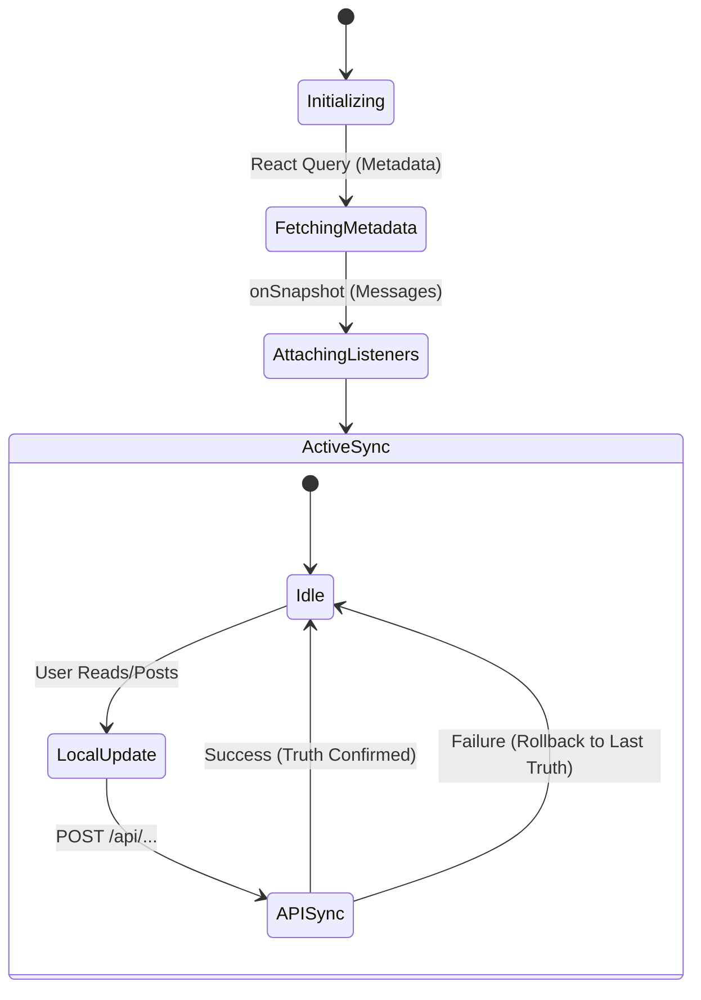

# Chat & Dashboard Synchronization

The **Chat Dashboard** is an important UI component in **scripture-habit**. It handles real-time messages, image uploads, and unread status markers across multiple groups.

---

## 🛰️ Real-time Core: `onSnapshot` Architecture

We avoid traditional polling or manual fetch patterns. Instead, the UI reflects the Firestore database using persistent WebSocket listeners.

### Delta Handling
The sync engine (in `src/components/groupchat/hooks/core/`) uses Firestore's ability to send only modified or added documents.
- **Optimistic State**: When a user reads a message, the UI updates the local state immediately while the API update processes in the background.
- **Snapshot Merging**: New messages are added to the local list, minimizing deep tree re-renders by using stable React `key` properties based on Firestore `doc.id`.

---

## 🏁 Read Markers

Synchronizing unread counts is managed using a **"Server Truth"** model:

1.  **Local Read**: When a user enters a chat, the app marks the local `unreadCount` as zero.
2.  **API Sync**: It calls `/api/update-read-status` to inform the server of the new "Last Read" timestamp.
3.  **Recovery Logic**: If the API call fails or a background tab conflict occurs, the next `onSnapshot` trigger from the server will overwrite the local state with the database value.

---

## 🖼️ Media & Image Handling

Images in the chat follow a multi-stage process to ensure the UI feels responsive:
- **Optimization**: Images are resized or compressed on the client before upload to save user bandwidth.
- **Storage**: Real-time URLs are generated via Firebase Storage.
- **Optimistic Preview**: The component displays a local blob URL instantly after the user selects an image, replacing it with the permanent URL only once the upload is confirmed.

---

## 🚦 Synchronization State Diagram

---

## 🚀 Performance Tips for Developers

To keep Firestore reads highly optimized and prevent unexpected billing surges, we adhere to the following architecture rules:

- **Firestore Bundle Boost (Initial Load)**:
  - In `useMessageStreamSync`, we attempt to fetch a pre-built Firestore Bundle from `/api/groups/bundle/:groupId` first. This loads the initial chunk of messages (up to 50) using exactly **1 API Read** instead of 50 separate document reads, which are then stored in the local cache.
- **Timestamp Rounding for Cache Hit Rate**:
  - In queries that filter by moving time windows (e.g., "past 24 hours"), **never use precise timestamps** like `Date.now()`. This changes every millisecond, rendering the query uncacheable.
  - Always **round the query timestamp** to the nearest 30 minutes (or 1 hour). This ensures the query signature is identical across multiple renders and page navigations, allowing the Firestore SDK's `persistentLocalCache` to serve the data instantly with **0 server reads**.
- **getDocs (List Views) vs onSnapshot (Detail/Active Views)**:
  - **getDocs**: Use for high-level lists (like the Dashboard group preview cards) where occasional manual refreshes or page-navigation updates are acceptable. This avoids keeping unnecessary WebSocket connections open in the background, keeping our read footprint flat.
  - **onSnapshot**: Reserve exclusively for detail/active views (like the active Chat pane) where real-time sync is essential for user engagement.
- **Limit Snapshots**: Always use `limit(N)` and `orderBy('createdAt', 'desc')` in chat queries to prevent loading too many historical messages.
- **Stable References**: Use `useMemo` for derived chat data to prevent the sidebar from re-rendering on typing events.
- **Background Suppression**: When the browser tab is inactive, listeners remain active but UI updates are throttled to save CPU.
