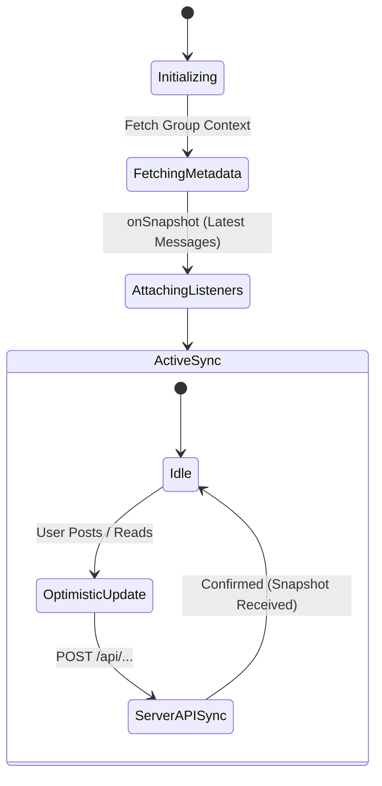

# Chat & Dashboard Synchronization

This document explains the real-time Firestore listener architecture (`onSnapshot`), read status tracking, and media handling across chat and dashboard views.

---

## 1. Real-Time Synchronization Architecture

Instead of continuous polling, the app maintains active WebSocket connections (`onSnapshot`) with Firestore to mirror changes instantly into the UI.



### Core Architecture Patterns
1. **Aggregated View Subscription (`messages_latest/latest`)**:
   Instead of listening to the entire `/messages` subcollection (which incurs high read costs on active chats), clients subscribe to a single aggregated document holding the latest 25 messages.
2. **Delta Processing (`docChanges`)**:
   Member lists are synchronized by processing only incremental document additions or modifications, avoiding full re-renders.
3. **Optimistic UI Updates**:
   When sending messages or marking chats as read, local React state is updated immediately before server confirmation.

---

## 2. Read Status Management

Read markers are maintained using a server-authoritative model:

1. **Local Clear**: Opening a group chat clears the local `unreadCount` to 0.
2. **Server Sync**: Dispatches `/api/update-read-status` to record the new `lastReadAt` timestamp.
3. **Automatic Recovery**: If the API call encounters network errors, the next incoming `onSnapshot` event reconciles local state with server data.

---

## 3. Media & Image Processing

- **Client-Side Compression**: Images are compressed on the client device prior to Firebase Storage upload to save user bandwidth.
- **Optimistic Preview**: Selected images immediately render with a local object URL and switch to the permanent storage URL upon upload completion.

---

## 4. Best Practices & Anti-Pattern Prevention

### ① Preventing Infinite Subscription Loops (Stable Ref Pattern)
Placing the `messages` array in the dependency list of the `useEffect` that attaches `onSnapshot` causes an infinite unsubscribe/resubscribe loop.
To prevent this, active message state is mirrored into a `useRef`:

```typescript
const currentMessagesRef = useRef<Message[]>(currentMessages);
useEffect(() => {
  currentMessagesRef.current = currentMessages;
}, [currentMessages]);
```

### ② Group Switching Race Conditions (Synchronous Reset)
Resetting chat state asynchronously inside a `useEffect` when changing `groupId` causes visual flicker and wiped cache states.
Detecting `groupId` changes directly during the component render phase ensures clean, flicker-free state transitions.

---

## 5. Related Documentation

- [Group Chat Architecture & Implementation](./groupchat-construction-guide.md)
- [Dashboard & MyNotes Guide](./dashboard-mynotes-construction-guide.md)
- [Firestore Transactions & Counters](./firestore-transactions-counters.md)
