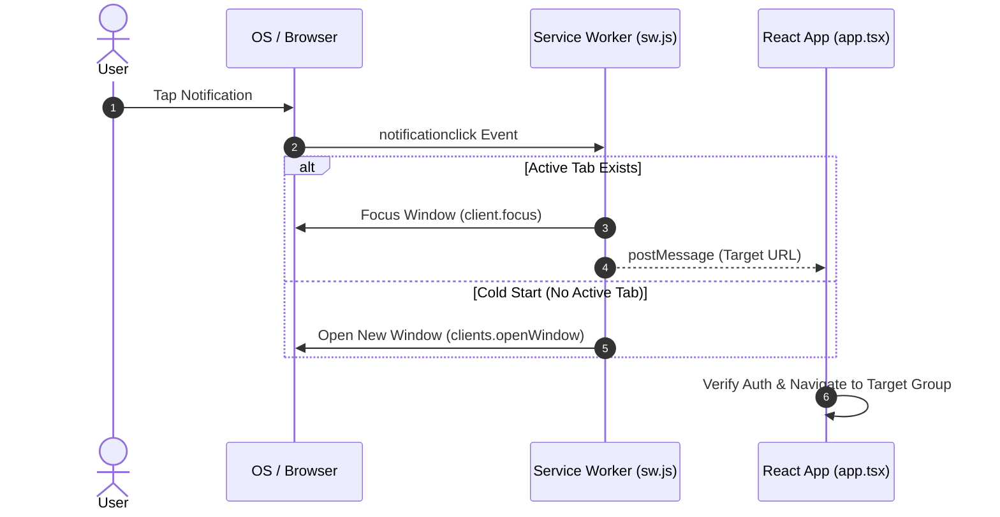

# Push Notification System

This document details Web Push (FCM) delivery, token management, notification tray cleanup, and deep-link routing.

---

## 1. FCM Token Storage & Privacy

To balance privacy protection and query efficiency, tokens are stored across two fields:

1. **Private Token Vault (`users/{uid}/private/tokens`)**:
   FCM registration tokens (`fcmTokens` array) are stored in private subcollections accessible only by the authenticated owner.
2. **Public Status Flag (`users/{uid}.hasFcmToken`)**:
   A public boolean flag on the user profile indicating whether valid tokens exist, allowing the hourly reminder job to index recipients quickly without reading private subcollections.

---

## 2. Client-Side Service Worker Setup

Push permissions and token registrations are handled in `src/utils/notification-helper.ts`:

1. **Browser Compatibility Check**: Verifies support for Service Workers and PushManager.
2. **Permission Request**: Invokes `Notification.requestPermission()`.
3. **Service Worker Registration**: Registers `/sw.js` with scope `'/'`.
4. **Token Enrollment**: Obtains a FCM token via VAPID keys and persists it to the user's private tokens document.

---

## 3. Notification Tray Management

To prevent stale notification clutter in the OS drawer:

- **On App Launch**: Closes active study streak reminders as the user has now engaged with the app.
- **On Entering Group Chat**: Selectively dismisses only notifications matching the active `groupId` while preserving alerts from other groups.

---

## 4. Multicast Delivery & Automatic Token Purging

- **Batches of 500**: Employs Firebase Admin SDK's `sendEachForMulticast` to dispatch notifications in 500-token batches.
- **Self-Healing Token Cleanup**: Uninstalled or invalidated tokens (`messaging/invalid-registration-token`) are detected from delivery feedback and automatically purged from the database.

---

## 5. Notification Click & Deep-Link Flow

When users tap a push notification, the service worker and app coordinate navigation to the relevant group chat or view:

---

## 6. Related Documentation

- [Timezone-Aware Streak Reminders](./timezone-streak-reminders.md)
- [Maintenance & Scheduled Jobs (Cron)](./maintenance-cron.md)
- [Chat & Dashboard Synchronization](./feature-chat-dashboard.md)
