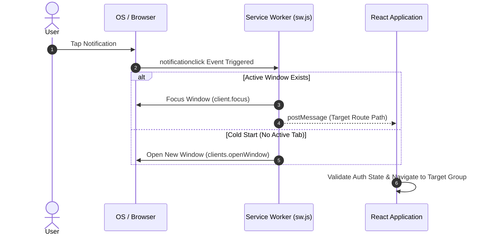

# Push Notification System

This document details the Web Push (FCM) delivery architecture, token privacy policies, notification tray lifecycle management, and deep-link routing in Scripture Habit.

---

## 1. FCM Token Storage & Privacy Architecture

To balance user privacy with query performance, notification tokens are partitioned into two tiers:

1. **Private Token Vault (`users/{uid}/private/tokens`)**  
   Device registration tokens (`fcmTokens` array) reside strictly within private subcollections accessible only by the authenticated owner.
2. **Public Eligibility Flag (`users/{uid}.hasFcmToken`)**  
   A denormalized boolean flag on the user document indicating active token presence, allowing hourly reminder jobs to index candidates without reading private subcollections.

---

## 2. Client-Side Service Worker Setup

Push permissions and token registrations are managed via `src/utils/notification-helper.ts`:

1. **Browser Compatibility Check**: Validates runtime support for Service Workers and PushManager.
2. **Permission Request**: Invokes `Notification.requestPermission()`.
3. **Service Worker Registration**: Registers `/sw.js` with root scope.
4. **Token Enrollment**: Acquires FCM tokens via VAPID key exchange and writes them to the user's private tokens document.

---

## 3. Notification Tray Management

To prevent stale notifications from cluttering the OS notification center:

- **On App Launch**: Dismisses active streak reminder notifications since user engagement has occurred.
- **On Entering Group Chat**: Selectively dismisses notifications matching the active `groupId` while preserving alerts from other groups.

---

## 4. Multicast Delivery & Token Purging

- **Batched Multicast**: Uses Firebase Admin SDK's `sendEachForMulticast` to dispatch notifications in 500-token batches.
- **Self-Healing Token Cleanup**: Uninstalled or invalidated tokens (`messaging/registration-token-not-registered`) are identified from delivery error codes and purged from Firestore automatically.

---

## 5. Notification Click & Deep-Link Flow

When users tap a push notification, the Service Worker and React application coordinate deep-link navigation:

### Deep-Link Sequence Breakdown

1. **`notificationclick` Interception**  
   The Service Worker captures the system tap event and extracts destination payload data (e.g., `/groups/{groupId}`).

2. **Window Reuse vs. Cold Start**  
   Focuses an existing browser window if available, transmitting the path via `postMessage`. Otherwise, it invokes `clients.openWindow`.

3. **Authentication Verification & Route Resolution**  
   React Router resolves the destination path, verifying authentication state before mounting the target chat or note interface.

---

## 6. Related Documentation

- [Timezone-Aware Streak Reminders](./timezone-streak-reminders.md)
- [Maintenance & Scheduled Jobs (Cron)](./maintenance-cron.md)
- [Chat & Dashboard Synchronization](./feature-chat-dashboard.md)
