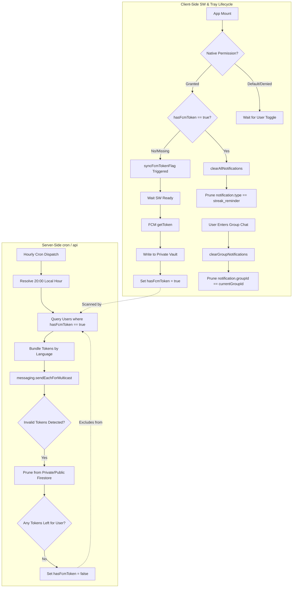
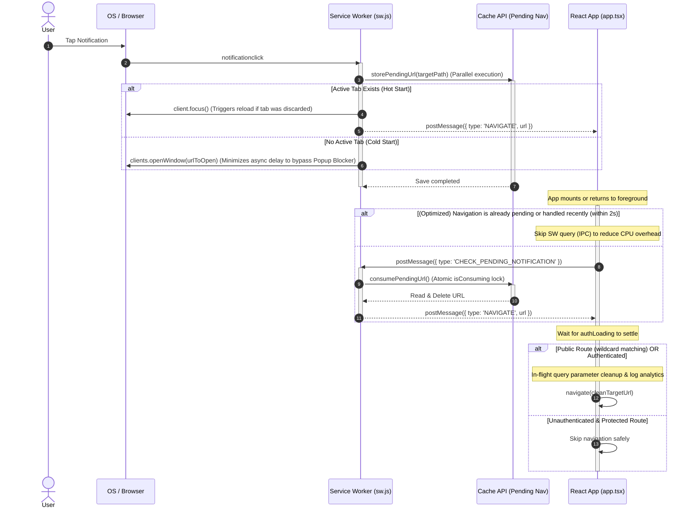

# Notification System

The **Notifications Subsystem** helps users stay engaged by delivering alerts when members post notes or achieve milestones, and sending daily study reminders.

---

## 🔑 FCM Token Storage and Privacy

To protect user privacy and improve performance, FCM registration tokens are stored using two main fields:

1. **Private Token Vault (`fcmTokens` array inside `users/{uid}/private/tokens`)**:
   - FCM registration tokens are stored strictly inside the user's private `tokens` document.
   - **Access Rules**: Firestore security rules restrict read and write access to the authenticated owner (`request.auth.uid == uid`). This prevents other group members from reading device tokens.
2. **Public Status Flag (`users/{uid}/hasFcmToken`)**:
   - A public boolean property `hasFcmToken: boolean` is stored on the user's profile document.
   - **Performance**: Daily reminders can search for eligible users using index reads without having to read private `tokens` documents or subcollections.

### Compatibility and Merging
During notification delivery, backend helpers safely collect and deduplicate tokens from both the old public `fcmTokens` array (retained for migration) and the new private `tokens` document's `fcmTokens` array. Newly registered devices use the private `tokens` document.

---

## ⚡ Client Service Worker Setup

Push notification permissions, service worker setup, and background token synchronization are handled on the client device inside `src/utils/notification-helper.ts`.

### 1. Permissions and Setup
When a user clicks "Enable Notifications", the client coordinates the following steps:
1. **Support Check**: Checks for `serviceWorker`, `Notification`, and `PushManager` support in the browser. Displays a message if the browser is incompatible.
2. **In-App Browser Warnings**: Displays a warning inside in-app WebViews (such as LINE, Instagram, Facebook) since push notifications often fail in these environments due to platform sandbox limits.
3. **Permission Prompt**: Calls `Notification.requestPermission()`.
4. **Service Worker Registration**:
   - Finds existing active registrations.
   - If an active registration is found, it updates and reuses it; otherwise, it registers `/sw.js` with the scope `'/'`.
   - Blocks execution using `await navigator.serviceWorker.ready` to ensure the background push listeners are running.
5. **Token Storage**: Fetches the unique FCM token using the VAPID Key. Writes the token to the user's private `tokens` subcollection using the Firestore `arrayUnion` operator and sets `hasFcmToken = true` on the public user document.

### 2. Self-Healing Flag Sync (`syncFcmTokenFlag`)
To ensure database flags are correct (e.g. after database resets):
- On application mount, if the browser `Notification.permission` is `'granted'` but the user profile indicates `hasFcmToken` is false or missing, the helper updates it in the background.
- It fetches the FCM token from the active Service Worker registration and writes the status back to Firestore to update the `hasFcmToken` flag.

---

## 🧹 Notification Tray Control

To keep the OS notification tray clean, active alerts are managed programmatically:

### 1. Streak Reminder Cleared on App Launch
Streak warnings are irrelevant once a user opens the application to complete their daily study:
- On application launch, `clearAllNotifications` gets the active service worker registration.
- It finds notifications displayed in the OS drawer using `registration.getNotifications()`.
- It calls `notification.close()` on notifications where `notification.data.type === 'streak_reminder'`. This clears streak reminders immediately upon app load.

### 2. Group Message Notification Clearing
To avoid closing unrelated updates:
- When a user enters a group chat screen, the client calls `clearGroupNotifications(groupId)`.
- It closes **only** the notifications where `notification.data.groupId === groupId`.
- Other notifications (like streak alerts or alerts from other groups) remain in the OS tray.

---

## ⚡ Multicast Sending and Chunking

Firestore messaging supports high-volume sending, but it has a 500-token limit per request. Our `sendPushNotification` utility splits requests:

- **Chunk Size**: 500 tokens.
- **Multicast Loop**: If a group has 2,000 active tokens, the system performs 4 parallel requests.
- **`sendEachForMulticast`**: We use the latest Firebase Admin SDK method which provides status reports for *each individual token* within the chunk.

---

## 🩹 Self-Healing Token Lifecycle

Mobile app uninstalls or device token expirations leave invalid tokens in the database. The `/api/streak-reminder` and `cleanupTokens` services use a self-healing feedback loop:

1. **Detection**: The Admin SDK reports `messaging/invalid-registration-token`.
2. **Capture**: Failed tokens are extracted from the multicast response.
3. **Tracking**: The `tokenToUserMap` identifies which User ID owns the failed token.
4. **Pruning**: `cleanupTokens` removes the failed token from both public and private Firestore locations.
5. **Flag Safety**: If a user has no FCM tokens remaining, the system sets `hasFcmToken = false` on their profile document to prevent future redundant lookups.

---

## 📦 Payload Structure

Every push we send uses a hybrid payload to ensure compatibility across Android and iOS.

| Key | Purpose | Logic |
| :--- | :--- | :--- |
| **`notification`** | **Visual** | Handled by the OS. Displays title and body even if the app is closed. |
| **`data`** | **Programmatic** | Handled by the client application. Includes `groupId` and `type` for deep-linking. |

### Foreground Suppression
If the app is open (foreground), we suppress the visual notification banner because the **real-time `onSnapshot` listener** already shows the content in the chat. This prevents duplicate alerts.

---

## 🚦 Communication & Lifecycle Flow

---

## 🚦 App Launch & Deep Linking Flow

When a user taps a push notification in the OS tray, the client coordinates window focus, application launching, and route redirection.

### 1. High-Level Sequence

### 2. Advanced Launch Optimizations

To ensure native-like performance and durability in PWA environments, several defensive techniques are implemented:

* **Popup Blocker Bypass**: By parallelizing the Cache write (`storePendingUrl`) and `clients.openWindow` in `sw.js`, we minimize asynchronous boundaries inside user-interaction handlers, ensuring the browser permits the tab opening.
* **Atomic Cache Read**: The Service Worker utilizes an `isConsuming` mutex lock during `consumePendingUrl`. This guarantees that if the client triggers multiple checks concurrently (e.g., fast tab switching during `visibilitychange`), the pending URL is only returned and deleted once, preventing duplicate navigations.
* **IPC Messaging Reduction**: `app.tsx` uses `useRef` to track `pendingUrlRef` and `lastNavigatedTimeRef`. If a direct `NAVIGATE` message has just been processed, the client skips sending `CHECK_PENDING_NOTIFICATION` to the SW for the next 2 seconds, eliminating redundant MessageChannel overhead.
* **In-Flight Query Cleanup**: Tracking parameters like `opened_from_push=1` are stripped *before* calling React Router's `navigate`, allowing a single navigation to the clean target URL. This prevents rendering and history conflicts caused by consecutive navigation replaces on mount.
* **Wildcard Path Matching**: `isPublicRoute` supports wildcard definitions (e.g., `/join/*` matching any subpaths) to ensure newly added dynamic public routes resolve seamlessly without manual hardcoding updates.

