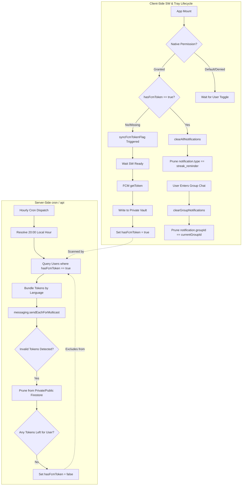

# Notification System: Delivery Reliability & Client Orchestration

The **Notifications Subsystem** ensures that the "social pressure" of the habit loop works effectively by delivering real-time alerts when group members post notes or achieve milestones, and by sending localized daily study reminders.

---

## 🔑 Privacy-Preserving Token Architecture

To protect user PII (Personally Identifiable Information) and maximize database performance while enforcing strict access control bounds, FCM registration tokens are organized with a secure dual-structure:

1. **Private Token Vault (`users/{uid}/private/tokens/fcmTokens`)**:
   - FCM registration tokens are stored strictly inside the user's private `tokens` document.
   - **Access Bounds**: Firestore security rules restrict read and write access to this subcollection solely to the authenticated owner (matching `request.auth.uid == uid`). This prevents other group members from harvesting or reading active device tokens during normal group metadata synchronization.
2. **Public Status Flag (`users/{uid}/hasFcmToken`)**:
   - A public boolean property `hasFcmToken: boolean` is maintained on the user's root profile document.
   - **Query Optimization**: Background Cron triggers (such as timezone-calibrated daily reminders) can scan and partition eligible users globally utilizing high-performance parallel index reads without having to read private tokens or fetch slow subcollections.

### Backward Compatibility & Dynamic Merging
During notification delivery, the backend `getUserFcmTokens` and `notifyGroupMembers` helpers safely aggregate and de-duplicate tokens from both the legacy public `fcmTokens` array and the secure private subcollection. Newly registered devices since the privacy migration strictly populate the private subcollection and prune from the public array.

---

## ⚡ Client-Side Service Worker Orchestration

Push notification permission requests, service worker lifecycle bindings, and background token synchronization are orchestrated on the client device inside `src/utils/notification-helper.ts`.

### 1. Permission and SW Setup Pipeline
When a user clicks "Enable Notifications", the client coordinates the following steps:
1. **Support Check**: Asserts support for `serviceWorker`, `Notification`, and `PushManager` natively in the browser. Displays a friendly toast alert if the device browser is incompatible.
2. **In-App Browser Warnings**: Intercepts the request inside in-app WebViews (such as LINE, Instagram, Facebook), advising the user that push notifications frequently fail in WebView overlays due to platform sandbox limits.
3. **Native Prompt**: Triggers `Notification.requestPermission()`. If granted, the pipeline proceeds.
4. **Service Worker Registration**:
   - Inspects existing active registrations.
   - If an active registration for the host is found, it updates and reuses it; otherwise, it registers `/sw.js` with the root scope `'/'`.
   - Blocks execution using `await navigator.serviceWorker.ready` to ensure the background push listeners are completely operational.
5. **Token Generation & DB Write**: Fetches the unique FCM token utilizing the project's public VAPID Key. Writes the token atomically to the user's private `tokens` subcollection using the Firestore `arrayUnion` operator and sets `hasFcmToken = true` on the public user document.

### 2. Self-Healing Flag Sync (`syncFcmTokenFlag`)
To guard against cases where database flags are out of sync with native browser states (e.g. following account resets or database restorations):
- On application mount, if the native browser `Notification.permission` is already `'granted'` but the user profile state indicates `hasFcmToken` is false or missing, the helper automatically triggers a silent background resolution.
- It fetches the active Service Worker registration, gets a valid FCM token, and writes the status back to Firestore to "heal" the missing `hasFcmToken` flag. This prevents users from silently falling out of the daily streak warning cron target list.

---

## 🧹 Contextual Notification Tray Control

To prevent OS notification trays from becoming cluttered and overwhelming, the client manages active visual alert Lifecycles programmatically rather than letting them linger indefinitely in the user's drawer.

### 1. App-Launch Streak Reminder Purging
Streak warnings are highly contextual and irrelevant once a user has opened the application to complete their daily study:
- On application launch, `clearAllNotifications` fetches the active service worker registration.
- It queries the list of active visual notifications displayed in the OS drawer via `registration.getNotifications()`.
- It filters and calls `notification.close()` exclusively on notifications holding `notification.data.type === 'streak_reminder'`. This automatically clears the lingering reminder from the user's tray immediately upon app load.

### 2. Selective Chat Room Clearing (`clearGroupNotifications`)
To maintain fine-grained control and avoid dismissing unrelated updates:
- When a user enters a specific group chat screen, the client triggers `clearGroupNotifications(groupId)`.
- The helper queries displayed notifications and closes **only** those matching `notification.data.groupId === groupId`.
- Other active notifications (such as streak alerts or notifications from other group chats) remain in the OS tray, ensuring relevant information is preserved while clearing the immediate context.

---

## ⚡ Multicast Sending & Chunking

Firestore messaging supports high-volume sending, but it has a 500-token limit per request. Our `sendPushNotification` utility implements **Automatic Chunking**:

- **Chunk Size**: 500 tokens.
- **Multicast Loop**: If a group has 2,000 active tokens across all members, the system automatically performs 4 optimized parallel requests.
- **`sendEachForMulticast`**: We use the latest Firebase Admin SDK method which provides granular success/failure reports for *each individual token* within the chunk.

---

## 🩹 Self-Healing Token Lifecycle (Ghost Buster Loop)

Mobile app uninstalls or device token expirations leave "ghost tokens" in the database. The `/api/streak-warning` and `cleanupTokens` services incorporate a **self-healing feedback loop**:

1. **Detection**: The Admin SDK reports `messaging/invalid-registration-token`.
2. **Capture**: The failed tokens are extracted from the multicast response.
3. **Traceability**: The `tokenToUserMap` identifies which User ID owns the failed token.
4. **Pruning**: `cleanupTokens` removes the failed token from both the Public and Private Firestore locations.
5. **Flag Safety**: If a user has no FCM tokens remaining after pruning, the system sets `hasFcmToken = false` on their public user document to prevent future redundant lookups.

---

## 📦 Payload Architecture: Notification vs. Data

Every push we send is a "Hybrid Payload" to ensure best compatibility across Android and iOS.

| Key | Purpose | Logic |
| :--- | :--- | :--- |
| **`notification`** | **Visual** | Handled by OS. Displays title and body even if app is closed. |
| **`data`** | **Programmatic** | Handled by Capacitor. Includes `groupId` and `type` for deep-linking. |

### Foreground Suppression
If the app is open (foreground), we often suppress the visual notification banner because the **real-time `onSnapshot` listener** already shows the content in the chat. This prevents redundant information overload.

---

## 🚦 Communication & Lifecycle Flow

