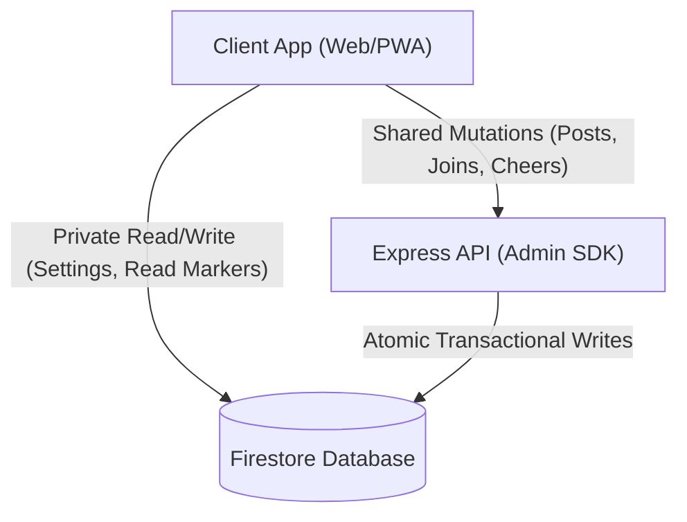

# Firebase Security Rules & Mutation Isolation

This document outlines the authentication constraints, membership validation, and server-side write isolation patterns in `firestore.rules`.

---

## 1. Two-Tier Defense Model

Security is verified across two boundaries:

```
Incoming Request ──► [ Tier 1: API Gateway ] ──► [ Tier 2: Database Rules ] ──► Commit
                       - Express Middleware            - firestore.rules
                       - verifyAppCheck (App Check)    - isAuthenticated()
                       - Rate Limiters                 - allow write: if false; (Shared Data)
```

If a client attempts to bypass the Express API to write directly to Firestore, security rules block the operation at the database level.

---

## 2. Core Security Rule Functions

### ① Authentication & Email Check (`isAuthenticated()`)
Restricts access to authenticated users with verified email addresses:

```javascript
function isAuthenticated() {
  return request.auth != null && (
    request.auth.token.email_verified == true || 
    request.auth.token.get('email_verified', false) == true ||
    request.auth.token.get('email', '').matches('.*@example[.]com$')
  );
}
```

### ② App Check Validation (`isAppCheckVerified()`)
Validates that incoming requests contain genuine App Check tokens when performing initial user registrations.

---

## 3. Enforcing Business Rules at Database Level

To prevent clients from circumventing the 4-group limit, security rules evaluate the user's current group count before allowing group creation:

```javascript
allow create: if isAuthenticated() && 
  request.resource.data.ownerUserId == request.auth.uid &&
  get(/databases/$(database)/documents/users/$(request.auth.uid)).data.get('groupIds', []).size() < 4;
```

---

## 4. Server-Side Write Isolation for Shared Data

To prevent data tampering and guarantee transactional integrity, **direct client writes to shared resources are strictly forbidden (`allow write: if false;`)**:



- **Shared Resources (`messages`, `members`, `cheers`)**:
  Locked down with `allow write: if false;`. All mutations must route through Express endpoints using the Firebase Admin SDK.
- **Private Resources (`users/{uid}`, `private/tokens`, `groupStates`)**:
  Authenticated owners (`request.auth.uid == userId`) may read and write their private documents directly for seamless offline responsiveness.

---

## 5. Related Documentation

- [Database & Security](./database-security.md)
- [App Check & API Protection](./security-architecture.md)
- [Firestore Transactions & Counters](./firestore-transactions-counters.md)
