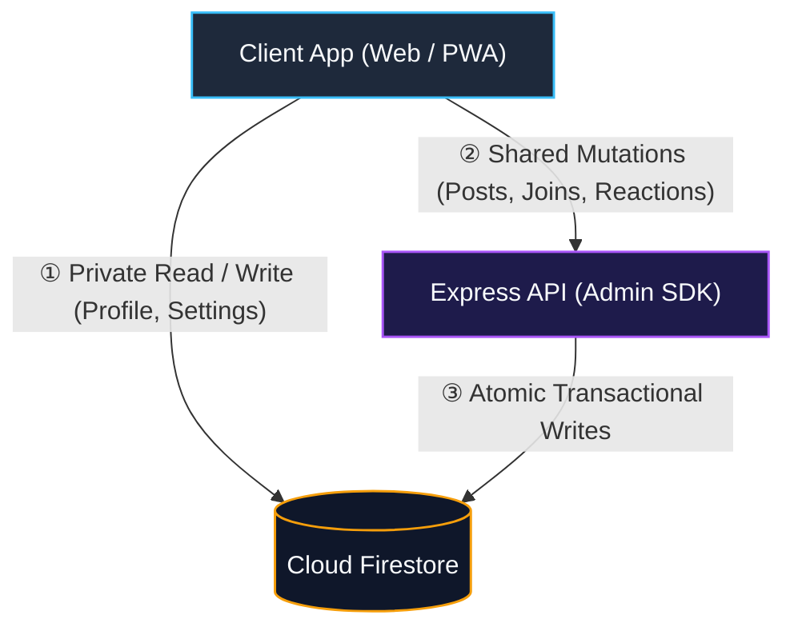

# Firebase Security Rules & Mutation Isolation

> [!TIP]
> **Interactive Architecture Tour**: [Open Live Tour (User Authentication & Login)](https://htmlpreview.github.io/?https://github.com/ScriptureHabit/scripture-habit/blob/main/docs/public/architecture-tour.html?tour=tour-login&lang=en)

This document outlines the authentication constraints, group boundary checks, and backend mutation isolation policies defined in `firestore.rules`.

---

## 1. Two-Tier Defense Model

Security validation occurs across two infrastructural boundaries:

```
Incoming Request ──► [ Tier 1: API Gateway ] ──► [ Tier 2: Database Layer ] ──► Data Commit
                       - Express Middleware            - firestore.rules
                       - verifyAppCheck (App Check)    - isAuthenticated()
                       - Rate Limiters                 - allow write: if false; (Shared Data)
```

Should an unauthorized client bypass the Express API and attempt direct Firestore mutations, Security Rules terminate the operation at the database level.

---

## 2. Core Security Rule Functions

### ① Authentication & Verification Guard (`isAuthenticated()`)
Restricts access to authenticated sessions with verified email addresses.

```javascript
function isAuthenticated() {
  return request.auth != null && (
    request.auth.token.email_verified == true || 
    request.auth.token.get('email_verified', false) == true ||
    request.auth.token.get('email', '').matches('.*@example[.]com$')
  );
}
```

### ② App Check Validation (`isAppCheckVerified()`)
Validates that incoming requests contain cryptographic App Check signatures during registration and high-risk workflows.

---

## 3. Database-Level Quota Enforcement

To prevent client manipulation of the 4-group limit, Security Rules dynamically inspect the user's membership count prior to granting group creation permissions:

```javascript
allow create: if isAuthenticated() && 
  request.resource.data.ownerUserId == request.auth.uid &&
  get(/databases/$(database)/documents/users/$(request.auth.uid)).data.get('groupIds', []).size() < 4;
```

---

## 4. Write Isolation Architecture for Shared Resources

To prevent state tampering and guarantee atomic consistency, **direct client mutations to shared resources are strictly disallowed (`allow write: if false;`)**.



### Write Isolation Breakdown

1. **Private Scope (`users/{uid}`, `groupStates`)**  
   Scoped strictly to the authenticated owner (`request.auth.uid == userId`). Direct SDK mutations are permitted to support offline persistence and immediate UI feedback.

2. **Shared Scope (`messages`, `members`, `cheers`)**  
   Direct client writes are prohibited (`allow write: if false;`).

3. **Transactional Guarantees via Backend API**  
   All shared mutations route through Express API controllers, where the Firebase Admin SDK executes atomic transactions to update streaks, message streams, and statistics concurrently.

---

## 5. Related Documentation

- [Database & Security Architecture](./database-security.md)
- [App Check & API Protection](./security-architecture.md)
- [Firestore Transactions & Counters](./firestore-transactions-counters.md)
